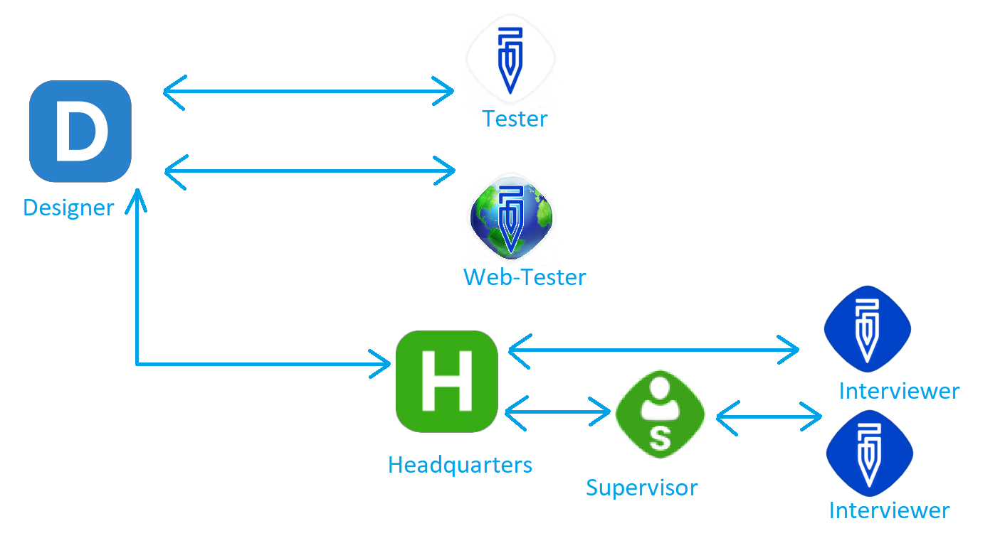

+++
title = "Communication between system components"
keywords = ["development", "contributing"]
+++

Survey Solutions has several components that communicate with each other at different stages of the survey lifecycle.

See [glossary](/faq/glossary/) for interpretation of some of the terms, which may have different meaning in other systems.

## Survey Solutions Components:
- Interviewer _(Android application)_
- Supervisor _(Android application)_
- Tester _(Android application)_
- Headquarters (HQ) _(Web application)_
- WebTester _(Web application)_
- Designer _(Web application)_

These components may communicate with other components of the system.

In the regular data collection flow these are common steps:
1. A new `Questionnaire` is created on `Designer`.
2. The `questionnaire` is tested using Android `Tester` and `Web-Tester`. Both apps _communicate_ with the `Designer`.
3.The `Headquarters` application _connects_ to `Designer` and downloads a questionnaire.
4. New assignments are created at `Headquarters`.
5. The `Interviewer` and `Supervisor` apps synchronize with `Headquarters`, send and receive data (multiple occurrences).
6. The `Interviewer` App synchronizes with the `Supervisor` App.

Note that not all surveys rely on supervisors using `Supervisor App` on a mobile
device, correspondingly it is common for the interviewers to synchronize directly
with the server.

## Synchronization

### I. Interviewer and Headquarters (HQ)

#### A. Initial step after clean installation

After installation user inputs synchronization endpoint (server URL), login name and password.

1. The `Interviewer App` sends request to `Headquarters` with login and password provided by user.
   - In case if user was not found in the system, password didn't match the user, or the user was locked the `Headquarters` returns `Unauthorized` response.
   - If user's credentials were successfully validated the server generates a new `Token` and returns it to the `Interviewer App`.
   - This `Token` is used for further authorization with `Headquarters`.
2. The `Interviewer App` requests the list of `Workspaces` from HQ and selects the first one in the received list.
3. The `Interviewer App` requests `Headquarters` to check if current user has a registered device.
   - If device is not linked (registered) to user the `Interviewer App` registers the current one.
4. The `Interviewer App` checks compatibility with `Headquarters`, providing device ID and communication protocol version of the application.
   - The `Interviewer App` also supplies application version in header as agent identifier.
   - The `Headquarters` validates all parameters and replies to the `Interviewer` whether synchronization is permitted.
   - Reasons that don't allow to continue include:
     - user has a different device, linked to profile;
     - application should be updated to the latest version;
     - the Interviewer application has a later version than the server and cannot be synchronized.
   - If compatibility check is successful the `Interviewer App` saves the list of workspaces.
   - The `Interviewer App` requests details about the interviewer and `Headquarters` `tenant Id` and saves details.

#### B. Routine synchronization
After login to the `Interviewer App`, the dashboard is displayed for the selected workspace. On pressing the `Sync` button the synchronization starts, which includes the following steps:

1. The `Interviewer App` checks the login information sending request to the server
   - User details are requested and updated;
   - Application sends request to the server to verify that sync is permitted;
   - Current supervisor is requested from server and updated;
   - Application sends statistics to `Headquarters`.
2. The `Interviewer App` requests public encryption key if doesn't not exist in the storage
3. The `Interviewer App` requests mobile device settings from the server and updates values for:
   - partial synchronization,
   - web interview URL template,
   - parameters for automatic location capture (period and accuracy).
4. If partial synchronization is enabled, the `Interviewer App` updates interviews with changes from `Headquarters`.
5. The `Interviewer App` uploads calendar events created or updated locally (on this mobile device).
6. The `Interviewer App` starts to uploads interviews to the `Headquarters`: those that are in the status `Completed`, those switched by the interviewer to CAWI mode, those unsynced yet if partial synchronization is enabled.
   For each interview the following items are sent in this order:
     - image files;
     - audio files;
     - audio audit files;
     - interview data.
7. The `Interviewer App` synchronizes assignments:
   - The list of assignments is requested from the `Headquarters`. For each of the assignments to be downloaded the application checks if a local copy of the questionnaire is present and downloads it if necessary.
   - The `Interviewer App` downloads assignments, updates and created new assignments if needed.
8. Downloading Interviews:
   - The `Interviewer App` gets the list of interviews from the HQ. Then checks the local list of interviews, removes and creates interviews one by one as necessary.
   - For every interview the questionnaire is downloaded if it doesn't exist and then the interview data.
9. Questionnaires synchronization. The list of questionnaires is retrieved from the server. Local questionnaires (stored on the mobile device) are updated according to the list received from the `Headquarters`. This may involve local data deletion and updates as required.
10. The `Interviewer App` downloads calendar events.
11. The company logo is updated (if it was changed).
12. The `audit log` is sent to the `Headquarters`.
13. Application sends statistics to `Headquarters`.

### II. Interviewer and Supervisor
  Routine synchronization

### III. Interviewer and Supervisor

### IV. Headquarters and Designer

The Headquarters provides UI to enter login and password to connect to Designer and validates them by calling the Designer API. If validation succeeded, it then calls the Designer API to get the list of the questionnaires that this user has access to. Once a particular questionnaire is selected to be imported and import is requested, the following actions are performed:

1. The user's credentials to access the Designer are validated.
2. The Headquarters prepares to import questionnaire in exclusive mode (note that the same questionnaire cannot be imported simultaneously).
3. The Headquarters requests the Designer API to get questionnaire providing information about what version of the questionnaire it supports. If the questionnaire in the Designer is erroneous (has errors) or the version of questionnaire on Designer is higher that Hadquarters supports error will be returned. The following results could be returned:
  - `Unauthorized (401)` - User is not authorized to perform this action any more. Might be locked by admin during the import.
  - `Forbidden (403)` - User has no access rights to this questionnaire. Shared status was revoked by owner.
  - `Upgrade required  (426)` - The Designer doesn't support old version of Headquarters.
  - `ExpectationFailed (417)` - Questionnaire contains new features not supported by the Headquarters.
  - `PreconditionFailed (412)` - Questionnaire contains errors.
  - `NotFound (404)` - Questionnaire not found. Might be deleted from the server.
  - `ServiceUnavailable (503)` - Server error occurred.
  - `RequestTimeout (408)` - Response  was not received within defined timeframe.

4. If the previous step succeeded Headquarters requests backup archive and questionnaire preview files for the questionnaire (in every translation).
5. Headquarters starts assignments migration if the corresponding option for assignments migration was requested during the questionnaire import.

### V. WebTester and Designer

### VI. Tester and Designer
