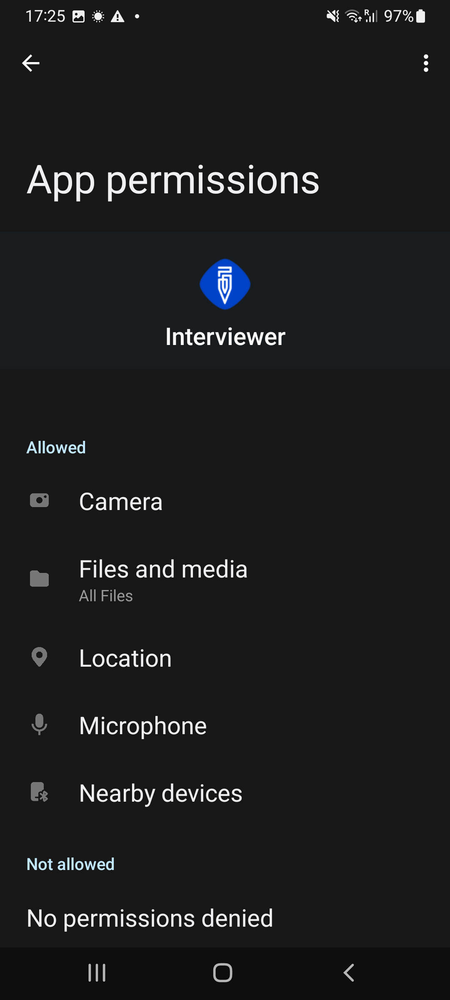

+++
title = "Android App Permissions"
keywords = ["permissions", "security", "privacy"]
date = 2023-04-19T00:00:00Z
+++

Android permissions regulate access of apps to particular functionality. When
it comes to Survey Solutions the following permissions are requested:

1. Access to <A href="images/camera_permission.png">camera</A>: is used to:
 - recognize qrcodes when setting up the application (enter synchronization point address);
 - recognize qrcodes/barcodes when answering the corresponding question type in the interview;
 - take pictures (answer picture type question).

2. Access to <A href="images/audio_permission.png">microphone</A> is used to:
 - answer audio type question;
 - record audio audit data during interview (all the time from the point of opening the interview to the point of closing the interview).

3. Access to <A href="images/location_permission.png">location</A> is used to:
 - answer GPS location question;
 - answer geography question with automatic or semiautomatic modes;
 - permit near field communication for synchronization between the Interviewer and Supervisor apps.

4. Access to <A href="images/files_permission.png">files and media</A> is used to:
 - pick photographs from the gallery as answers to picture questions;
 - store maps received from the HQ;
 - store troubleshooting packages.

5. Access to <A href="images/nearby_permission.png">nearby devices</A> is used to:
 - establish connection for synchronization between the Interviewer and Supervisor apps.

  

The apps generally request the permissions when they are about to execute the
action, for which the permission is needed. For example, a camera permission
may be requested when the user wishes to answer a picture question.

Depending on the version and configuration of your OS the exact request for
permissions and possible answer options may vary. For example, they may include
a "*allow only once*" option, or simply include "*always allow*" and
"*always deny*" options or their equivalents.

If the user does not grant the permission request made by Survey Solutions,
then certain functionality will not be available.

If the app is not used for a long time Android OS may revoke the permissions
granted to the App earlier.

If you want to revise your preferences regarding the permissions granted to
Survey Solutions Apps (Interviewer App, Supervisor App, Tester App), meaning
revoke the permission granted earlier, or grant the permission denied earlier,
then you can change them in that App's properties. See the following Google's
article for details: [Change app permissions on your Android
phone](https://support.google.com/android/answer/9431959)

Depending on the locally applicable laws and regulations you may be legally
obligated to explain and announce the fact of the recording, and obtain
consent prior to capturing audio recordings, photographic images, location
data, or other privacy-related information:

- from your interviewers;
- from your respondents;
- from others present during interviews.

Local regulations may prohibit taking photographs in the vicinity of military
bases, airports, or government facilities. Use of Survey Solutions doesn't
free the user from the obligation to comply with such regulations.

Survey coordinators are encouraged to have a review of the planned activity
with privacy, ethics, and legal experts to determine it's feasibility and
proper implementation details.
