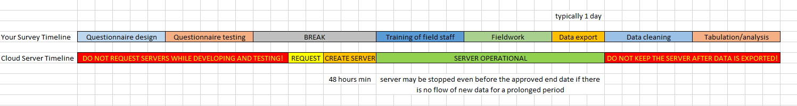

+++
title = "Cloud server request"
keywords = [""]
date = 2017-01-23T11:41:42Z
lastmod = 2020-04-09T00:00:01Z
aliases = ["/customer/portal/articles/2723103-cloud-server-request","/customer/en/portal/articles/2723103-cloud-server-request","/customer/portal/articles/2723103","/customer/en/portal/articles/2723103"]

+++

   

<STRONG>⚠️ The article below describes the process of requesting cloud servers that was 
in effect until April 09, 2020.</STRONG>
  

Effective April 09, 2020 use:

- [PDS (personal demonstration servers)](/headquarters/config/personal-demo-server/) 
for studying the application, or 

- [standalone servers](https://support.mysurvey.solutions/headquarters/config/standalone-server/) 
for survey data collection.

                    

Process overview
---------------

After you have developed and thoroughly tested your questionnaire,
request a new cloud server through Survey Solutions' self-service
portal. To do so, follow these steps:

1. **Navigate to the [self-service server portal](https://mysurvey.solutions)**.
2. **Log in using your Designer credentials.** These are the
    credentials used to access and edit questionnaires developed with
    [Survey Solutions Designer](https://designer.mysurvey.solutions).
3. **Create a new server request.** From the *Create Request* menu,
    select *New server request*.
4. **Fill the server request form.** Provide all requested information
    as accurately as possible. Contact the support team with questions
    about the form.
5. **Submit the server request.** Click on the *Submit* button at the end
    of the form in order to submit your request. Take a note of the
    4-digit number assigned to your request.

Continue reading until the end of this page for important details.

Important details
-----------------

Do not submit a server request to test new functionality. There is a
    publicly available [demo server](/headquarters/config/demo-server)
    arranged specifically for this purpose.

***Before submitting a new server request***

<OL>
<LI> For surveys with 100,000 or more interviews
     directly
    with your project details prior to requesting a server;

<LI> Check that your questionnaire compiles in the *Designer* without errors. Any
request specifying a questionnaire that doesn't compile will be rejected.
Please, finish the design and test your questionnaire **before**
requesting a cloud server.

<LI> Check that your questionnaire has one or more identifying fields defined.
If your questionnaire doesn't have any identifying questions defined,
explain why. Most questionnaires **should** contain identifying fields
(whether you are doing a sample-based survey, or a listing-type operation).

<LI> Check that you have filled out the questionnaire information page as
shown in #2 [here](https://support.mysurvey.solutions/questionnaire-designer/toolbar/panel-of-advanced-instruments/).

</OL>

***Notes on filling out the server request form***

<OL>

<LI> Submit a request from the account of that survey's point of contact.
Read the notes in the *Email* section below.

<LI> Submit a separate request for each separate survey effort. While a
    single server can host any number of surveys, users will be best
    served by the followig rule. For each data collection effort,
    request a separate server. If a single survey uses several survey
    instruments, request a single server. If there is more than one
    survey effort, request a separate survey for each survey effort.
<LI> Special note on quarterly surveys: If you are conducting an ongoing
survey with intermediate reporting on a quarterly basis, request the
cloud server for one quarter only. At the end of the quarter submit an
extension form. Based on the volume of data and patterns of usage we
will either extend the existing server for the next quarter, or advise
to relocate to the new server for the next quarter.

<LI> Do not abbreviate the survey and the organization names! Not "*KLFS*",
but "*Kuwait Labour Force Survey (KLFS)*", not "*GIZ*", but
"*Gesellschaft fuer Internationale Zusammenarbeit (GIZ)*".

<LI> The form asks for web links to the sites of the funding and
implementing organizations. Include the links to the most relevant pages,
optimally the one that describes this particular survey
(for implementing organizations) or this particular grant/loan/project
(for funding providers). Students conducting individual research may
link to their university pages or personal websites. If you have absolutely
no web-presence, specify https://mysurvey.solutions for a link.

<LI> For surveys where the funding organization is The World Bank,
specify the 6-digit project number P######, which can be looked up at
[this page](http://maps.worldbank.org/p2e/mcmap/map.html?code=&level=&indicatorcode=0553&title=Global&org=ibrd)
or in your project funding documentation.

</OL>

***After submitting your request for a cloud server:***

<OL>

<LI> Our personnel will review your request. The decision process and server
creation is not instantaneous, this will take time.

<LI> We may (and often do) send questions to you to better understand the
operation being planned, so make sure you monitor your inbox after
submitting your request. Not answering these questions may delay the whole
process.

<LI> Do not change your questionnaire from the moment you've submitted the
request until the request is approved or rejected (unless requested by us);

<LI> If you need to follow up on your request and you are writting to the
support, make sure that your inquiry contains the 4-digit request number
that is issued when you submit your request.

<LI> If you need to follow up on your request, submit your inquiry from the
**same email account** that is associated to your account. For example, if
your account is associated with an email at *gmail.com*, but your official
business address is at *undp.org*, submit your follow up inquiry from the
gmail account. We have no way of verifying that you own both email
accounts, and will not provide any details about the server or request
to inquiries that we receive from a different address.

<LI> When you login to your account you should be able to see the verdict
among the [notifications](https://mysurvey.solutions/Notifications).
The notification on new server creation that you see in your account
will not reveal the actual password. The password is generated by an
automated system and is mailed to you directly.

<LI> If you see the *New server notice* in the notifications, but you don't
see the message in your mail inbox, check your spambox and any other
filters that you've setup in your mailbox. Do not ask us how to check
your spambox, *we don't know*. Instead ask your mail system administrator
or [ask a search engine](https://www.google.com/search?q=gmail+check+spam).

</OL>

***Timing***
<OL>
<LI> Most requests are processed within 2 business days after submission.
Some may take more.

<LI> We can't process requests demanding a server today (let alone yesterday).
Depending on the other details you specify in the request it will be 
either rejected, or processed with server created on a later date.

<LI> No new servers are usually created on the day of release of a new
version.

<LI> There is usually no point in requesting the server way in advance of
your need. For example, there is no point to submit a request in July
for the server that you will need in December. Optimally, submit your 
request for a new cloud server 16-7 days before the date when you first 
need it.

<LI> A cloud server may be stopped, shut down and decommissioned even
before the approved end date if there is no flow of new data for a 
prolonged period.

</OL>

***Email***

<OL>
<LI> Every request is submitted from a particular account at the self-service
server management portal. Please note that by submitting the request, you
are designating yourself and your email account as the point of contact
for all communication regarding the server (e.g., admin login credentials,
notifications about service closing, etc.).

<LI> Hence it is important that you submit the request from a live account -
the one that you monitor daily! If you don't monitor your email account,
you may miss an important notice from our administrator notifying you about
updates, system unavailability, or server closure.

<LI> Many users have multiple email addresses. The notifications will be sent
to the email associated with the account from which the request was submitted.

<LI> If you no longer remember which email account is associated with your login,
then proceed to the *Designer* site, login and check the account properties
(select *Manage account*).

<LI> If you forget your password to your email account/mailbox, contact
your email provider.

<LI> If you lose the access to your email, you will eventually lose control
over your server, because you will not be able to monitor it for notifications, 
or recover the server management portal password should you forget it.

</OL>

This article is part of the series of [instructions for Survey Solutions
cloud servers](/faq/cloud-server-instructions).