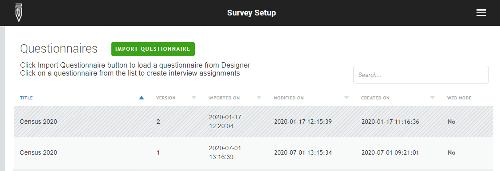

+++
title = "Deleting a survey"
keywords = [""]
date = 2017-01-23T12:01:52Z
lastmod = 2020-09-10T00:00:00Z
aliases = ["/customer/portal/articles/2723119-deleting-a-survey","/customer/en/portal/articles/2723119-deleting-a-survey","/customer/portal/articles/2723119","/customer/en/portal/articles/2723119"]

+++

Survey deletion is possible, but as a dangerous operation is made
available only to [server administrators](/headquarters/accounts/survey-solutions-server-administrator/). When a survey is deleted all
data collected as part of that survey is irretrievably and irreversibly
lost. Hence the same steps should be applied as described in [actions
after the end of the
survey](/faq/actions-after-the-end-of-the-survey).  

Make sure you backup your data before deleting a survey! Even if this
was training, pre-test, or a field test. In some cases even data
collected as part of such exercises can be invaluable for improving the
questionnaire, estimating the performance of interviewers, or duration
of the survey.  

There is rarely any need to delete a survey. [Deleting a questionnaire
template](/headquarters/survey-setup-tab-import-copy-and-delete-questionnaire-templates-and-create-assignments)
will delete the whole survey with all data associated with it.


Any interviews data received at the server from any tablet after the
corresponding questionnaire has been deleted will also be
automatically deleted from the tablets and not retained at the server!

Make sure you synchronize the tablets **before** exporting the data and
deleting the survey questionnaire from the server.
{}

Deleting a questionnaire may take a considerable time depending on the
size of the survey and server performance. While the survey is being
deleted its questionnaire still appears in the list of imported
questionnaires in the disabled state, such as '*Census 2020 v2*' in the
following illustration. The questionnaire is automatically removed from
the list when the deletion process completes.

