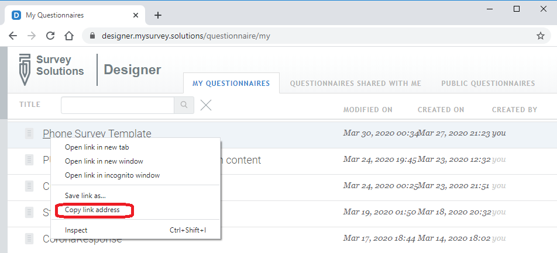

+++
title = "FAQ for email support"
keywords = ["FAQ rules email support"]
date = 2017-07-24T14:40:55Z
lastmod = 2020-04-21T00:00:00Z
aliases = ["/customer/portal/articles/2846777-faq-for-email-support","/customer/en/portal/articles/2846777-faq-for-email-support","/customer/portal/articles/2846777","/customer/en/portal/articles/2846777"]

+++

1. Before writing your request, study the [documentation](http://docs.mysurvey.solutions)
    online, [read the FAQ](/faq/), and browse our [users' forum](http://forum.mysurvey.solutions).
    Don't neglect [Google](http://www.google.com) or [other search
    engines](https://en.wikipedia.org/wiki/Web_search_engine). This is
    usually the fastest way to get your issue resolved. It will also
    help you to use the right terminology when asking a question.

2. All of the questions of the kind
    *"Is it possible to do X in Survey Solutions?"*
    or *"How do I do X in Survey Solutions?"*
    should not be sent to the support team directly, but rather be posted
    to the [user forum](https://forum.mysurvey.solutions) as public
    questions.

3. Write your request clearly. If we don't understand it, we will not
    be able to help and it will take multiple rounds of emails to obtain
    clarification, ultimately resulting in a slower resolution.
    Messages simply reporting *"X doesn't work"*
    or *"X is not working"* without steps to
    reproduce the problem will be immediately returned to sender for
    clarification without further investigation. Most of the reports of
    the type *"X doesn't work"* are
    because X never existed or never intended to work the way you imagined
    it. While describing the issue refer to the documentation
    and indicate which instruction you've followed, and what was the specific
    problem (which error message you received exactly, whether the program
    has frozen, computer rebooted, etc).

4. Introduce yourself, your survey and your questionnaire. Do not assume
    we or other users know what BTLDMS or KVZTS/D is. If you experience a
    compatibility issue (device related) introduce your device (brand,
    model number, manufacturing year, OS version).

5. Questions of the type
   *"What is the best way to do X?"* typically
   can't be considered without a context. Make sure you include your
   project description, any alternatives you are considering and associated
   costs, risks, and benefits.

6. Do not CC (copy) any other address in your request. Once you receive
    the answer to your request, you can forward it to your partners/co-authors.

7. Confirm promptly if the issue is resolved once you receive the answer. We
    will not be able to address your case until all previous support cases are closed.

8. Once the issue is resolved and you have a new issue, start a new request,
    do not answer to the old thread of the resolved issue. Do not write
    *"Thank you for resolving issue A, and I have two
    more questions B and C"*. Instead close the thread of issue A
    confirming it is resolved, start a new request for issue B and start
    another for issue C.

9. Urgent requests: all requests are urgent. Consequently all requests will be
    served in the order they arrive.

10. Use attachments to supplement your case description:

    - place screenshots for interface issues;

    - place long error messages verbatim in a separate text file;

    - include preloading files in text format; explain which tool was used to produce these files;

    - include PDF version of the questionnaire if necessary.

11. If the issue is related to a particular questionnaire, copy the link
    to it from the list of your questionnaires in the Designer.

12. In general requests for server maintenance, such as erasing a survey,
    resetting credentials, upgrading the version of the server
    component, etc are expected from the person designated as
    responsible for the server. We reserve the possibility to deny the
    requests from other persons if we can’t reliably establish their
    relationship to the data server in question.

13. Check the support address. This is the support line for the Survey
    Solutions software. If you are experiencing a device issue, perhaps
    you should contact the device manufacturer? If your issue is related
    to a statistical package, refer to the corresponding forum for that
    software.

14. Give each question you submit a meaningful title that explains in short
    what the issue is about. Here are the top ten worse titles for the
    questions we received: *"Question"*, *"Request"*,
    *"Inquiry"*, *"Survey Solutions"*, *"Server"*, *"Urgent"*, *"Hello!"*,
    *"Need help!"* , *"Support"*, *"SOS"*. Instead write
    *"Error 601 during download of binary data file"*,
    *"Assignment appears on the dashboard of supervisor without a number"*,
    etc.

15. This is not a private email. Do not expect the same agent to
    respond to your every request; *"How are things?"*
    is not a support question.
