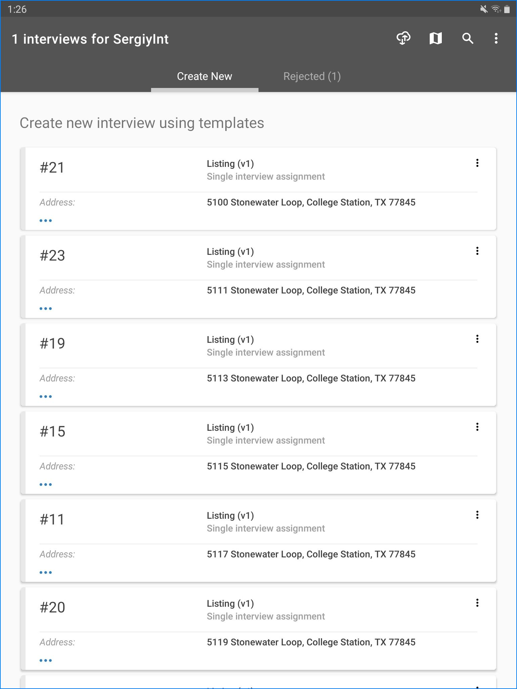
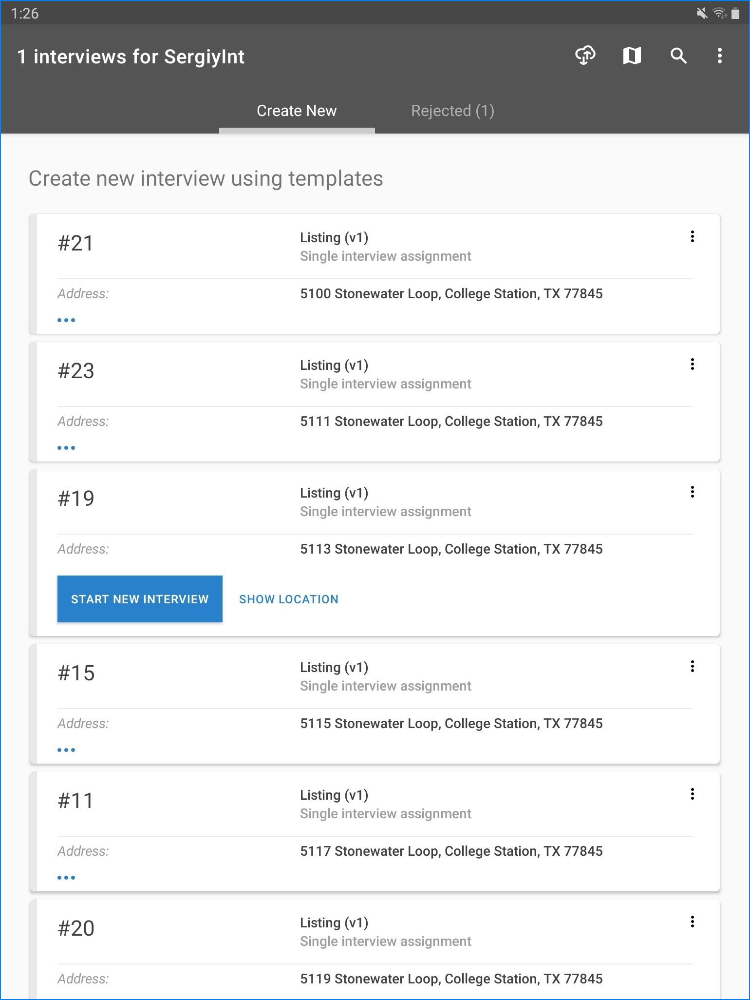
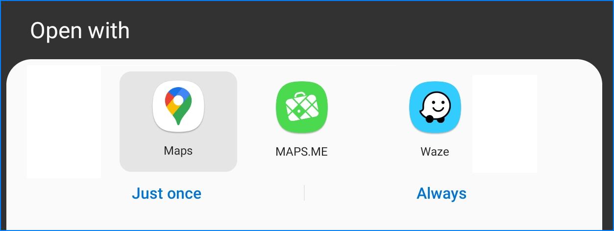
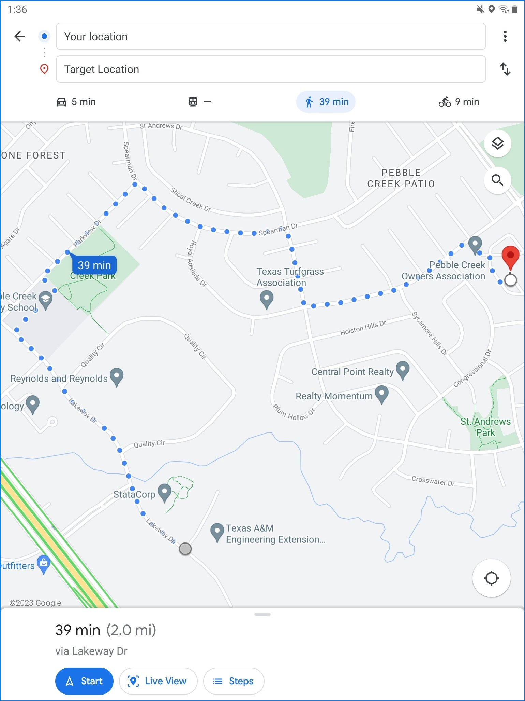
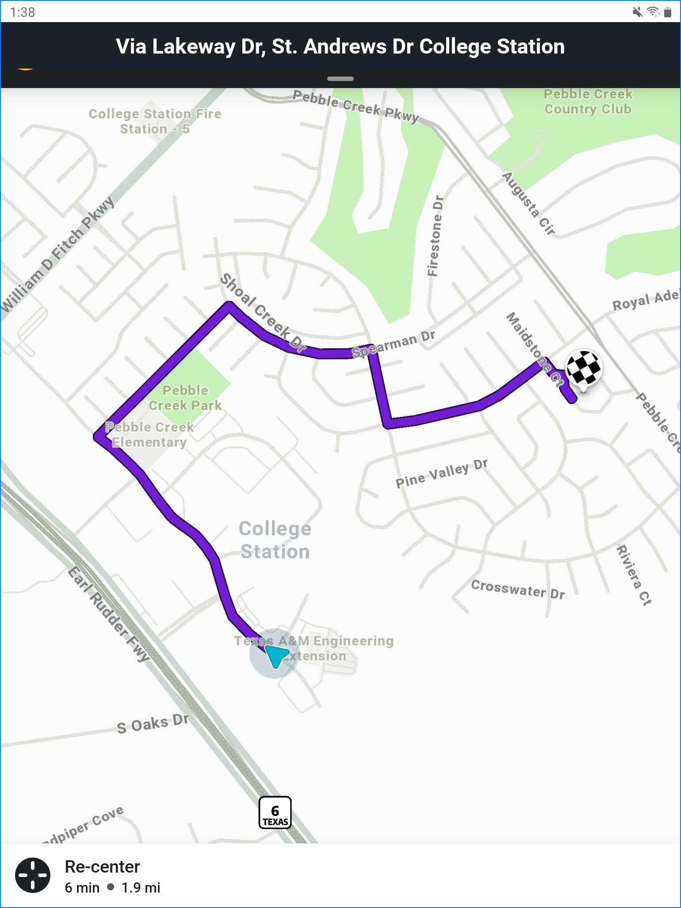

+++
title = "Navigation to Destination"
keywords = ["navigation","map","routing"]
date = 2023-04-23T00:00:00Z

+++

This article describes the features of Survey Solutions related to guiding the 
field workforce (interviewers and supervisors) to the particular destinations
(typically dwellings/households).

This is especially useful when the target location for interview is known 
(coordinates known), which helps finding the proper way to the destination in 
the situations of:

- panel surveys (coordinates are known from previous wave of the survey);
- cross-sectional surveys on geo-coded frames (households comprising the 
sampling frame are recorded with their coordinates during the precedeing 
listing or census enumeration);
- cross-sectional multi-visit survey (coordinates are recorded during the
first visit, then re-used for subsequent visits);
- audit survey (coordinates are recorded by the interviewers during the main
survey, then reused by auditors during the audit survey).

While we are mainly thinking of the location of the household or dwelling, it
is not essential for Survey Solutions, and the destination can equally be the
location of an enterprise, farm, plot, school, hospital, a generic facility, 
a landmark, a water source, etc.

In the specific case of spatial sampling, the coordinates may be those ones of
an imaginary grid cell's center, which have no recognizable mark on the ground, 
yet each interviewer may need to arrive to the spot from which they can explore.

One should remember that due to accuracy of the technology the location 
coordinates may not be sufficient to identify the exact target and the 
coordinates should be supplemented with other identification variables, which
vary by context of the survey, but commonly include the street address, 
company name, or textual description of the destination.

Having the coordinates of the targeted households greately simplifies the 
navigation of interviewers, who may need to return to the same location for 
example, to finish the started interviews, that were postponed. But they are
even more important when the interviewers need to arrive to a particular
location, which they have not visited before, such as the location of the
households sampled from the list of the households in a particular area
enumerated during the census.

When the target coordinates are preloaded for the interviewers, they are
typically included in a question at the cover page, and thus are protected
from the interviewer's modification (the interviewers can only see where the
household is located, but can't change it). In other cases, the cover page
variable may be left blank, in which case the interviewer needs to fill it out 
himself/herself, and which can be used subsequently for verification by the 
supervisor or auditing interviewer.

#### 1. 

Identify one of the cards, corresponding to the household the 
interviewer wishes to proceed next. Here we will try to reach 
the household corresponding to assignment #19.

#### 2.

Click on the three dots (horizontal) icon to unfold the card revealing the 
`START NEW INTERVIEW` and `SHOW LOCATION` buttons. Click on the `SHOW LOCATION`
button.

#### 3.

Select which external App will be used for navigation. Your mobile device may 
sugget multiple choices from the Apps already installed (such as Google maps 
or Uber) and you can extend these choices by adding another App from the 
Google Play. These maps are mostly the Apps that handle maps or 
transportation-related, such as various taxi apps.

Warning: some of these apps may cost you money! Check before downloading and 
using! There is usually plenty of free alternatives, though they vary by 
country, version of Android, and other factors. 

Here we chose between Google Maps, Maps.Me, and Waze:

  
We can also specify whether the selected App should be used just once (for 
this target only) or always (for this and all future ones).

#### 4.

After we selected the App, it will start and receive the target coordinates
from the Survey Solutions Interviewer App, which can then be used to plan the
travel to the destination:

Depending on the App and connectivity status it may provide all or some of 
the following:

- indication of the current position on the map;
- indication of the target position the map;
- selection of various map layers (satellite, terrain, etc);
- selection of labels (street names, etc);
- position of visible landmarks;
- calculation of distance from current location to target;
- calculation of time needed to get from the current location to target;
- correction of optimal route and time to travel depending on the preferred 
mode of transportation (on foot, by bike, by car, using public transportation);
- turn-by-turn navigation;
- bus transfers, train transfers, etc;
- traffic conjestion areas;
- cost estimates;
- street view photography.

Some of these apps support storing the data needed for their work on the 
user's device to allow working while disconnected, which may require setting up
while connected to the Internet (for example, cacheing of the map data by 
Google Maps). Some functionality may not be available while disconnected (for
example, pedestrian navigation for Google Maps) where it requires processing on 
that App's server.

Users should realize that the accuracy of the maps, routing, timing and cost 
estimates produced by these Apps are the responsibility of the corresponding 
App's authors and maintainers. Survey Solutions Interviewer App installed on a
mobile device collaborates with them by:

- providing the destination coordinates only;
- doing this only on demand of the interviewer (supervisor) that presses the
corresponding button;
- installing of these Apps and usage of this service is optional.

Storing the data offline (mostly the map tiles/satellite photography) takes
considerable space on the mobile device and must be factored in when estimating
the required storage space needed for data collection/device procurement.

Some apps include additional restrictions on the use of the stored maps data.
For example, limiting the download and storage of a country's map data only for 
devices that are already located in that country, and not permitting storing it 
for devices located abroad. Consult the individual App's policies and support
to find out more details about the possible limitations.

See also:

* [map dashboard](/interviewer/app/map-dashboard/)
* [supervisor map dashboard](/supervisor/supervisor-map-dashboard/)

