+++
title = "Computer Assisted Web Interviewing (CAWI)"
keywords = [""]
date = 2017-05-05T21:00:19Z
lastmod = 2017-05-05T21:00:19Z
aliases = ["/customer/portal/articles/2801239-computer-assisted-web-interviewing-cawi-"]

+++

Introduction
============

The CAWI mode in Survey Solutions allows the collection of survey
information through web interviews. Enumerators are not conducting the
interviews, as the respondents are fully guided by the software, with
which they interact through the Internet—either with a tablet or
computer. Unlike the CAPI mode in Survey Solutions, **if respondents are
utilizing a computer to fill out the survey respondents need to have a
stable Internet connection during the entire process**. Another
difference to note when deploying the survey on a computer is that the
picture and barcode question types are not available because
they require hardware most computers do not have.  
  
This mode is most useful when the respondents are not easily
approachable or a face-to-face interview cannot be easily scheduled,
such as surveying employees in firms or international organizations that
are spread across a large geographical area.  
   
The designers of the questionnaires that will be applied in the
web-interview mode need to be aware of the following:

-   **self-enumeration:** the respondents will enter their information
    themselves without presence of the interviewer, hence navigation
    must be intuitive and clear;
-   **instructions and questions wording:** the respondent will not be
    trained on the survey and may need more instructions and
    explanations relatively to the interviewers that had had a training
    on the survey;
-   **error messages must be clear and instructive**: they need to tell
    the respondent of where the problem may be, and how it may be
    resolved;
-   **different presentation of some question types** in the web
    interview mode (for example, barcode reading);
-   **interviews collected in web-survey mode cannot be rejected back to
    the respondents**.

 

Setting up a web interview 
===========================

Survey Solutions provides a flexible platform for the CAWI mode. There
are two independent decisions that must be made in terms of [1) whether
or not there is identifying information on survey cases](#createassign)
and [2) how the respondent/interviewer will interact with the
software](#distributing). 

 

### Creating assignments  

Similar to the CAPI mode of Survey Solutions, depending on the needs of
your survey the CAWI mode can be setup in different ways --i.e. Having
identification information for your assignment or not. Creating
assignments in CAWI mode is done exactly the same way as in CAPI mode.  
   
***1) Having identification information for your
assignment***  
For example, this may be the case when an initial listing has been
conducted, and thereby the names, positions, and/or email addresses of
respondents are available. First [interviewer
accounts](http://support.mysurvey.solutions/customer/en/portal/articles/2482233-teams-and-roles-tab-creating-user-accounts-)
would be created for each respondent. Then, assignments are [created one
by one or in upload
mode](http://support.mysurvey.solutions/customer/en/portal/articles/2832918-survey-setup-tab-import-copy-and-delete-questionnaire-templates-and-create-assignments)
and allocated to respondents. Information on how assignments can be
distributed to respondents is reviewed below.  
   
   
***2) Not having identification for your
assignment***  
For example, this setup would work when you have the email address of a
contact person in a firm and you expect N number employees to fill out
the survey. In this situation, [one interviewer
account](http://support.mysurvey.solutions/customer/en/portal/articles/2482233-teams-and-roles-tab-creating-user-accounts-)
would be created. Then, [one
assignment](http://support.mysurvey.solutions/customer/en/portal/articles/2832918-survey-setup-tab-import-copy-and-delete-questionnaire-templates-and-create-assignments)
is created with the size set to unlimited (quantity = -1). This means
that an unlimited number of survey cases can be created for this one
assignment. The size of the assignment can be revised at any point in
time on the server. Information on how assignments can be distributed to
respondents is reviewed [below](#fillingqnr).  
  
 

 

### Distributing assignments

***1) Generate the link***

After you have created the assignments you would like to distribute in
CAWI mode, you will need to generate the links to the questionnaire.
When identification information is not available this is the only way to
distribute assignments, but it can also be used when there is
identification information available. Remember the cases must be
in *interviewer assigned* status prior to generating the link(s).  
   
To generate links for the assignments,   
 

1) Go to the ***Survey Setup*** tab, and then click on
***Questionnaires***.   
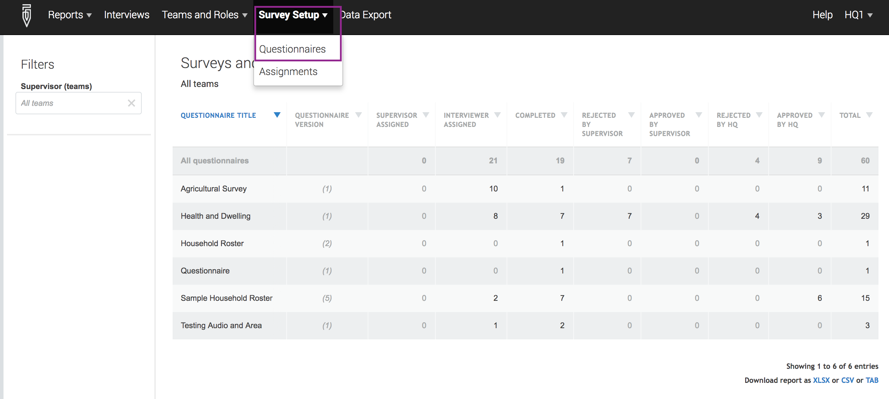  
  
  
2) Click on the questionnaire that you would like to setup survey cases
as web interviews.   
  
  
3) Select ***Web Interviews Setup.**  
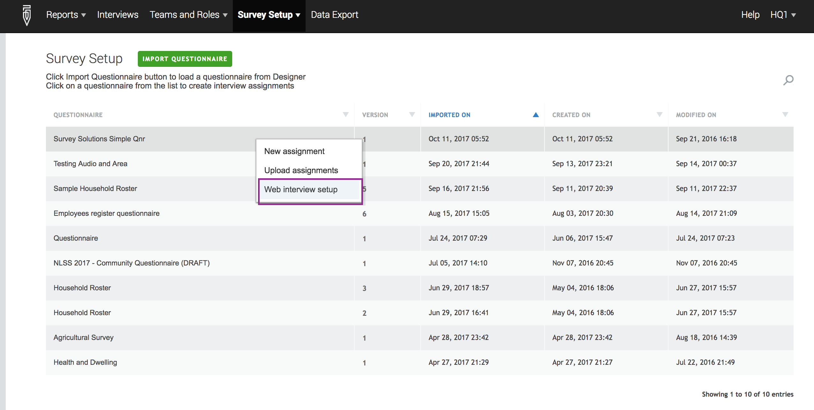*  
  
  
4) Enable/disable spam protection before clicking
on ***Start***. Enabling spam protection will help defend against
robot-submitted data by requiring the respondent to enter a CAPTCHA code
before being allowed to start the interview. This mode is useful if
respondents, and not interviewers, will be filling out the
questionnaire.  
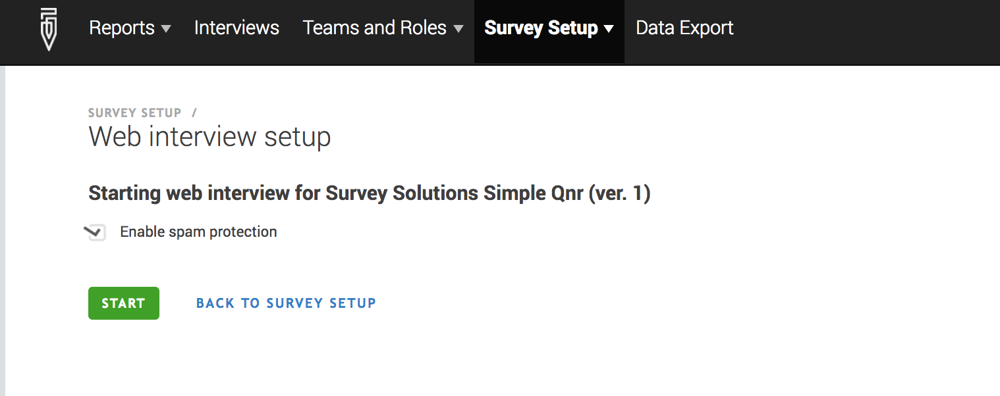  
  
  
5) Click the blue ***Download* ** button to download a zip file with a
tab delimited file with information about the assignments and the links
to the questionnaire for the assignments. The downloaded
*interviews.tab *file will contain the following information: 

-   Identifying questions (i.e. Identification number of household, as
    shown in the image below)
-   Generated interview id and key;
-   Link to be sent to the respondent. One link will be generated for
    each assignment. **Note that Survey Solutions does not automatically
    send the links for interviews to the respondents, and the links must
    be delivered to them using your own mailer.**

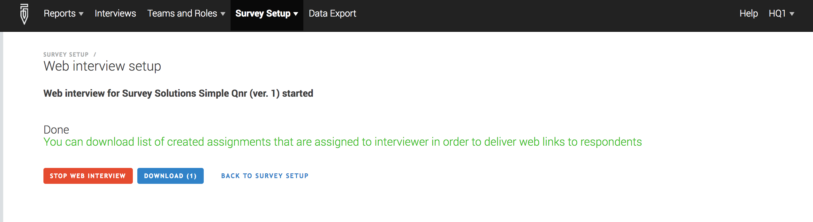   
After you have completed your data collection, you can go back to survey
setup page and the Web Interviews Setup (Shown in Step 3 above) and
click on the orange ***Stop Web Interview***  button to stop the web
interviewing. After clicking on this button, all the links to the
questionnaires that you have shared be expired. You can reactivate the
links by following steps 1 through 5 again.   
   
If the respondent needs to interrupt an interview for a longer time, and
close the program or restart a computer, he/she should retain her own
personalized interview link, which can be copied at any point after
clicking on the initial start button. The link contains a long system
generated interview case id.  
 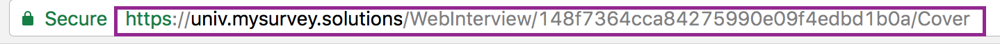  
Below is more information on how respondents can navigate and fill out
questionnaires on the web interface.  
   
***2) Respondent login to web
interface/tablet***  
This method of distributing assignments can only be used when
identification information is available for respondents, as each
respondent would have an [interviewer account created on the
server](http://support.mysurvey.solutions/customer/en/portal/articles/2482233).
The respondent would then use the login credentials created to either
login to the server or on a tablet. However, ***note that Interviews
started online, may be completed online or on the tablet after
synchronization, but interviews received on the tablet must be completed
on the tablet.***  
   
For information on how to use the tablet please refer to the articles
under the
[Interviewer](http://support.mysurvey.solutions/customer/en/portal/topics/954155-interviewer/articles)
topic. If using the web interface either accessed through the link or
logging in to the server, refer to the [information
below](#fillingqnr). 

###  

***Summary***  
Please refer to the table below for examples on how the CAWI mode can be
setup as described above.   
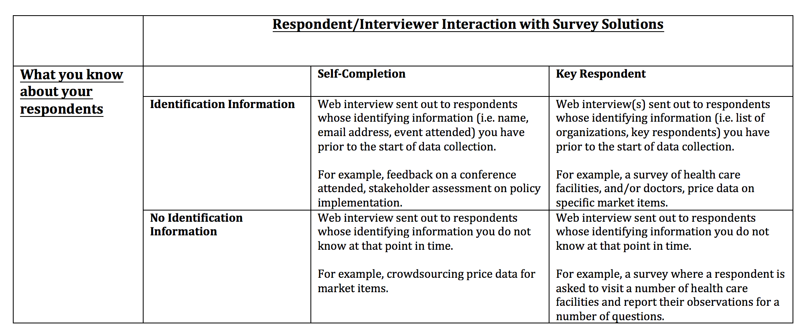

The custom messages that appear can be customized. Please refer to [this
article](http://To%20customize%20messages%20that%20appear%20please%20refer%20to%20this%20article.)
for more information. 

### Filling out the questionnaire 

This article covers how to access the questionnaire, and navigate
through the web interface when filling out the questionnaire on a
computer.  
  
If using a link to access the questionnaire, respondents will see a
landing page similar to this:  
  
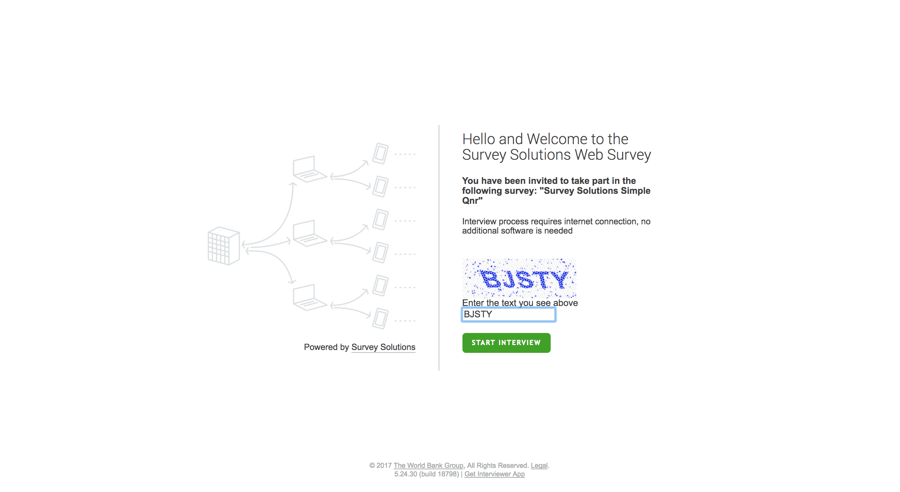   
  
If respondents are instructed to login to the server, have them navigate
to the URL of the server \[servername.mysurvey.solutions\]. Then, use
the enumerator/respondent login credentials to login.    
   
The web interface consists of the following tabs:  
   
1) **Create new**, lists the assignments assigned to the respondent.  
2) **Started**, lists the cases that have been started, but not
completed.  
3) **Completed**, lists the cases that have been completed.  
4) **Rejected**, lists the cases that have been rejected by the
supervisor.  
   
 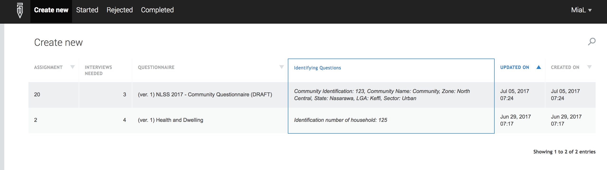  
   
    
**To logoff**, respondents click on their username at the top right and
select logoff.  
   
   
  
  
To begin filling out the questionnaire, click on the tab according to
the status of the survey. Then, click on the case or assignment if
listed under the Create new tab and click on Open or Start new interview
(for assignments).  
  
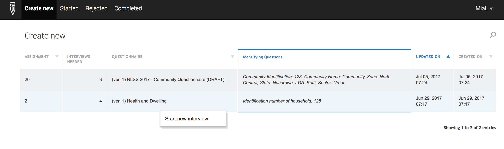  
  
  
***The data entered as part of the web-interview is sent to the server
immediately***, so there is no Save action specifically required from
the respondent. However, the respondent will still need to
click ***Complete*** to signify that there is nothing else he/she wants
to add or change in the interview and it that the case may be sent for
validation and processing.   
  
  
After the respondent has gone through the entire questionnaire and ready
to set as complete, navigate to the Complete section. An overall comment
can be added if the respondent chooses to do so, before clicking on
Complete.  
  
 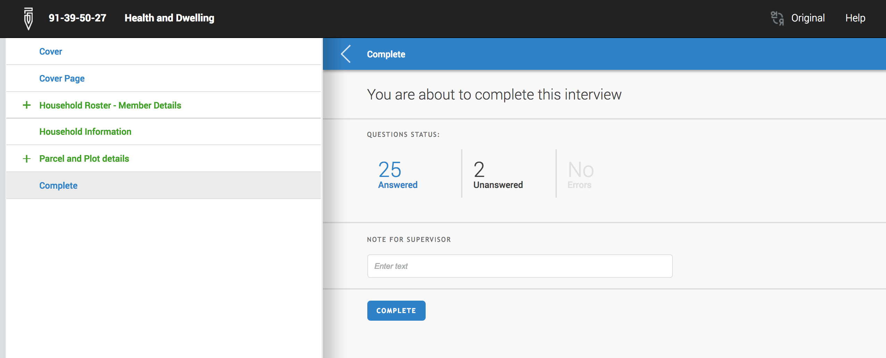  
   
If the questionnaire is multilingual, the respondent/interviewer can
change the language of the questionnaire, by clicking on ***Original***
at the *top right corner of the screen*.  
  
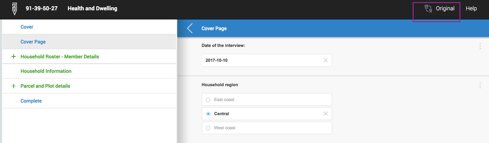  
   
**To add a comment to any question,**  
   
1) Click on the 3 vertical dots at the upper right corner.  
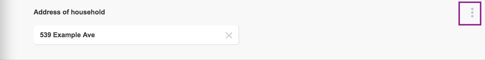  
2) Click on *Add comment.  
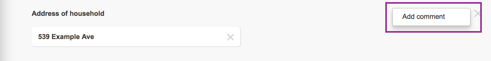*  
2) Type the comment in the box that appears.  
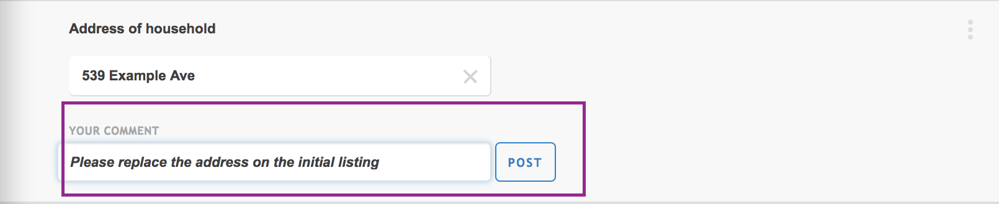  
3) Click on *Post*. Once posted the comment cannot be deleted or edited.
However, another comment can be added.    
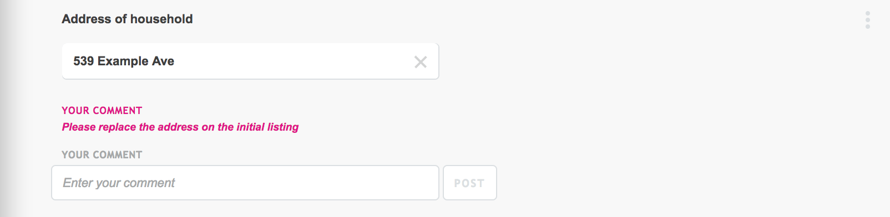  
   
**To go back to the homepage to logoff,**  
   
1) Click on the pencil icon on the upper left hand side.  
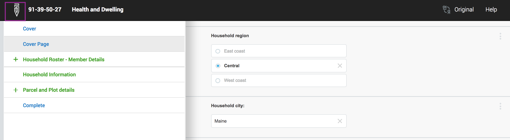  
2) Click on the username at the upper right hand corner and click on
Logoff.   
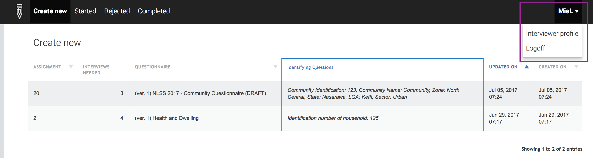
