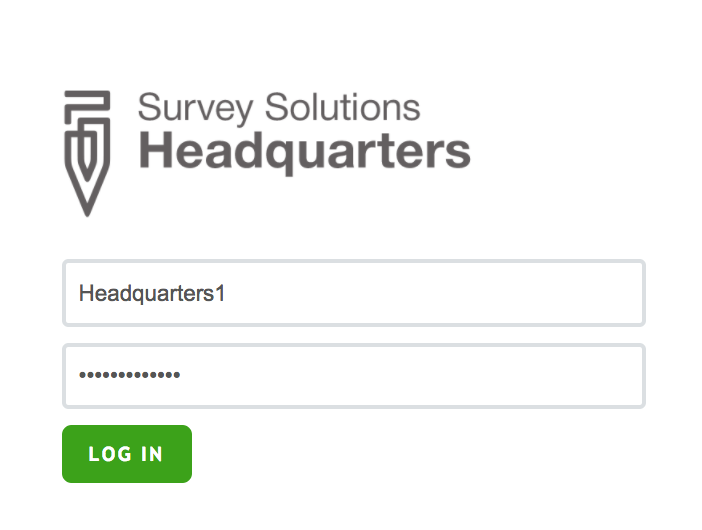
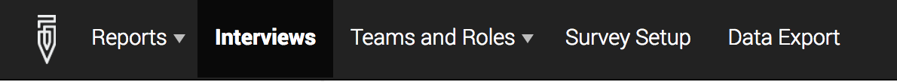
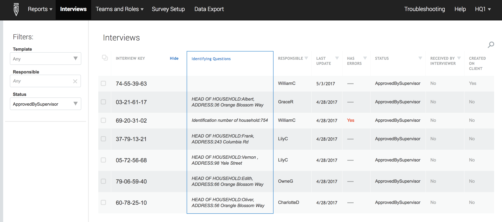
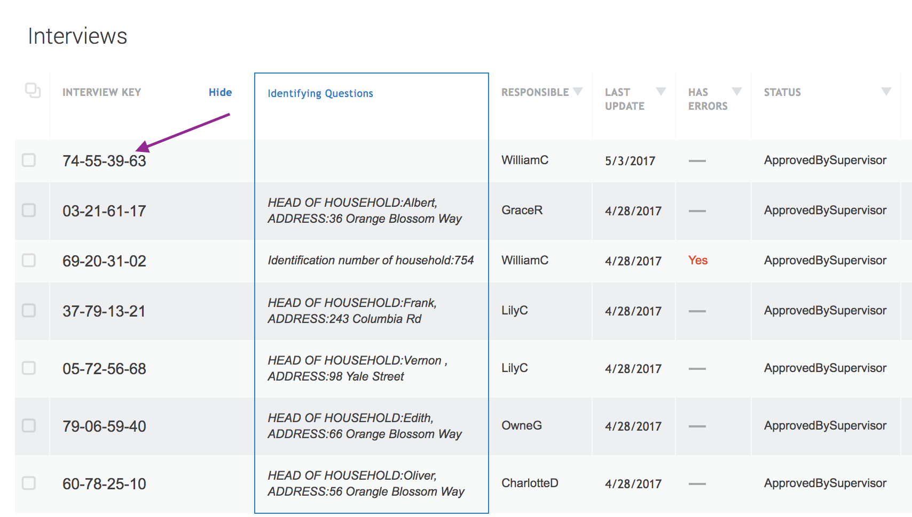
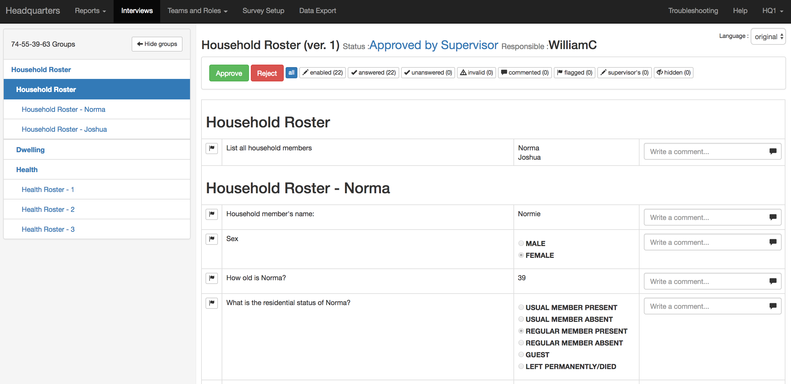

+++
title = "Headquarters user: Browsing the Completed Interview"
keywords = ["check ","review","headuarters"]
date = 2016-07-19T15:44:25Z
lastmod = 2016-07-19T15:44:25Z
aliases = ["/customer/portal/articles/2502601-headquarters-user-browsing-the-completed-interview"]

+++

Step 1
------

  
Log in to your server using a headquarters account. If you are testing
Survey Solutions, log in at demo.mysurvey.solutions using the following
username and password:  
  
**Username:** Headquarters1  
**Password:** Headquarters1   
  
  
  
  
  
 

Step 2
------

  
Go to the *Interviews* tab  
  
  
  
  
  
 

Step 3
------

  
From the filter on the left side of the screen, select *Approved By
Supervisor*  
  
  
  
  
  
 

Step 4
------

  
Click on the interview key for the survey case that you would like to
browse.  
  
  
  
  
  
Now you can see all the answers given by the respondents—the answers
marked in red are invalid according to the validation rules.   
  
  
 

Step 5
------

  
If the interview should be approved, click on the *Approve* button. To
return it to the supervisor, click on the *Reject* button.  
  

