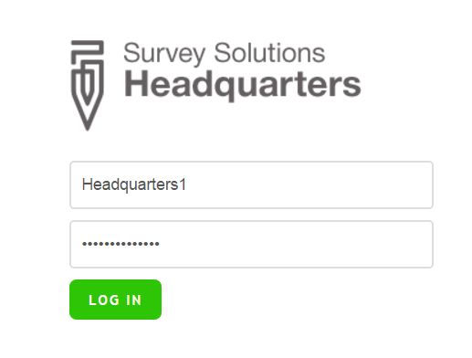
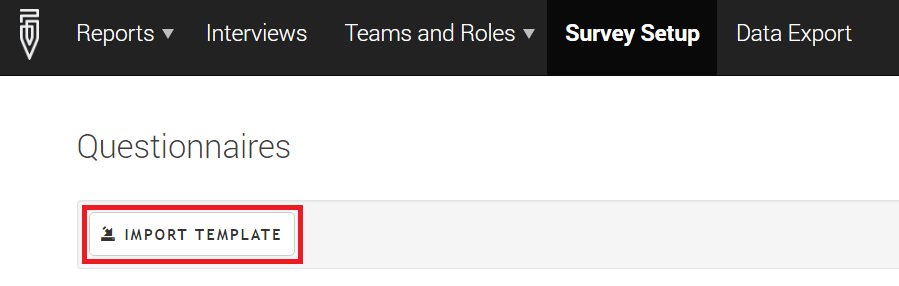
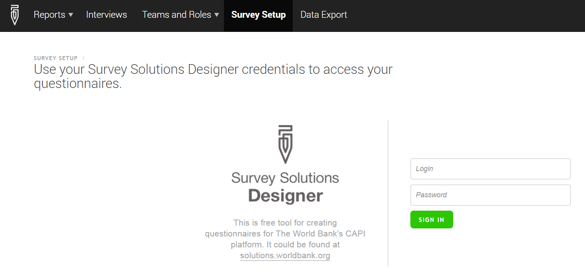
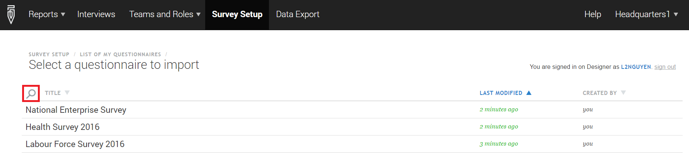
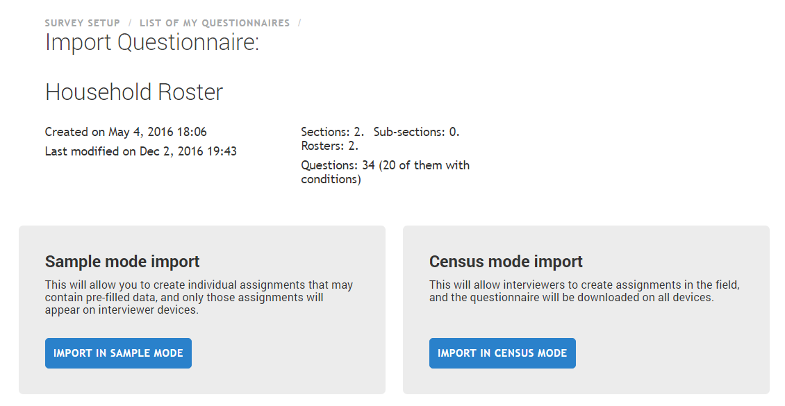

+++
title = "Import the Questionnaire (prior to 5.21)"
keywords = ["import","setup","headquarters"]
date = 2016-06-23T21:15:31Z
lastmod = 2016-06-23T21:15:31Z
aliases = ["/customer/portal/articles/2475089-import-the-questionnaire-prior-to-5-21-"]
expirydate = 2016-07-06T00:00:00Z
+++

The step by step instructions detailed below are necessary in order to
upload your finished questionnaire to your tablets.   
 

**Step 1** 
-----------

Log in to your server using the *administrator* or *headquarters*
username and password.  
  
The demo server can be accessed at <https://demo.mysurvey.solutions>.   
  
The headquarters username and password are:   
  
**Username**: Headquarters1  
**Password:** Headquarters1  
  
  
  
  
**Note that each institution using Survey Solutions will utilize their
own server. Consequently, the details listed above may not be
applicable. You may use the demo server and username (above) to test
Survey Solutions. **  
 

**Step 2**
----------

Import the template from the ***Survey Setup*** tab  
  
To import a template, you need first to access the ***Survey Setup***
tab by clicking on the main menu bar. Then, click the button ***Import
template***.  
  
  
  
 

**Step 3**
----------

  
Enter your username and password from [Questionnaire
Designer](https://solutions.worldbank.org)   
   
After clicking ***Import template***, the server will ask for the user
name and password from Questionnaire Designer (where you created your
questionnaire), in order to select the relevant template. **This is not
the username for the *headquarters* server.**  
  
If you have forgotten your username or password, go to
http://solutions.worldbank.org/ and click on the ***Forgot your
password**?* link to create a new password.  
  
  
  
 

**Step 4**
----------

  
Choose the questionnaire template to import to the server.  
   
After you log in, you will be presented with a list of your
questionnaires from Designer. From the list, select the questionnaire
template that you would like to import to the server. To search for your
questionnaire, click on the magnifying glass icon to bring up the search
bar.  
  
  
 

**Step 5**
----------

Choose whether to import the questionnaire template in Sample mode or
Census mode.  
  
The questionnaire template can be imported to the server in Sample or
Census mode (as described in the [Census or Sample
Mode?](/getting-started/census-or-sample-mode-prior-to-5-21-) article).
Import the questionnaire template by clicking on the blue ***Import in
Sample Mode ***or ***Import in Census Mode.***  
  
  

 **Step 6**
-----------

  
Repeat these steps each time you make changes in the questionnaire or
create a new questionnaire  
   
You must go through the steps 1-5 every time you or a member of your
team creates a new questionnaire template or change a template that has
been already imported to the server**. Changes made in Questionnaire
Designer do not automatically propagate to the headquarters server.**
