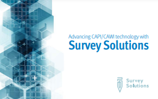
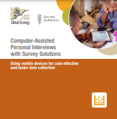
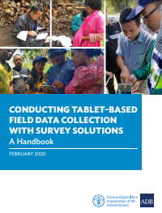

+++
title = "Overview: Printable materials"
keywords = [""]
date = 2019-06-19T12:00:00Z
lastmod = 2023-11-01T01:00:00Z

+++

This page contains downloadable resources for users wishing to have a quick look at the capabilities and possible uses of Suvey Solutions.

<TABLE border=0>
<TR bgcolor=lightblue>
<TD width=20>
<TD width=200>
<TD width=20>
<TD width=300>
An overview booklet about Survey Solutions can be downloaded here as 
printable PDF in <A href="resources/SurveySolutionsBooklet_2018oct(ENG).pdf">English</A> 
and <A href="resources/SurveySolutionsBooklet_2018oct(FRA).pdf">French</A> languages 
(16 pages, less than 1MB).
<TD width=20>
</TR>

<TR>
<TD width=20>
<TD>
<TD>
<TD>
An older overview <A href="resources/flyer2.pdf">flyer</A> is also downloadable (in English only, 2 pages, less than 2MB).
<TD width=20>
</TR>

<TR bgcolor=lightblue>
<TD width=20>
<TD>
<TD>
<TD>
The Statistics Division of the Food and Agriculture Organization of the United Nations (FAO)
 has published overview booklets in <A href="resources/GS-CAPI-SUSO-BROCHURE-05.pdf">English</A>
and <A href="resources/GS-CAPI-SUSO-BROCHURE-FR-001.pdf">French</A> (8 pages, less than 1MB).

  (Their GSARS.ORG website is no longer accessible, but the preserved copies are linked here.)
<TD width=20>
</TR>

<TR>
<TD width=20>
<TD>
<TD>
<TD>
The Food and Agriculture Organization of the United Nations (UN FAO) and Asian Development Bank (ADB) have compiled a handbook "<A href="http://www.fao.org/3/ca7691en/CA7691EN.pdf">Conducting Tablet-Based Field Data Collection with Survey Solutions: A Handbook (2020)</A>" (81 pages, 16MB) which will be useful for beginners to familiarize with the components of the system and its functionality as it was around 2018-2019.
<TD width=20>
</TR>
</TABLE>