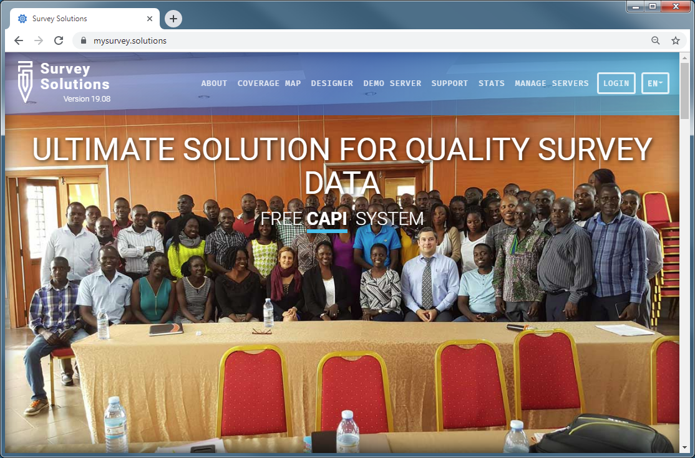
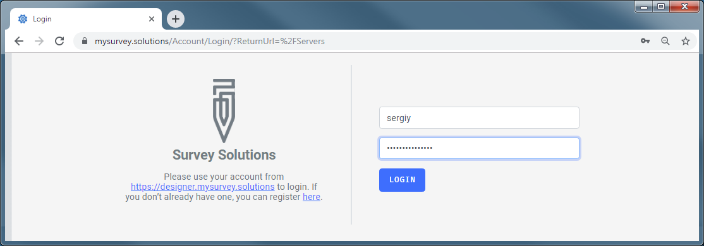
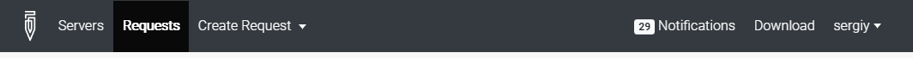
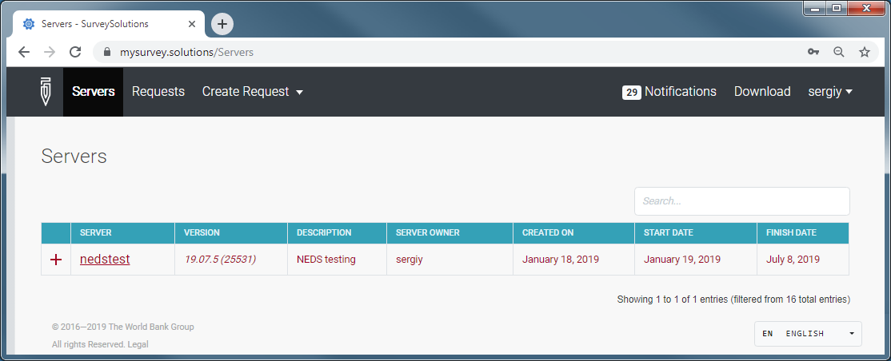
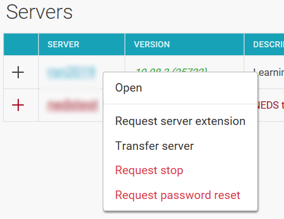
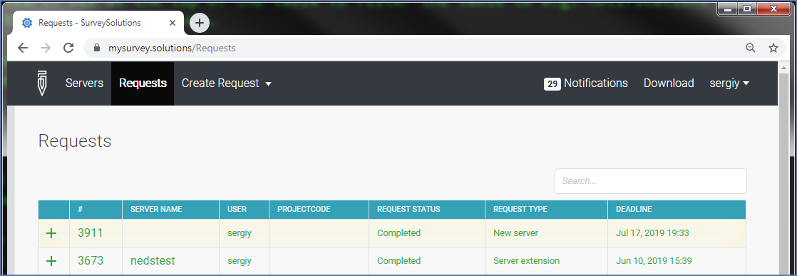
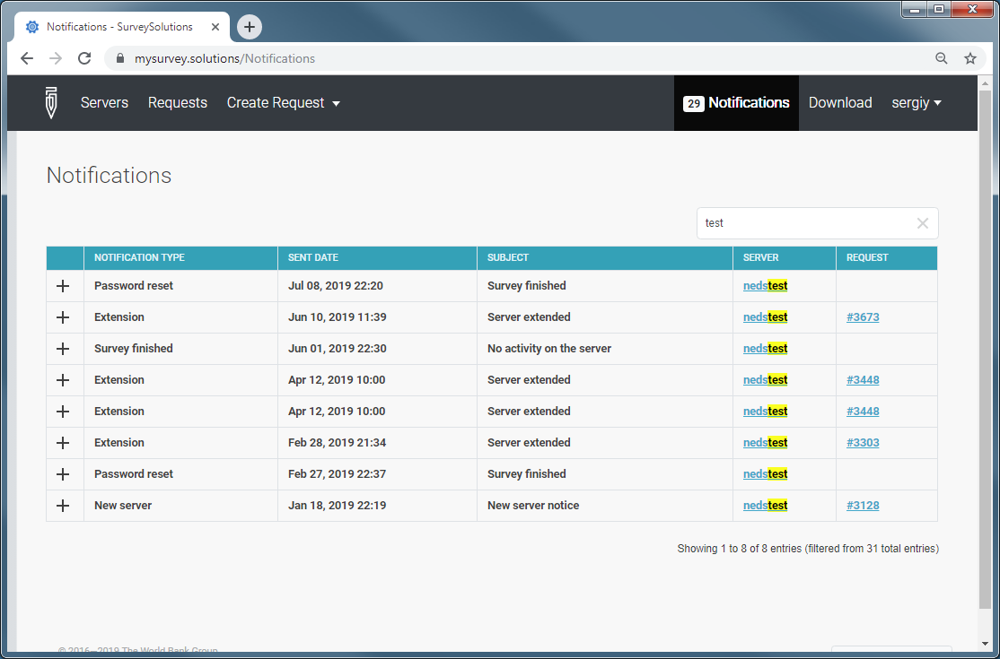
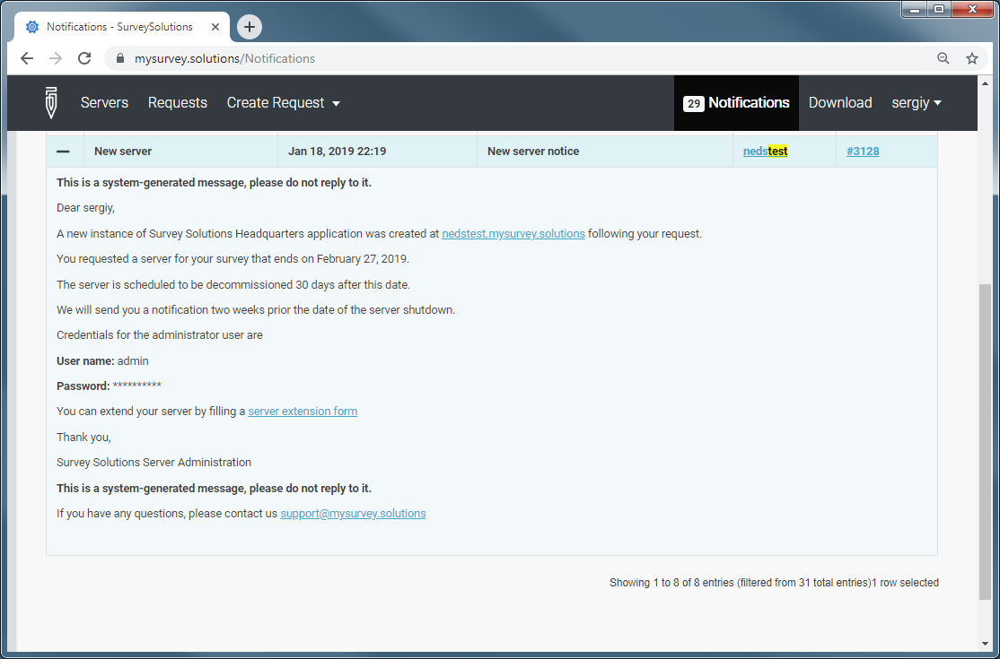
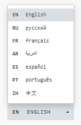

+++
title = "Self-service portal"
keywords = ["portal"]
date = 2019-09-04T12:00:00Z
lastmod = 2019-09-04T12:32:00Z
expirydate = 2020-11-01T12:00:00Z
+++

All data servers of Survey Solutions are requested and managed from the self-service portal.
To access the portal proceed to https://mysurvey.solutions

You will arrive to the following page: 

 

Click on the *Login* button at the top-right corner.

Sign-in with your Designer credentials. If you don't have Designer credentials yet, read
the message on the screen how to obtain it.

 

### Main menu

 

The main menu at the top of the portal takes you to the following pages:

- ***Servers*** - list of the currently existing servers.
- ***Requests*** - list of all created requests for server creation and maintenance.
- ***Create request*** - create a new request for server creation or maintenance.
- ***Notifications*** - list of messages sent-out by the Survey Solutions to you.
- ***Download*** - download link for the local server installation.
- ***Account*** - sign-out from the self-service portal.

### Servers page

After authentication, you will be taken to the **Servers** page. Here is the list of your currently existing (active or inactive) servers.

 

For each server the following information is shown in the columns of the table:

- ***Server*** - server prefix/name, the full address of the server shall be : https://YourServerPrefix.mysurvey.solutions
- ***Version*** - the version of the Survey Solutions package installed on the server
- ***Description*** - description of the server / name of the survey.
- ***Server owner*** - always your account login to the Survey Solutions system.
- ***Created on*** - date when the server was created.
- ***Start date, finish date*** - the start and finish dates as specified in the request for a server.

<TABLE width=50%><TR><TD>
**IMPORTANT: The list only shows the cloud-based servers provided by the
Survey Solutions developers team! Standalone servers are not shown in this table.**
</TD></TD></TABLE>

Servers shown in red are inactive servers (stopped).

Clicking on the PLUS sign opens up detailed information about the server that was specified in the request (see below).

Clicking on the server name will take you to that server's login page.

Right-clicking on the server name will open a context menu with the following available actions:

- ***Open*** - view the timeline and information about that server.
- ***Request server extension*** - creates a new server extension request for this server.
- ***Request to stop the server*** - (careful!) create a new request to stop/erase/destroy the server and all data.
- ***Transfer server*** - create a new request to transfer server ownership to another user.

 

### Requests page

The requests page lists all of your submitted requests for servers creation and maintenance.

 

For each request the following information is listed in the columns of the table:

- ***Request number*** - refer to this request number in the inquiries to support.
- ***Server name*** - prefix/name of the server that the request is related to.
- ***User*** - your account name
- ***Project code*** - for the servers used in the World Bank projects the project code.
- ***Request status*** - status of this request (e.g. submitted, completed, rejected, etc)
- ***Request type*** - type of the submitted request (new server, server extension, etc).
- ***Deadline*** - date by which the request to be processed.

### Create request

This menu allows creation of new requests of the following types:

- ***New server request***;
- ***Server extension request***;
- ***Transfer server ownership***.

Each request is an electronic form that must be filled out by the user. Incomplete, 
inaccurate or misleading information may delay processing or cause the request to be 
rejected. After the submission each request is assigned a 4-digit request number and 
appears in the requests list (see requests page above).

See also the relevant information on [cloud server requests](/faq/cloud-server-request/).

### Notifications

The notifications page shows the list of notifications messages sent out by the system or
the servers maintenance team to you. If you are not seeing these messages in your email
box, check your spam folders.

 

The following information is shown in the columns of the table of notifications:

- ***Notification type*** - type of the notification, such as extension, password reset, etc;
- ***Sent date*** - date and time when the notification was sent out via the Survey Solutions portal;
- ***Subject*** - subject of the notification message;
- ***Server*** - prefix/name of the server that the notification concerns;
- ***Request*** - the request number (if applicable) that the notification concerns.

Clicking on the PLUS sign allows to view the text of the notification that was sent out.

 

<TABLE width=50%><TR><TD>
**IMPORTANT: new server notifications shown in the portal do not reveal the password
assigned initially by the system to the default admin account. This information is
shown as asterisks: &ast;&ast;&ast;&ast;&ast;&ast;&ast;&ast;&ast;&ast;. The actual
password may only be seen in the actual message received by email in your mail inbox.
This is intended.**
</TD></TD></TABLE>

Use the search box at the top of the table to filter the table to e.g. notifications
related to a particular server.

Number of new (unread) notifications is shown in the main menu next to the notifications
menu item (as shown in the illustration: 29).

<TABLE width=50%><TR><TD>
**IMPORTANT: Notifications are sent from an unsupervised email account. Do not reply to the 
notification address as we will not be able to receive/process such messages.**
</TD></TD></TABLE>

### Download

Download takes you to the page where an installation file of the data server part of
the Survey Solutions software may be acquired.

The page shows the version of the software, approximate size of the download, and
the link to installation instructions.

<TABLE width=50%><TR><TD>
**IMPORTANT: Before the local server becomes operational, a request for the local
server installation of Survey Solutions must be submitted and approved.**
</TD></TD></TABLE>

### Account menu

The account menu allows you to sign out of the portal. The portal contains sensitive
information about your server.

Remember to sign out of the portal after you finish your work! The server will 
timeout your session after 20 minutes of inactivity, but will not require a 
password to renew an abandoned session!

 

Do not share your Designer password! This will allow the other person to gain access
to the portal, then your server, then your data.

### Portal language

At the bottom of the page there is a selector for the language of the portal.

 

You can make an adjustment to another language if the default language is not the most convenient to work with.