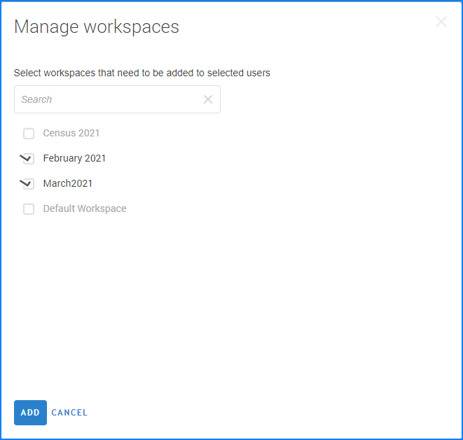
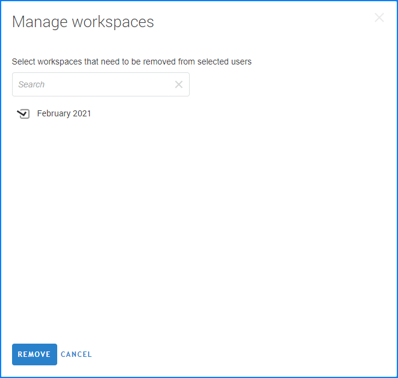
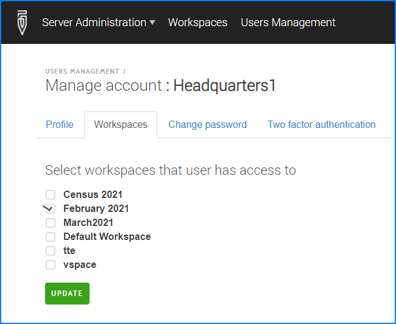
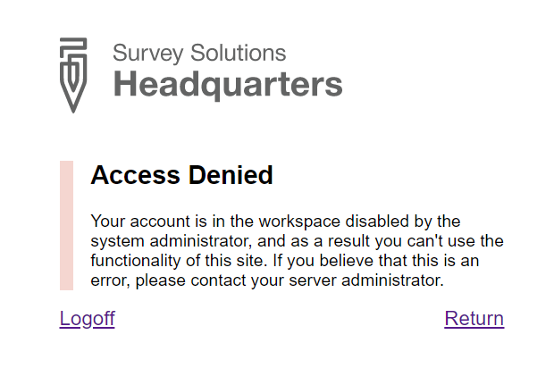

+++
title = "Adding Users to Workspaces"
keywords = ["user access", "permissions", "isolate"]
date = 2021-03-01T10:10:10Z
lastmod = 2021-03-01T10:10:10Z

+++

Some users (Headquarters, API users) may be granted access to more than 1
workspace. This access is granted by the server administrator at the `Server Administration` --> `User Management` page.

To give access to a certain workspace, the administrator selects the user
account(s) from the list of all user accounts on the server, then selects
`Add to Workspaces`.

  

In the dialog window that appear, administrator should select the names
of the workspaces that the user should be granted access to, and confirm
the changes. As a result, the selected users are granted access to the
workspaces, which are selected in the dialog. Any other workspaces that
they had access to previously will be still accessible.

To remove access to a certain workspace, the administrator selects the
user account(s) from the list of all user accounts on the server, then
selects `Remove from Workspaces`.

  

In the dialog window that appear, administrator should select the names
of the workspaces that the user should be eliminated from, and confirm
the changes. As a result, the selected users are denied access to the
workspaces, which are selected in the dialog. Any other workspaces that
they had access to previously will be still accessible.

Alternatively, for a single user the administrator can access the account
profile in the server and select the `workspaces` tab.

  

The checkmarks in this dialog indicate the workspaces that the selected
user currently has access to. The administrator can add or remove access
to any workspaces by adding and removing the appropriate checkboxes. Any
such changes are applied immediately on pressing the `Update` button.

Note also that a user may be left without access to any workspace. In this
case when that user tries to log in, he or she will be denied access to the 
system:

  

