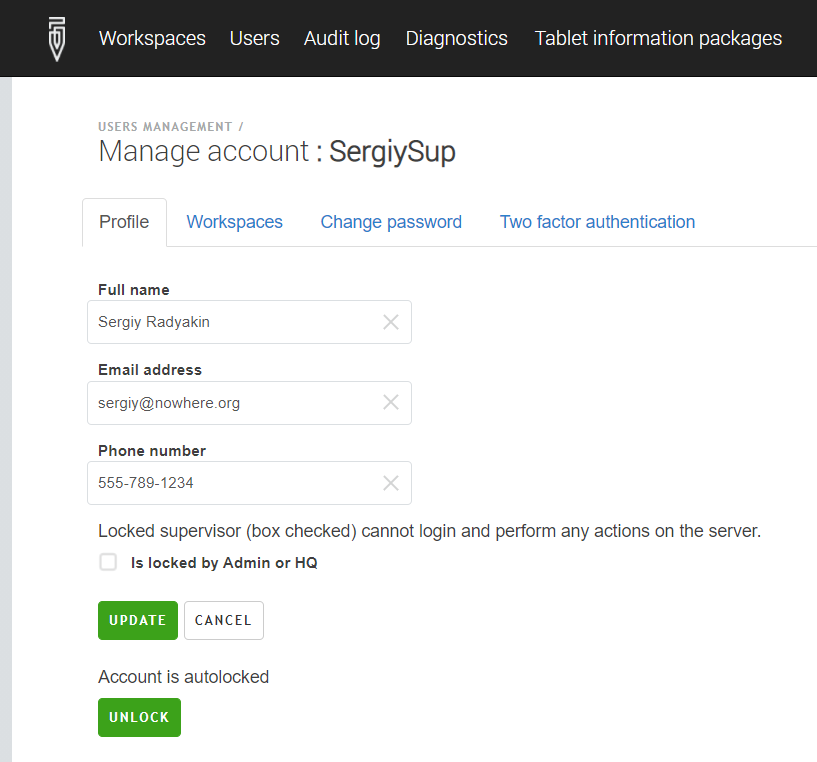

+++
title = "Autolock"
keywords = ["account", "security", "captcha"]
date = 2021-06-23T10:10:10Z
lastmod = 2021-06-23T10:10:10Z

+++

To protect the safety of the data and prevent disruptions to the operations due
to hacker attacks, the system responds to attempts to guess a user's password.

<CENTER>
  <A href="images/3state.png">
     
  </A>
</CENTER>

In the _normal_ state, the user needs to enter just the login name and password to
access the system. If, however, she makes multiple attempts to log in with an
incorrect password, the system raises to the _elevated_ state.

To log in in the _elevated_ state the user needs to supply her login name,
password, and additionally solve a _CAPTCHA_ challenge.
[Read more about CAPTCHAs](/headquarters/accounts/captcha/).

If the user enters multiple wrong combinations of user names and passwords in
the _elevated_ state, the system passes to the _locked_ state, where the user
with this name cannot log in for the predefined duration of time.

<CENTER>
  <A href="images/locked_account_with_captcha.png">
     
  </A>
</CENTER>

The parameters of this defensive strategy are:

- the number of attempts before transition from _normal_ to _elevated_ state
is fixed at 5;
- the number of attempts before transition from _elevated_ to _locked_ state
is defined in _MaxFailedAccessAttemptsBeforeLockout_ parameter in the
_Authentication_ section of `appsettings.production.ini` file;
- duration of the _locked_ state, as defined in the parameter _LockoutDuration_
in the following format `d.hh:mm:ss`, where:

  - **d** is days (assumed 0 if omitted);
  - **hh** two digits for hours (mandatory);
  - **mm** two digits for minutes (mandatory);
  - **ss** two digits for seconds (mandatory).

The exact values of these parameters are up to the security expert to determine.

Note that the counters of incorrect login attempts and locking are on the
per user basis. For example, if the accounts of users _John_ and _Mary_ are
locked, users _Peter_ and _Irene_ may still be able to log in.

Note also that when autolock gets activated, this doesn't disable the user that
has already logged in.

System administrators should not rely solely on these _CAPTCHA_ and _autolock_
features to ensure the safety of their data. They should use the time of the
automatic lockout to trace the IP addresses from which the attack is being
staged to disable further communication with them, and apply all other tools
available to them to prevent unauthorized access to the collected data.

### Releasing the autolock by the administrators using the UI

The Survey Solutions administrator can release the autolock that has been
engaged from the user's profile by pressing the `UNLOCK` button.
<BR>

<details>
   <SUMMARY>Administrator's view of the autolocked account.</SUMMARY>
   <CENTER>
     <A href="images/unlock_button.png">
        
     </A>
   </CENTER>
</details>

<BR>
The users in HQ role can see the status of the account, but can not remove
the autolock:
<BR>

<details>
   <SUMMARY>HQ-user's view of the autolocked account.</SUMMARY>
   <CENTER>
     <A href="images/hq_view.png">
        
     </A>
   </CENTER>
</details>
<BR><BR>


### Releasing the autolock from console

To release the autolock that has already engaged before it expires automatically
requires OS-access to the server where Survey Solutions is installed. This
maintenance can be performed by the person who installed Survey Solutions.

We will need to run the command: `releaselock` with parameters
`--username` or `--login`. For example:

```
.\WB.UI.Headquarters.exe manage users releaselock --login loginName
```
You need to run this command while in the directory where the file
`WB.UI.Headquarters.exe` is located.
