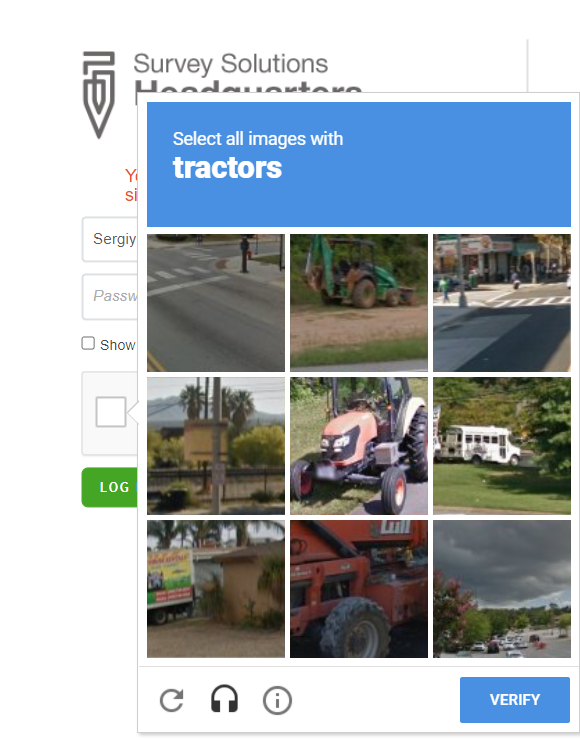
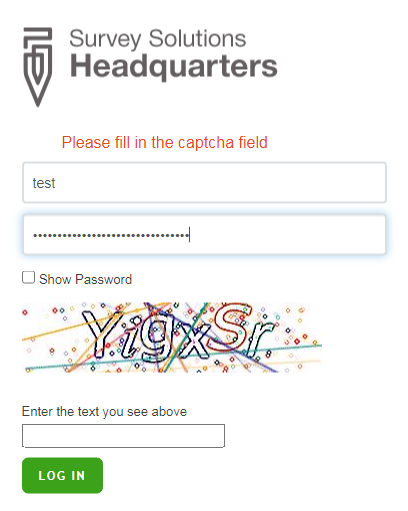

+++
title = "CAPTCHA"
keywords = ["account", "security", "captcha"]
date = 2021-06-23T10:10:10Z
lastmod = 2021-06-29T10:10:10Z

+++

A [brute-force attack](https://en.wikipedia.org/wiki/Brute-force_attack)
(aka BF-attack) is an attack on the system by probing of all possible
combinations of inputs to the login forms (user names, passwords, and any
other information there).

If a system is able to tell humans from computers apart, it can defend itself
from mechanical guesses.

A [_CAPTCHA_](https://en.wikipedia.org/wiki/CAPTCHA) is a challenge that humans
 can solve easily, while computers have difficulties with. Thus a _CAPTCHA_
 serves as an effective, (though not completely bullet-proof) mechanism for
 protecting a system from brute-force attacks.

When a certain number of incorrect login attempts occur, the Survey Solutions
 login form will start asking a CAPTCHA challenge:

  

The above shown _CAPTCHA_ shows if the server administrator has [configured
Survey Solutions to utilize Google's captcha service](/headquarters/config/server-installation/#captcha).
If this service is not used, Survey Solutions will rely on its built in
_CAPTCHA_, which appears like the following:

  

If the user continues to enter incorrect combinations of login/password even
with the CAPTCHA, an [autolock](/headquarters/accounts/autolock/) will
eventually engage.
