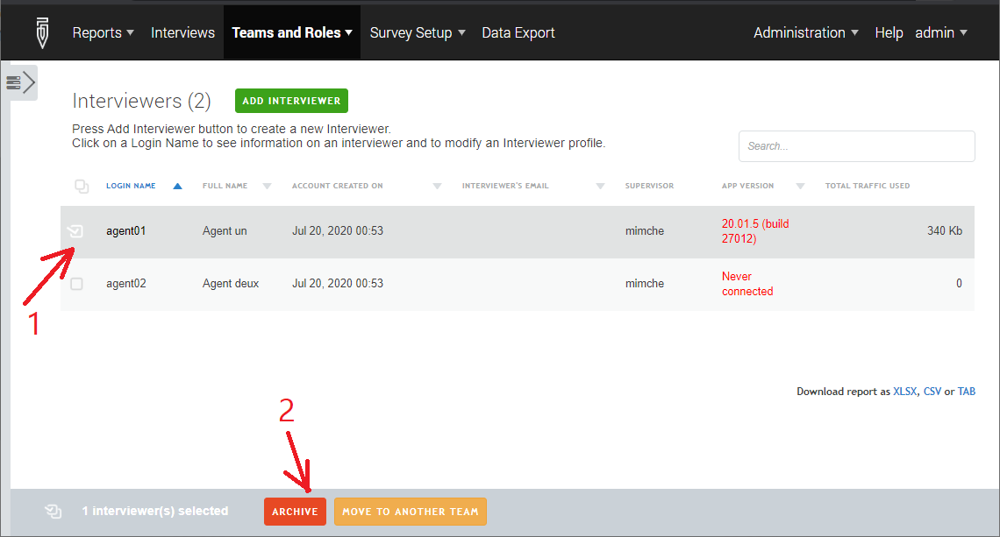

+++
title = "Deleting accounts"
keywords = ["users","server","login","account"]
date = 2020-07-28T00:00:00Z
lastmod = 2020-07-28T00:00:00Z

+++

Deleting accounts
------

An account that is created in Survey Solutions can not be **deleted**. Ever. This is because the account is mentioned in the history of the events that were originated by that user (such as created or completed an interview).

Yet an account can be **archived**, which is the closest thing to deleting it.

This action is available to an administrator only, which can (1) select the interviewer account to be archived and (2) click the *Archive* button to perform the action:

Only interviewer and supervisors accounts may be archived.
A confirmation will be required to make sure you don't disable an account by mistake.

An account that is archived:

- may not be used to log in to the system through the web interface;
- will not be accepted for synchronization;
- will not be available as a selection in drop-down selections for responsible for interviews and assignments, and be similarly suppressed from other dialogs in the system which imply an active account.

Accounts that are archived may be subsequently un-archived. To do this, as an administrator proceed to the interviewers page, select *"Archived interviewers"* instead of the default *"Active interviewers"* in the filter. Then select the account and click *Unarchive*.

The procedure for the supervisors is exactly the same. Take a note, then when a supervisor account is archived, all of its interviewers' accounts are also archived.
