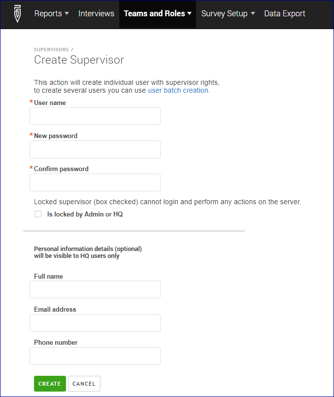

+++
title = "Creating User Accounts "
keywords = ["create user","create supervisor","create interviewer","accounts"]
date = 2016-06-30T06:28:59Z
lastmod = 2020-07-28T00:00:00Z
aliases = ["/customer/portal/articles/2482233-teams-and-roles-tab-creating-user-accounts-","/customer/en/portal/articles/2482233-teams-and-roles-tab-creating-user-accounts-","/customer/portal/articles/2482233","/customer/en/portal/articles/2482233","/headquarters/teams-and-roles-tab-creating-user-accounts-","/headquarters/accounts/teams-and-roles-tab-creating-user-accounts-"]

+++

The *Teams and Roles* menu provides tools for managing the human
resources responsible for data collection:

- The following accounts may be created by the users in the role **Headquarters** or **Administrator**:
  - interviewer and
  - supervisor accounts.

- The following accounts may be created by the users in the role **Administrator** only:
  - headquarters,
  - observers, and
  - API accounts.


  The *Teams and Roles* menu also provides access to the [batch user upload
  feature](/headquarters/batch-user-upload), where up to 10,000 user
  accounts can be created from a single tab-delimited file. To learn more
  about batch user upload, please refer to [this article](/headquarters/accounts/batch-user-upload/).  


### Creating accounts

To add a supervisor, we select *Teams and roles* in the main menu, then
*Supervisors*, and then click the *Add supervisor* button. For a new account
of a supervisor role we need to fill out the following form (the full name,
contact email and phone number fields are optional):

    

Administrators can similarly create headquarters,
[observer](/headquarters/accounts/survey-solutions-server-observer/) and API
accounts filling out exactly the same forms.

When creating interviewer accounts, one must additionally specify to
which team the interviewer is assigned by selecting the appropriate supervisor's
name. Correspondingly, to create a team, first create the supervisor, then
the interviewers of the team, not other way around.


An account can not be **renamed**. If you make a typo in the account name, you will need to create another one.



Interviewer accounts **may not be created** by supervisors,
but **may be edited** by their supervisors, see the next section.


### Editing accounts.

To modify the details of an existing supervisor account, click on the
account's username listed in the *Name* column of the corresponding
list (interviewers, supervisors, headquarters, etc). This will take you
to the user's profile where you can:

- change the password for the account, or
- lock access to the account, or
- update the name/email/phone associated with an account.


Interviewers may be transferred from one team to another by
a Headquarters or an administrator user. This operation is
not done in the interviewer's profile, but on the list of
interviewers.



Interviewers may update their contact information if permitted
by the server administrator, see user profile settings in
[admin settings](/headquarters/config/admin-settings/).




- **Interviewers** may never change their own password. They must rely
on their superiors to assist with this matter.

- **Supervisors** may change passwords of interviewers of their team
(without the need to know the original password) and can change
their own password (must enter old password).

- **Headquarters** users may change the password of any of the
supervisors or interviewers (without the need to know the
original password) and can change their own password (must enter
their old password).

- **Administrator**  may change any password (without knowing the
original one) except of his own (without which he can't even
login).

In addition to password protection, since version 20.05 of
Survey Solutions, any user may set up a [2-factor authentication](/headquarters/accounts/two-factor-authentication/) for using the server accounts.

See also [password best practices](/interviewer/app/password-best-practices/)

