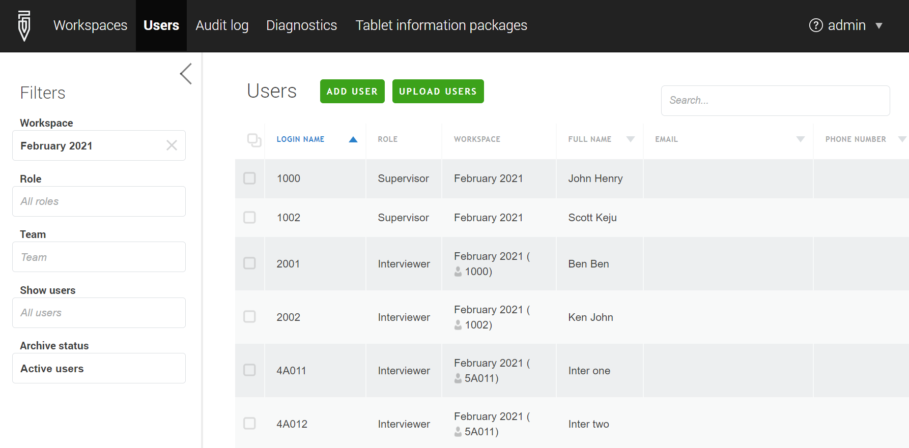
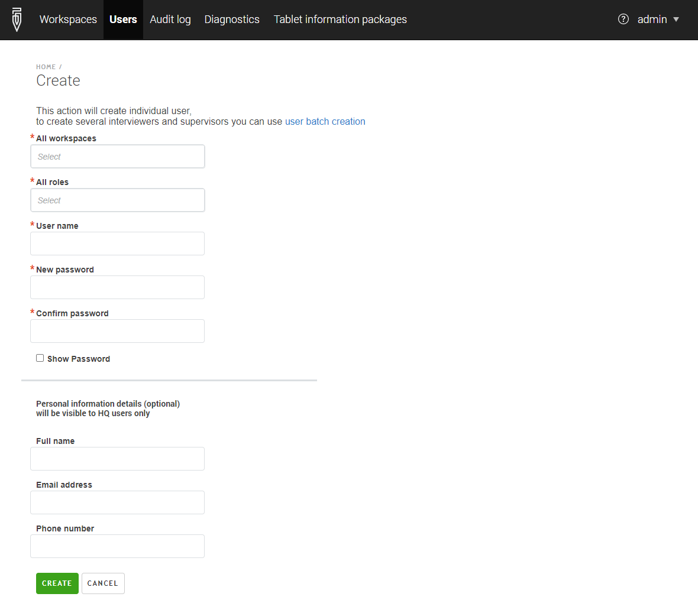

+++
title = "Creating User Accounts "
keywords = ["create user","create supervisor","create interviewer","accounts"]
date = 2016-06-30T06:28:59Z
lastmod = 2020-07-28T00:00:00Z
aliases = ["/customer/portal/articles/2482233-teams-and-roles-tab-creating-user-accounts-","/customer/en/portal/articles/2482233-teams-and-roles-tab-creating-user-accounts-","/customer/portal/articles/2482233","/customer/en/portal/articles/2482233","/headquarters/teams-and-roles-tab-creating-user-accounts-","/headquarters/accounts/teams-and-roles-tab-creating-user-accounts-","/getting-started/create-user-accounts-for-your-team-"]

+++

Management of the user accounts is performed from the `Users` page, which
is accessible for **Headquarters** or **Administrator** users by clicking the
Cog-wheel icon in the menu bar (`Administration`) and then selecting `Users`.

    

### Creating accounts

To add a supervisor, we click the `ADD USER` button. We then need to fill out
the following form (the full name, contact email and phone number fields are optional):

    

Administrators can similarly create headquarters,
[observer](/headquarters/accounts/survey-solutions-server-observer/) and API
accounts filling out exactly the same forms.

Survey Solutions **does not** utilize the contact information (specified in the
full name, contact email and phone number fields) to make automatic
notifications or robocalls. Instead this information is stored for convenience
of the survey managers (HQ and team supervisors) if they need to reach, for
example, a particular interviewer.

When creating interviewer accounts, one must additionally specify to
which team the interviewer is assigned by selecting the appropriate supervisor's
name. Correspondingly, to create a team, first create the supervisor, then
the interviewers of the team, not other way around.


An account can not be **renamed**. If you make a typo in the account name, you will need to create another one.



Interviewer accounts **may not be created** by supervisors,
but **may be edited** by their supervisors, see the next section.


Users in the role **Administrator** can create accounts in the following roles:
  - interviewer,
  - supervisor,
  - headquarters,
  - observers, and
  - API accounts.

Users in the role **Headquarters** can create accounts in the following roles:
- interviewer, and
- supervisor.

### Uploading accounts.


  The `Users` page also provides access to the [batch user upload
  feature](/headquarters/batch-user-upload) via the `UPLOAD USERS` button. In
  this case up to 10,000 user accounts can be created from a single
  tab-delimited file that is prepared and uploaded to Survey Solutions data
  server. To learn more about batch user upload, please refer to
  [this article](/headquarters/accounts/batch-user-upload/).


### Editing accounts.

To modify the details of an existing account, click on the
account's username listed in the *Name* column of the corresponding
list (interviewers, supervisors, headquarters, etc). This will take you
to the user's profile where you can:

- update the name/email/phone associated with an account, or
- change the password for the account, (available to administrator users only) or
- change the two-factor authentication for an account (available to administrator users only) or
- set/reset locks associated with the account (available to administrator users only).

### Transferring interviewers

Interviewers may be transferred from one team to another by
a Headquarters or an administrator user. This operation is
not done in the interviewer's profile, but on the list of
interviewers.


Interviewers may update their contact information if permitted
by the server administrator, see user profile settings in
[admin settings](/headquarters/config/admin-settings/).




For resetting the accounts' password, see [Password issues](/faq/password-issues/).

In addition to password protection, since version 20.05 of
Survey Solutions, any user may set up a [2-factor authentication](/headquarters/accounts/two-factor-authentication/) for using the server accounts.

See also [password best practices](/interviewer/app/password-best-practices/)


**_Teams and Roles_ Menu**

The *Teams and Roles* menu provides lists of supervisors and interviewers to
provide access to their profiles (for the supervisors only the list of
interviewers of their own team is accessible).

The `Interviewers` list shows the list of the interviewer accounts in the current workspace with their attributes:
- Login name;
- Full name;
- Date the account was created;
- Email address;
- Date of last login;
- Supervisor name (aka team name);
- Interviewer App version;
- Total traffic used.

The list of interviewers may be filtered by:
- supervisor - to show the list of interviewers in a specific team (reporting to a specific supervisor within the current workspace);
- common interivewer issue:
  - no issue,
  - never connected,
  - no assignments received,
  - never uploaded,
  - tablet reassigned,
  - old version,
  - less than 100MB free space.
- archival status (*active* or *archived*).

The `Supervisors` list shows the list of the supervisor accounts in the current workspace with their attributes:
- Login name;
- Date the account was created;
- Email address;
- Archival status (*no*=*active*, *yes*=*archived*).

The supervisors list doesn't have filters.

Both interviewers and supervisors lists provide a search functionality where the list is reduced to accounts mentioning a particular substring, which allows locating a particular account by login name when the list of the corresponding users is long to avoid navigation through multiple pages (each page shows up to 20 accounts only).

Lists of accounts with their attributes can be exported from these pages to a downloadable file in XLSX, CSV, or TAB formats by clicking the corresponding link in the page footer.

#### See also
- [Password change](/faq/password-change/).
- [Password best practices](/interviewer/app/password-best-practices/).
- [2-factor authentication](/headquarters/accounts/two-factor-authentication/).