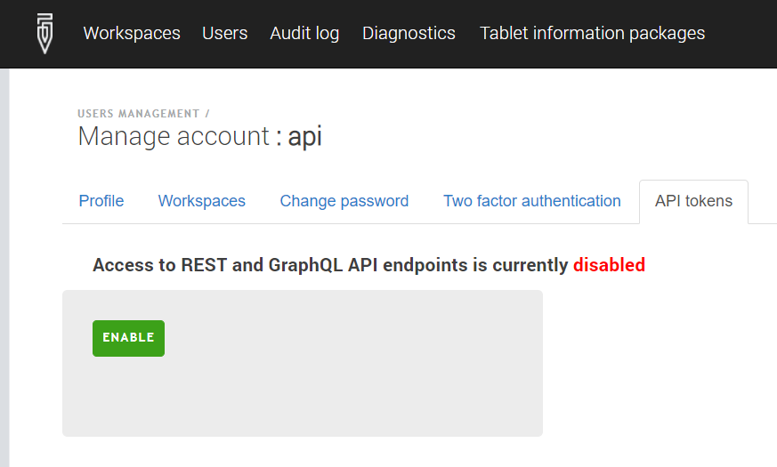
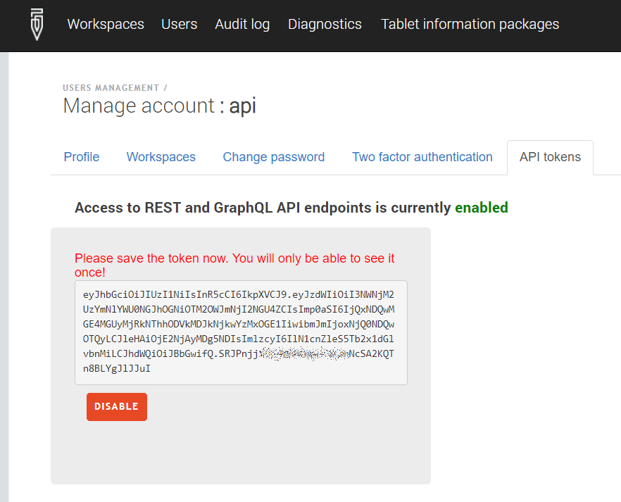

+++
title = "Token-based authentication"

keywords = ["account", "security", "token", "API"]
date = 2022-02-09T00:00:00Z
lastmod = 2022-02-09T00:00:00Z

+++

Survey Solutions supports two methods of authentication for API queries: Basic (a combination of the login and password) and Bearer (using a system-generated token) also known as JSON Web Token (JWT).


## Activation of the token-based authentication for the server

By default token-based authentication is switched off. To activate it, the server configuration file must be modified to include the following section:
```
[JwtBearer]
Enabled=true
SecretKey=[..............]
```

For the `SecretKey` specify any alphanumeric key of at least 16 digits/characters long. Save the settings file and restart the server.


## Activation of the token-based authentication for an account

After the restart it will be possible to enable token-based authentication for a particular account:

<CENTER>
  <A href="images/api_tokens_enable.png">
     
  </A>
</CENTER>


Once the ENABLE button is pressed, the software will generate a new token for this account and display it:

<CENTER>
  <A href="images/api_tokens.png">
     
  </A>
</CENTER>

At this time copy the token that can be seen in this window to a secure file from which you can later consume it using your API queries.
If you disable token-based authentication and then re-enable it again, the software will generate a different access token and invalidate the earlier generated one.

## Use of token-based authentication

To authenticate your queries, add the following to its HTTP-headers:
```
“Authorization: Bearer TOKEN”
```
For example, if using the Requests module in python, then write:
```
requests.get('url', headers={'Authorization: 'Bearer YOURTOKENVALUE'})
```

## More information

Formal description of the JWT standard is given in [RFC 7519](https://datatracker.ietf.org/doc/html/rfc7519).
An overview is available at https://jwt.io/introduction
