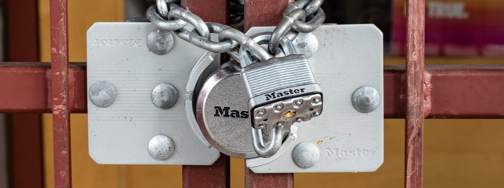
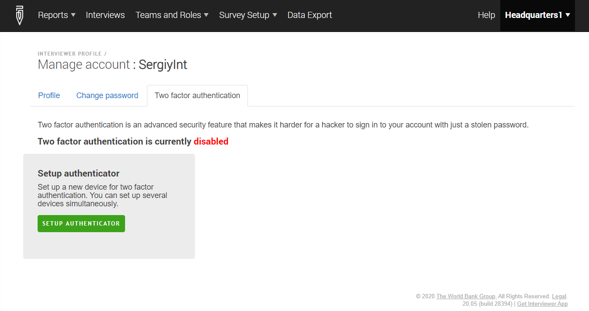
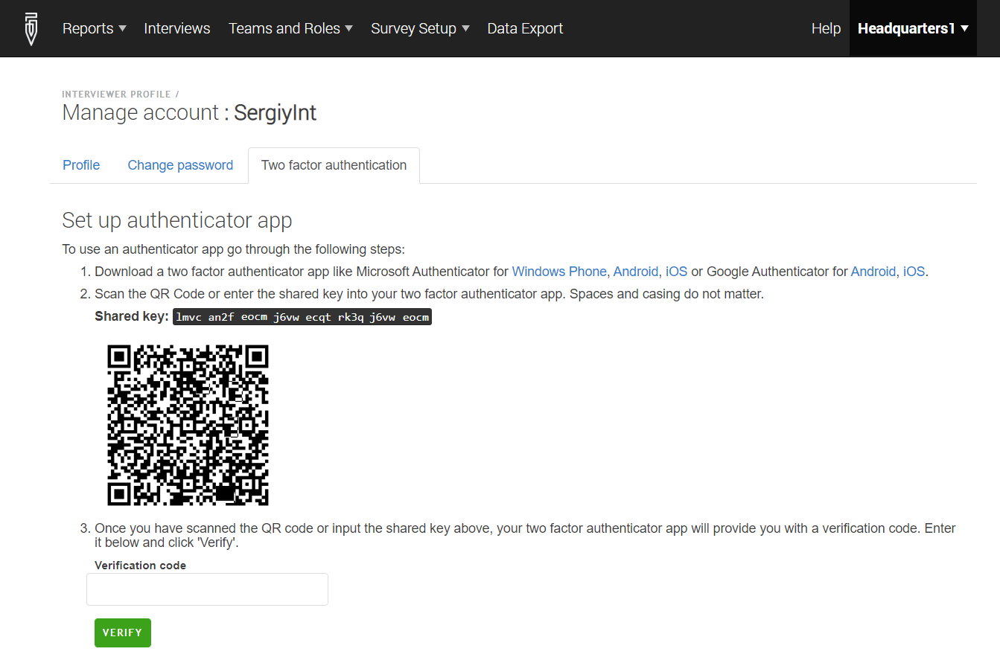
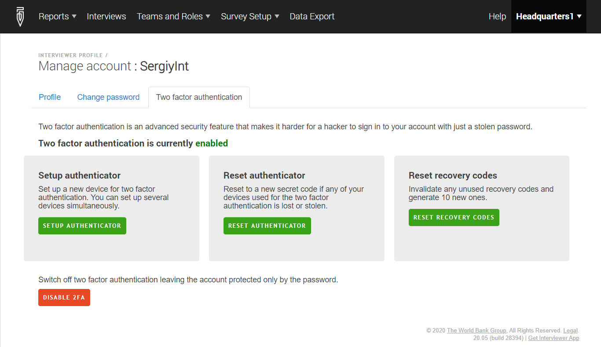
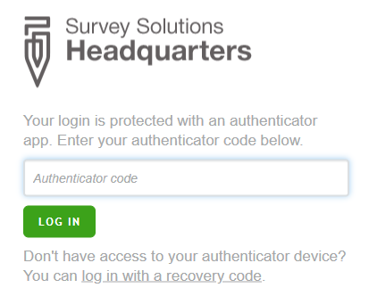
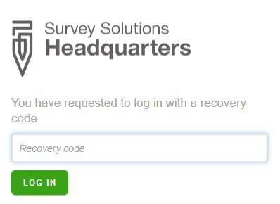

+++
title = "Two factor authentication (2FA) for user accounts"
keywords = ["security","password"]
date = 2020-05-13T10:10:10Z
lastmod = 2020-05-13T10:10:10Z

+++

  

### Setting up two factor authentication 

1. login to the server using your login and password;
2. navigate to your account settings (for interviewers: 
**Interviewer profile** --> **Edit personal info**);
3. click the **Two factor authentication** tab;
4. click the **Setup authenticator** button;

  

5. You will be presented with the **Configure authenticator app** form showing a QR-code.

  

6. Now take your Android, IOS or Windows phone or tablet and set up 
any of the following applications: Google Authenticator, Microsoft 
Authenticator, or another authenticator as designated by the survey 
coordinator.
7. Scan the QR-code from step #5 with this app. 
8. The authenticator app will display a *verification code*. Enter 
this code into the field **Verification code** in the Survey 
Solutions form showing the QR-code.
9. By entering the correct verification code you are activating the 
two factor authentication. The program will display 10 single use 
*recovery codes* that can be used to access your account if the 
device that was set up with the authenticator app is lost, damaged, 
stolen, or otherwise not accessible. Take a note of these codes and 
store them in a secure location.

  

### Accessing your account with two factor authentication

1. Login to the server using your login and password;
2. If the two factor authentication was set up correctly using the 
above instructions, you will be then challenged to enter the 
*authenticator code* - the code that is currently displayed in the 
authenticator app installed on your mobile device.

  

3. Once a correct code is entered, you will be taken to the default 
page of the site corresponding to your user role.

4. If you no longer have access to authentication codes generated 
by the authenticator app, you may employ the single use recovery 
code. To do this select the link **log in with a recovery code**.

5. Enter the recovery code in the next form and mark it as used. Each 
code may be used only once:

  

### Generating additional recovery codes
At any time when two factor authentication has been set up and you 
are logged in, you can request a new batch of 10 recovery codes to 
be generated by clicking the **Reset Recovery Codes** button. The 
previous (used and unused) recovery codes will no longer be acceptable.

Store the recovery codes in a safe place for emergency cases. Do not 
store them on the same device where you've installed the authenticator 
app.

When you've used 7 or more of the codes (when 3 or less remain 
available) you will get a warning about this. At this time consider 
generating a new batch of the recovery codes.

### Resetting authenticator
Resetting authenticator allows to regenerate the private secret value 
associated with the user account. As a consequence, any codes that 
are generated by the authenticator app(s) that were earlier set up 
with this account will no longer be valid, and these apps will need 
to be re-configured again using the newly displayed QR-code.

If you chose to reset the authenticator, but do not enter the new 
verification code, your account will be left without the two factor 
authentication.

Resetting the authenticator does not disable the recovery codes. A 
batch of new recovery codes may be generated if necessary using the 
procedure outlined above.

### Resetting two factor authentication
Any user that has his access lost because of the two factor 
authentication must refer to a higher positioned user: interviewers 
to supervisor, supervisor to headquarters, headquarters to admin. 
That user will be able to turn off the two factor authentication or 
reset it to be used with a different device.

If this reset is done remotely the QR-code may not be used, and the 
user should enter into the Authenticator App the shared key that is 
displayed directly above the QR-code.

The admin user that has lost the possibility to enter the site 
because of the two factor authentication (e.g. the phone lost and 
recovery codes exhausted) will need to directly access the server 
to reset his two factor authentication settings.

### Selecting authenticator app
You can use one or multiple authenticator apps for the same account, 
for example, if you need to set up on Android and Windows phones. 
The apps may be from different manufacturers as long as they conform 
to the standard described here: 
https://en.wikipedia.org/wiki/Time-based_One-time_Password_algorithm

Some examples include:

- [Google Authenticator](https://support.google.com/accounts/answer/1066447);
- [Microsoft Authenticator](https://www.microsoft.com/en-us/account/authenticator).

Your organization may create its own application conforming to the 
above mentioned algorithm to be independent of the vendors and 
fully control the source code.

⚠ The authenticator app's functionality 
depends on the accuracy of the clock settings of the device on 
which it is installed. 

To prevent unauthorized access to the authenticator app, make sure 
that the mobile devices where it is used are locked with a PIN, 
password, fingerprint or other similar technology.

### Glossary

**Authenticator code** - the code displayed by the authenticator app;

**Recovery code** - one of a set of 10 single use codes generated for 
the account to gain access to it when the mobile device with the 
authenticator app is no longer accessible (lost, stolen, damaged, 
etc).

**Shared key** - a string value generated by the Survey Solutions 
application to initialize the authenticator app.

**Verification code** - the first authenticator code used to confirm 
the correctness of the setup and verified by the Survey Solutions HQ.
