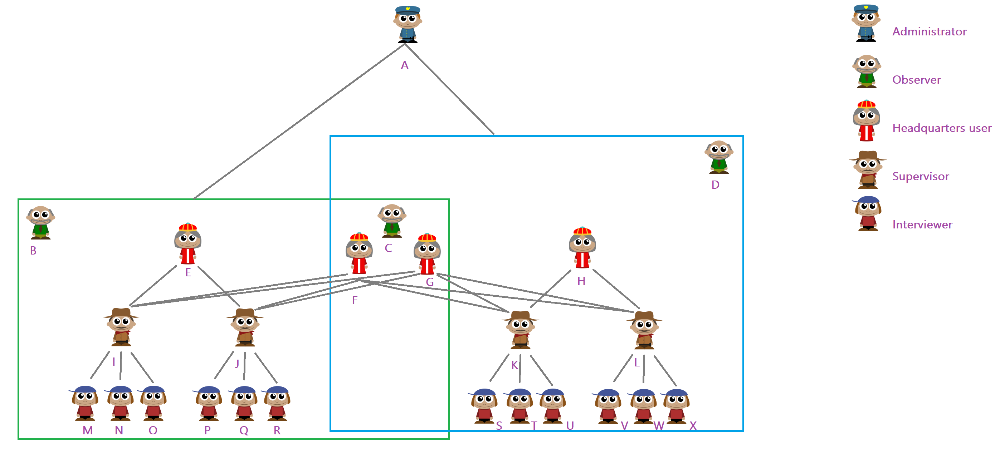

+++
title = "Workspaces"
keywords = ["workspace", "partition", "isolate"]
date = 2021-03-01T10:10:10Z
lastmod = 2022-05-010T10:10:10Z

+++

  

Workspaces allow partitioning of a single server into multiple compartments that have limited impact on each other.

The following are the rules guiding the use and functioning of the workspaces:

1. An administrator has access to all workspaces.
1. A user with an HQ and observer accounts may belong to one, some, or all workspaces, as designated by the administrator.
1. Each interviewer and supervisor account may log in to a single workspace.
1. User names are unique across all workspaces.
1. Questionnaires are imported into workspaces. Same questionnaire may be imported into different workspaces if necessary and their version numbering is independent.
1. Workspaces may be created, disabled, and deleted.
1. Disabling a workspace locks all activity in the workspace (stops web interviews, does not allow any user to log in). Users attempting to access a disabled workspace will receive a "Workspace Disabled" error page and must contact their survey coordinator for further instructions.
1. A workspace may be deleted only if it doesn't have any surveys/questionnaires.
1. Deleting a workspace actually deletes (not archives) all the user accounts (interviewer/ supervisor) and all the maps that were part of that workspace.
1. Deletion of a workspace is irreversible.
1. Administrator configures each workspace settings separately (logo, global message, export password, email providers, etc).
1. The troubleshooting tools available for administrator (audit log, device logs, tablet information packages, etc) are separated by workspaces.
1. Users having access to multiple workspaces may switch between them using a workspace selector without the need to log in to each workspace separately.
1. Reports are built based on the content of a single workspace.
1. A special workspace named 'primary' is always defined and can not be disabled or deleted. Any server updated from earlier Survey Solutions versions will place all the earlier entered data (including survey data, user accounts, maps, etc) into the primary workspace.
1. An observer may observe only in the workspaces in which he is permitted by the administrator, even if impersonating users that have access to other workspaces.
1. Each workspace is assigned an identifier `name` and a text label `display name`. The text label is shown to the users when they switch between the workspaces, while the identifier is used for forming the URLs in API calls. See more in the *Workspace attributes* section below.

To manage workspaces, the menu item `server administration` (available for administrators only) now leads to the list of the workspaces defined on the server. The settings and troubleshooting tools collected in the context menu were previously relevant for the whole server, but now are attributable to a particular workspace. For each enabled workspace the following actions are provided in the workspace context menu:

- Edit,
- Settings,
- Email providers,
- Device logs,
- Audit log,
- Tablet information packages,
- Disable*
- Delete*

*) The actions to disable and delete a workspace do not apply to the primary workspace.

Disabled workspaces may only be turned back on or deleted, so their context menu is smaller:

- Enable
- Delete

### List of users on the server

Users on the server are distinguished by the accounts and the full list of all
accounts on the server is available by accessing the `Server administration` -->
`Users Management` page.

The list supports filtering by workspace and role of the user, as well as
narrowing down the users to a particular group:

- 'missing workspaces' - users not assigned to any workspace.
- 'with disabled workspaces only' - users that don't have access to any enabled workspace.
- 'locked users' - users with an account lock placed on them.
- 'archived users' - users that have been archived.

A search box allows to seek the list for a user with a particular account
name or a full name.

### Workspace attributes

Every workspace has the following attributes:

- `name`;
- `display name`.

#### Workspace `name` attribute

The attribute `name` is an alphanumeric identifier of the workspace, a combination of digits `0..9` and small Latin letters `a..z` from 1 to 12 characters long. No spaces are permitted in the `name` of a workspace. The `name` is used to form the URLs to the resources located in this workspace (such as the links to the web-interviews, for example).

The `name` of each workspace must be distinct from the name of any other workspace on the server, and cannot be changed once the workspace is created.

Examples of the `name` attribute include: "*lfs2024*", "*census2025*", "*monitoring*", "*2026*".
Note that `name` may start with a digit or consist solely of digits (in contrast to variable names).

Reserved names: the system excludes some names as reserved. Users can create workspaces with any other names except the following: "*administration*", "*api*", "*apidocs*", "*graphql*", "*users*".

#### Workspace `display name` attribute

The attribute `display name` is a human-readable title assigned to a workspace to be displayed wherever a choice must be made between multiple workspaces or to identify the currently selected workspace. It can be typed in any language and may include spaces (multiple words). It must be anywhere from 1 to 300 characters long. If it includes multiple whitespace characters sequentially, they will be replaced with a single space character.

NB: the system technically allows one to create two or more workspaces with the same `display name`, but this is not recommended in practice.

Examples of `display name` may be "*Labour force survey*", "*Перепис населення 2025*", "*Price survey*", "*The United States of America*".

The `display name` of a workspace can be changed after the workspace is created if necessary (click on the workspace name and select `Edit` from the context menu that appears).

#### Default workspace

When a new Survey Solutions server is created the first workspace is created automatically and is given `name`="*primary*" and `display name`="*Default workspace*". The workspace can be given a different `display name` if necessary, but the automatically created workspace with name `primary` may not be deleted or disabled.

If the Survey Solutions server is upgraded from a version before the workspaces were introduced (from version before v21.01) then all the previously arranged data (questionnaires, assignments, interviews, maps, etc) will be automatically placed into the *Default workspace*.
