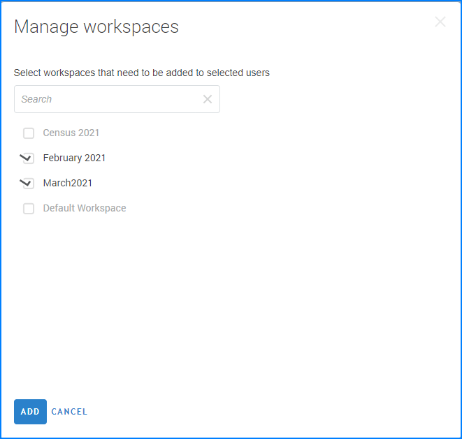
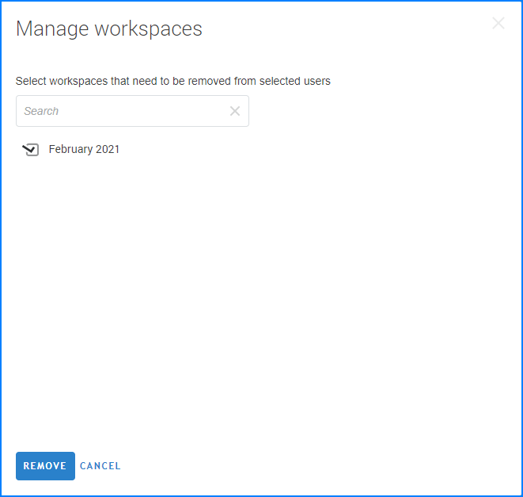

+++
title = "Workspaces"
keywords = ["workspace", "partition", "isolate"]
date = 2021-03-01T10:10:10Z
lastmod = 2021-03-01T10:10:10Z

+++

  

Workspaces allow partitioning of a single server into multiple compartments that have limited impact on each other.

The following are the rules guiding the use and functioning of the workspaces:

1. An administrator has access to all workspaces.
1. A user with an HQ and observer accounts may belong to one, some, or all workspaces, as designated by the administrator.
1. Each interviewer and supervisor account may log in to a single workspace.
1. User names are unique across all workspaces.
1. Questionnaires are imported into workspaces. Same questionnaire may be imported into different workspaces if necessary and their version numbering is independent.
1. Workspaces may be created, disabled, and deleted.
1. Disabling a workspace locks all activity in the workspace (stops web interviews, does not allow any user to log in). Users attempting to access a disabled workspace will receive a "Workspace Disabled" error page and must contact their survey coordinator for further instructions.
1. A workspace may be deleted only if it doesn't have any surveys/questionnaires.
1. Deleting a workspace actually deletes (not archives) all the user accounts (interviewer/ supervisor) and all the maps that were part of that workspace.
1. Deletion of a workspace is irreversible.
1. Administrator configures each workspace settings separately (logo, global message, export password, email providers, etc).
1. The troubleshooting tools available for administrator (audit log, device logs, tablet information packages, etc) are separated by workspaces.
1. Users having access to multiple workspaces may switch between them using a workspace selector without the need to log in to each workspace separately.
1. Reports are built based on the content of a single workspace.
1. A special workspace named 'primary' is always defined and can not be disabled or deleted. Any server updated from earlier Survey Solutions versions will place all the earlier entered data (including survey data, user accounts, maps, etc) into the primary workspace.
1. An observer may observe only in the workspaces in which he is permitted by the administrator, even if impersonating users that have access to other workspaces.
1. Each workspace is assigned an identifier and a text label. The text label is shown to the users when they switch between the workspaces, while the identifier is used for forming the URLs in API calls.

To manage workspaces, the menu item `server administration` (available for administrators only) now leads to the list of the workspaces defined on the server. The settings and troubleshooting tools collected in the context menu were previously relevant for the whole server, but now are attributable to a particular workspace. For each enabled workspace the following actions are provided in the workspace context menu:

- Edit,
- Settings,
- Email providers,
- Device logs,
- Audit log,
- Tablet information packages,
- Disable*
- Delete*

*) The actions to disable and delete a workspace do not apply to the primary workspace.

Disabled workspaces may only be turned back on or deleted, so their context menu is smaller:

- Enable
- Delete

### List of users on the server

Users on the server are distinguished by the accounts and the full list of all
accounts on the server is available by accessing the `Server administration` -->
`Users Management` page.

The list supports filtering by workspace and role of the user, as well as
narrowing down the users to a particular group:

- 'missing workspaces' - users not assigned to any workspace.
- 'with disabled workspaces only' - users that don't have access to any enabled workspace.
- 'locked users' - users with an account lock placed on them.
- 'archived users' - users that have been archived.

A search box allows to seek the list for a user with a particular account
name or a full name.

### Adding users to workspaces

Some users (Headquarters, API users) may be granted access to more than 1
workspace. This access is granted by the server administrator at the `Server Administration` --> `User Management` page.

To give access to a certain workspace, the administrator selects the user
account(s) from the list of all user accounts on the server, then selects
`Add to Workspaces`.

  

In the dialog window that appear, administrator should select the names
of the workspaces that the user should be granted access to, and confirm
the changes. As a result, the selected users are granted access to the
workspaces, which are selected in the dialog. Any other workspaces that
they had access to previously will be still accessible.

To remove access to a certain workspace, the administrator selects the
user account(s) from the list of all user accounts on the server, then
selects `Remove from Workspaces`.

  

In the dialog window that appear, administrator should select the names
of the workspaces that the user should be eliminated from, and confirm
the changes. As a result, the selected users are denied access to the
workspaces, which are selected in the dialog. Any other workspaces that
they had access to previously will be still accessible.

Alternatively, for a single user the administrator can access the account
profile in the server and select the `workspaces` tab.

  

The checkmarks in this dialog indicate the workspaces that the selected
user currently has access to. The administrator can add or remove access
to any workspaces by adding and removing the appropriate checkboxes. Any
such changes are applied immediately on pressing the `Update` button.
