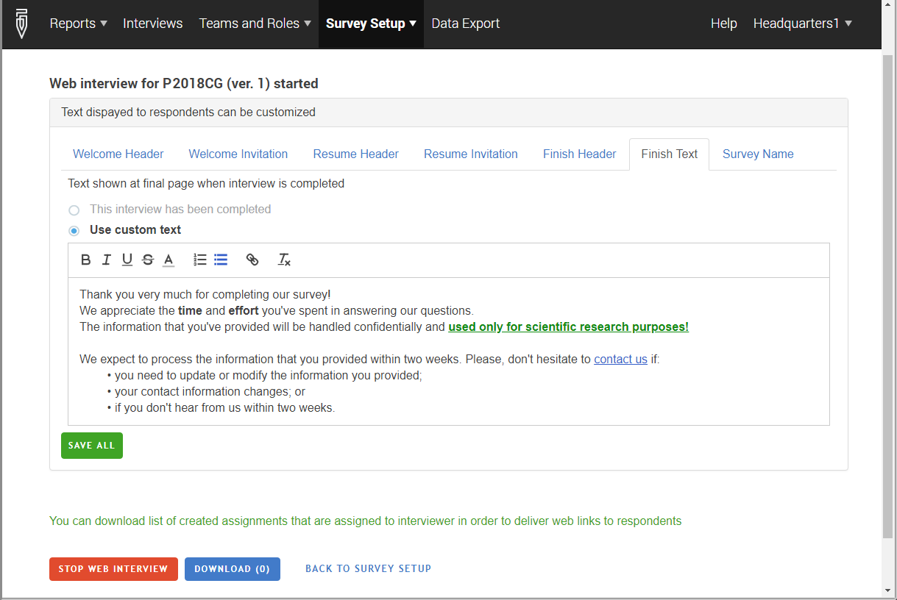

+++
title = "Customize web interview messages"
keywords = [""]
date = 2018-04-02T22:01:17Z
lastmod = 2018-04-02T22:01:17Z
aliases = ["/customer/portal/articles/2932033-customize-web-interview-messages","/customer/en/portal/articles/2932033-customize-web-interview-messages","/customer/portal/articles/2932033","/customer/en/portal/articles/2932033","/headquarters/customize-web-interview-messages"]

+++

Web interviews conducted with Survey Solutions contain reasonable
default messages suitable for many surveys. But if the default messages
are not suitable for a certain purpose, they can be customized in the
web survey setup dialog at the Survey Solutions Headquarters:  
  
  
  
For every parameter select if you wish to display a built-in default
message, or a custom one, and if so, provide your custom (formatted)
text of such a message. You can use the formatting toolbar provided in
the editor to adjust the font color and font attributes, include
numbered and bullet lists, and include hyperlinks.
