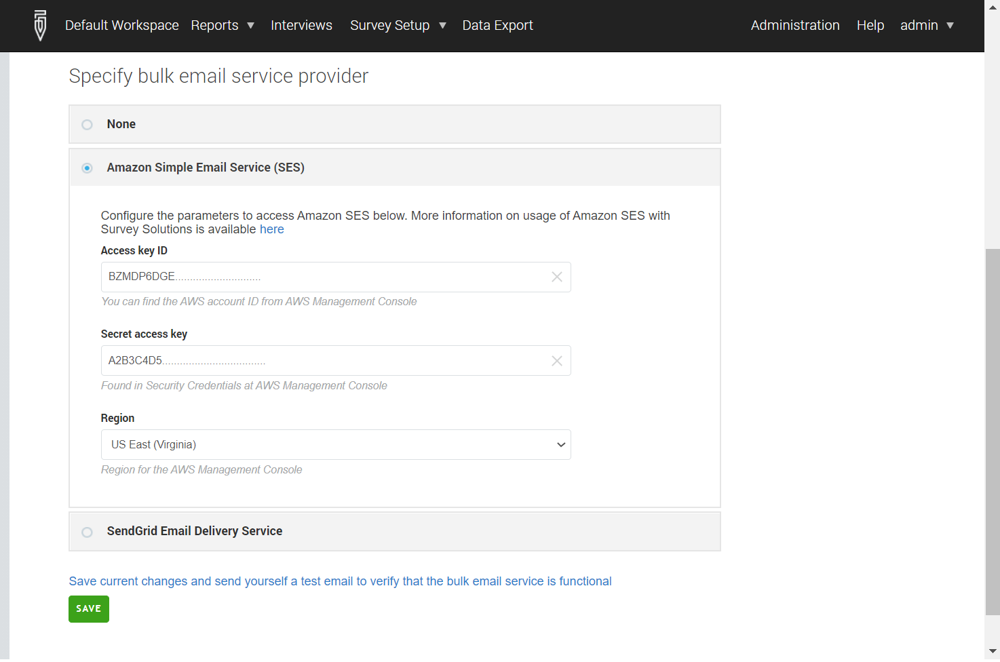

+++
title = "Configuring Amazon SES as an email service provider"
keywords = [""]
date = 2019-03-31T10:10:10Z
lastmod = 2021-05-24T10:10:10Z

+++

Amazon provides a number of services (free and paid) that may
be of interest to the application developer. Here we are specifically
interested in utilizing the **Simple Email Service (SES)** from within Survey
Solutions for mass email sending.

<B>Usage of this service may cost you money.
Make sure you understand all charges, limits and policies before
utilizing this service.</B>

**Amazon Simple Email Service** is available at the following address:
[https://aws.amazon.com/ses](https://aws.amazon.com/ses)

If you are already an Amazon AWS user, you can login to your
Management Console right away. Otherwise you will need to create
a new AWS account.

A valid credit card is required to create this account. Amazon plans
and regulations determine when, how and how much you will be charged
for these services. The below instructions are applicable to personal
accounts. Your organization may have a corporate or other kind of
account with preferential treatment, different billing arrangements,
or simplified configuration process.

Once a new account is created login to the Management Console.
Select `Services`&#x2192;`Customer Engagement`&#x2192;`SES`.

Verify the address that you will be using for sending out the messages.
This is done by clicking the link that you receive from
the <I>Amazon Web Services <no-reply-aws@amazon.com></I>.

Next, utilize the `Add user` wizard to create a new user and assign this
user appropriate permissions, group membership and policies.

Once the user is created, proceed to `Security Credentials` and `Create
Access Key`. You will be issued an *Access Key* and you will obtain the
*Secret* as a downloadable file. You have only one chance to preserve
this pair (though you can issue another *Key + Secret* pair later).

In the email service provider dialog of the Survey Solutions you will
need to enter these SES-specific items:

- Access Key;
- Secret Access Key;
- Region.

 

If you've just created your AWS account it is likely in the sandbox mode
and it will only permit you to send the notifications to the emails that
you yourself have confirmed. To reach real survey respondents you will need
to `Request Increased Sending Limits`, where you submit (to Amazon) the
information about your intents.

Note that when you fill out the Survey Solutions email provider settings, you
need to specify the region, with exactly the same value as selected when setting
uo your SES account, for example, <I>"US East (Northern Virginia)"</I> aka
<B>us-east-1</B>.

On the basis of the information you provide you will be assigned various
limits on number of emails that may be sent per second, per 24-hour period
and per month. Depending on the limit, email requests above those limits
may cost more or be disregarded.

The approval of the request is not instantaneous, and may take days. Plan
your operations accordingly.

The above process may sound confusing at first, but numerous tutorials
online from Amazon and other sites explain more details of this process.
See for example:
SES pricing: [https://aws.amazon.com/ses/pricing/](https://aws.amazon.com/ses/pricing/)

### Links to other useful sources:

A simple tutorial from Amazon:
[https://aws.amazon.com/getting-started/tutorials/send-an-email/](https://aws.amazon.com/getting-started/tutorials/send-an-email/)

More in-depth explanation of how this works:
[https://docs.aws.amazon.com/ses/latest/DeveloperGuide/sending-email.html](https://docs.aws.amazon.com/ses/latest/DeveloperGuide/sending-email.html)

Read users' feedback about the service or submit your own here:
https://www.g2crowd.com/products/amazon-simple-email-service-amazon-ses/reviews
