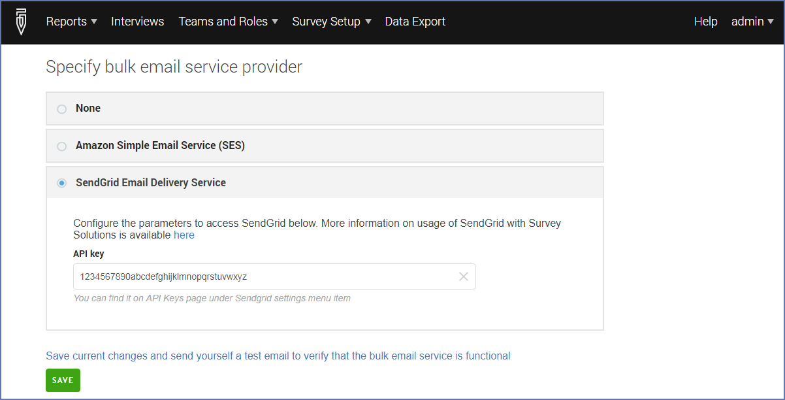

+++
title = "Configuring Sendgrid as an email service provider"
keywords = [""]
date = 2019-03-31T10:10:10Z
lastmod = 2019-03-31T10:10:10Z

+++

SendGrid is a bulk email service provider that can be used in Survey 
Solutions for delivering invitations for CAWI surveys as an alternative 
to Amazon SES:
[https://sendgrid.com/](https://sendgrid.com/)

<B>Usage of this service may cost you money.
Make sure you understand all charges, limits and policies before
utilizing this service.</B>

SendGrid reqires you to have a domain and confirm yourself 
as a domain owner. The sending address must belong to this 
domain. For example, if you want to send emails from <I>name@site.com</I>
you must confirm yourself as the owner of the <I>site.com</I>.

SendGrid offers a number of pricing and usage plans:
[https://sendgrid.com/pricing/](https://sendgrid.com/pricing/)

You will need to confirm the account by clicking the link in the email
that the service will send you.

Start by going to https://sendgrid.com page and picking your plan, and 
filling out the account properties as requested by the service. Once 
confirmed you can login to your account, click API keys, and create a 
(named) <B>API key</B>. The API key is exactly what Survey Solutions is 
expecting from you to be entered in the Email Provider Settings dialog. 
The API key will only be displayed once, you can delete an existing and 
create a new API key at any time.

