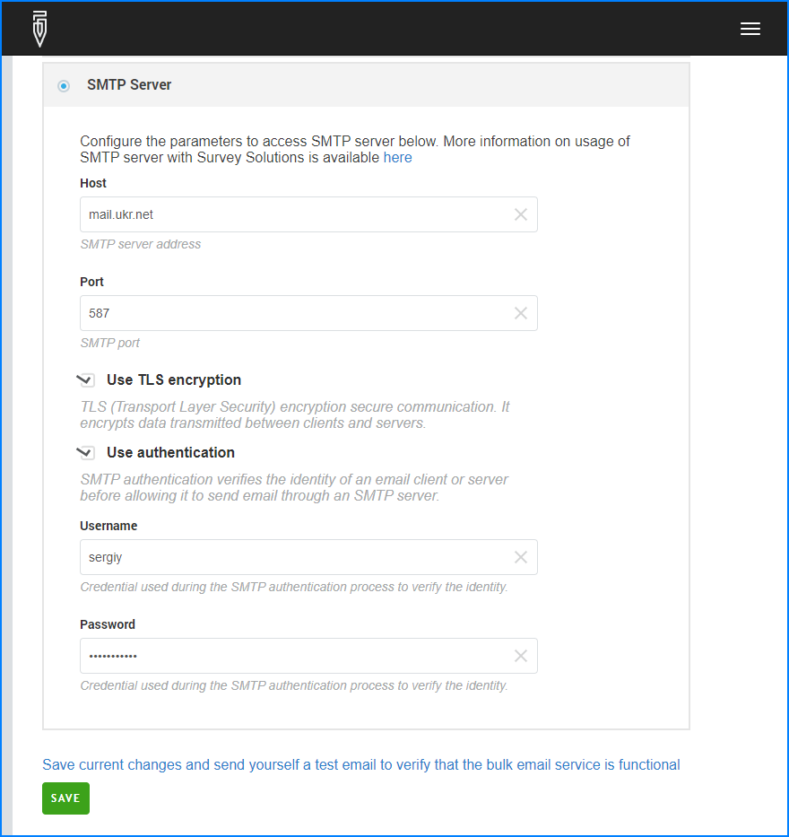

+++
title = "Configuring SMTP server as an email service provider"
keywords = ["cawi","web survey", "email"]
date = 2024-07-29T10:10:10Z
lastmod = 2024-07-29T10:10:10Z

+++

Servers providing [Simple Mail Transfer Protocol (SMTP)](https://en.wikipedia.org/wiki/Simple_Mail_Transfer_Protocol) service can be used to send out messages from Survey Solutions. The technical description for the SMTP has passed several revisions and users may refer to e.g. [RFC 8314](https://datatracker.ietf.org/doc/html/rfc8314) for details.

  

The settings specific to using SMTP are described below, while the other settings common to other service providers are described in the article [Bulk email service providers](/headquarters/cawi/email-providers/).

**Host** - the address of the server (may also be referred to as the SMTP server, or outgoing mail server, etc. in your provider's documentation).

**Port** - the port number that the host monitors to receive message submissions.

**Use TLS encryption** - flag whether Transport Layer Security (TLS) must be used to encrypt the data transmitted between this server and the SMTP host.

**Use authentication** - flag indicating whether the identity of the sender must be confirmed to the SMTP server using the `username` and `password` specified below.

**Username** - user name passed to the SMTP host to establish the identity of the sender (this field is only accessible when **use authentication** checkbox is checked).

**Password** - password used to confirm the identity of the specified user (this field is only accessible when **use authentication** checkbox is checked).

**SAVE** - press the `SAVE` button to preserve the changes you've made to these settings. If you leave the page without saving the changes, they do not take effect.

The SMTP server may be set up as part of your organization, or can be provided by a third-party, in which case ***the corresponding information (host, port, username, password) will be provided by that party***. In general, use of TLS is recommended, and authentication with name and password is mandatory for most cases when the server is accessible from the Internet, (though corporate servers may utilize another access control mechanism).

Please take note that:

* it is common for SMTP servers to have quotas implemented for the amount of submissions for each account, and sending may be disabled if the number of requests is above the permitted rate. Survey Solutions is not aware of such rate controls.

* your server or network may impose restrictions on the connections to certain ports and you may need to clear/whitelist them so that Survey Solutions may send out the messages (or else it may not be able to reach the SMTP server and establish a connection).

#### Sending a test email

Once you save the settings of the SMTP server, check that everything is working fine by sending a test email to yourself (any email account for which you can check the incoming mail) by typing that address in the `Send test email` dialog that appears below. If you don't receive the test message within a few minutes (and you've checked your spam folder or its equivalent), that is usually indicative of some of the settings specified incorrectly, or the SMTP-server being not reachable or not functioning.