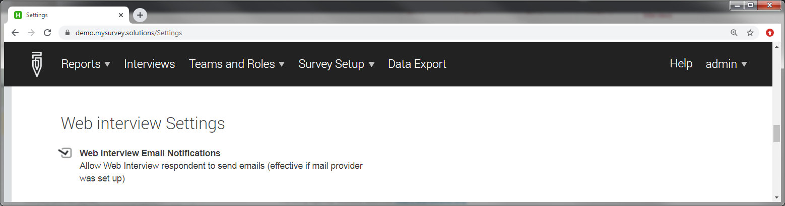

+++
title = "Web Interviewing"
keywords = ["web interviewing", "CAWI", "Self-enumeration"]
aliases = ["/getting-started/computer-assisted-web-interviewing-cawi-"]
date = 2020-01-28T00:00:00Z
lastmod = 2020-10-30T00:00:00Z

+++

In addition to CAPI surveys on Android tablets, Survey Solutions
provides two distinct possibilities:

- **Interviewing:** Interviewers conduct interviews using the
web interface (without a tablet);
- **Self-enumeration:** Respondents fill out interviews in the browser.

The difference is essential:

- In the first case the person filling out the interview is a known
member of the team, has an account created in the system, assigned
to a team of a certain supervisor and so on. We use this mode when
e.g. we set up a call centre and our interviewers don't physically
travel to the respondent, so don't need a mobile device (tablet)
or to work offline (disconnected), but collect multiple interviews
and report to a certain supervisor;

- In the second case, the respondent doesn't have an account in the
system, and could in general be anonymous, and typically only one
interview in the survey is filled out by each respondent.

This article is dedicated to the discussion of the second case,
the setup of the web survey for self-enumeration. The first case
is described in details in the topic dedicated to the
[web-interviewer](/interviewer/web-interviewer/web-interviewer-overview).

Advantages and disadvantages
-------------------------------

Web enumeration has numerous advantages to the face-to-face interviewing:

- doesn't require interviewers, their training and travel time;
- doesn't require interviewer equipment (tablets) as data entry
will be performed by the respondent using his/her device;
- the whole survey can be faster (theoretically can be completed within a day);
- some sensitive questions may be easier to answer in the absence of interviewer;
- it may be possible to reach respondents, which would otherwise be not reachable
(for example, those living in remote places, or conflict areas).

There are equally-important concerns:

- it may be difficult for a respondent to fully understand the
survey and complete a complex questionnaire without guidance of
an interviewer, who has had some training on the topic;

- survey coordinator must be able to contact respondents to
invite them to take a survey (for example, per email);

- respondents must have access to and be able to use a device
(computer/tablet/smartphone) with internet access.

A survey coordinator should carefully weight the costs and
the benefits, as well as estimate the impact of the mode of
collection on the quality of data. Web-interviewing may
introduce an essential bias into the data stemming from
self-selection on the basis of age, literacy, IT-literacy,
income, etc.

In many cases the self-enumeration is used as a supplementary
tool to face-to-face interviewing in an attempt to reach the
representative audience in a cost-effective manner.

Setting up a CAWI survey
--------------------------

Conducting a CAWI survey requires the following:

 1. Compose the questionnaire.
 2. Import the questionnaire to the data server.
 3. Make web-assignments for the survey.
 4. Activate the web-survey mode.
 5. Distribute the links.
 6. Review incoming data/follow up with the respondents if necessary.
 7. De-activate the web-survey mode.

Below we discuss these steps in more detail.

1\. Composing the questionnaire
--------------------------------------

There is hardly any difference in the questionnaire for the
web interviews. You can generally use the same questionnaire
that you use for the face-to-face interviews also for the web
interviews, but it is worth to:

- Explain the structure of the questionnaire to the respondent
and give an idea about how to navigate through the modules;

- Check the wording of the questions - without the interviewers
some things may be not clear, explain them in the instructions;

- Check the error messages - they must be clear to the respondent.
Remember that the respondent wouldn't have the training session
that the interviewers typically get before the survey, so the
questionnaire must be more 'user-friendly'.

2\. Importing the questionnaire
----------------------------------

There is no difference of this step relative to importing the
questionnaire for a face-to-face interviewing. Note that if
you import a different version of the same questionnaire to the
data server, the web mode for it (step #4) will need to be
activated again, specifically for each version.

3\. Make web-assignments
--------------------------

Once you import the questionnaire, you will need to create
web-assignments. They are just like the regular assignments,
but the following properties are important or exist only for
web-assignments:

<TABLE class="table table-striped">
<TR>
<TH>Preloading column
<TH>Property
<TH>Meaning

<TR>
<TD>_webmode
<TD>Web mode
<TD>A simple boolean flag that is raised if the assignment is
intended to be completed directly by the respondent. In the
preloading file 1 corresponds to web mode, and zero or not
specified value corresponds to no web mode for the assignment.

<TR>
<TD>_email
<TD>Email
<TD>Email address of the respondent (optional)

<TR>
<TD>_password
<TD>Password
<TD>if a password (optional) is specified, interviews based
on this assignment will be protected by the password, which
also needs to be communicated to the prospective respondents
of the survey. See below on <A href="#cawipassword">password rules</A>.

<TR>
<TD>_responsible
<TD>Responsible person
<TD>Account of the person responsible for the assignment.

<TR>
<TD>_quantity
<TD>Quantity
<TD>Number of interviews that may be generated from this
assignment; -1 corresponds to unlimited amount.
</TABLE>

-----------------------

In addition to the above properties, the web assignments have
all the properties of the regular assignments. So that we can,
for example, specify the values for identifying questions (fields).
The email and password only make sense for the web mode
assignments and are not effective for the regular assignments.
The values of all of these properties can be seen in the
corresponding columns of the table showing the assignments
(`Menu` &#x2192; `Survey Setup` &#x2192; `Assignments`).

For a CAWI survey, set the value of **_webmode** to 1 for all
assignments. For a mixed survey, only for those assignments that
must be filled out by the respondents through the web.

Even though the CAWI survey is done through a self-enumeration
(by the respondent) the person responsible for the assignment
must be specified and be in the role of interviewer. A web
assignment will not be created if it is made in the name of a
user in a different role and you will get a corresponding error
message.

The combination of the assignment's **quantity**, **email** and
**password** will determine the overall protocol of the survey.

When the email is specified during the assignment creation, the
Survey Solutions can utilize one of the [bulk email delivery
services](/headquarters/cawi/email-providers/)
to deliver the invitations for the survey. If these services
have not been configured yet, the headquarters user must contact
the server administrator, as such configuration requires
administrator's access level.

<TABLE class="table table-striped">
<TR>
<TH>#
<TH>Properties
<TH>Situation

<TR>
<TD>1
<TD>

- quantity=-1
- email=..empty..
- password=..empty..

<TD>
Typical setup for a public opinion survey - one link is made public
through any media (newspaper, TV, website). All visitors of the link
will have an opportunity to fill out an interview.

If the bulk email delivery service has been set up, at the start of
the interview they will have a possibility to enter their email, so
that they will receive a link to follow in case their session is
interrupted and they need to continue the started interview.

There is no limit to the number of interviews to be collected.

<TR>
<TD>2
<TD>

- quantity=-1
- email=..empty..
- password=..specified..

<TD>
Typical setup for a non-public survey of unknown audience, for example,
visitors to a conference. The password must be made available to them
(e.g. written on the board, or announced to them). The role of the
password is to separate this group from all the other people who are
not exposed and not the focus of the study. There is no limit to the
number of interviews to be collected.

<TR>
<TD>3
<TD>

- quantity=-1
- email=..specified..
- password=..specified..

<TD>
Typical for monitoring surveys - the same respondent must authenticate
himself/herself with the password, and can submit an unlimited number
of interviews (presumably regulated by the established protocol:
daily, weekly, monthly, etc, or when a particular event happens, such
as a patient arrives with a particular symptom).

<TR>
<TD>4
<TD>

- quantity=1
- email=..specified..
- password=..specified..

<TD>
Typical for private opinion surveys - the respondents are invited directly
and can submit only one interview. To start the interview they must
follow the link and confirm their access with the issued password.

The interview may be completed in multiple seatings. If the respondent
interrupts the interview, he/she can continue by clicking the same link
received in the original invitation.

<TR>
<TD>5
<TD>

- quantity=1
- email=..specified..
- password=..empty..

<TD>
Similar to the above, but the respondents do not need to enter the
password to start their interviews, just click on their personalized links.

<TR>
<TD>6
<TD>

- quantity=1
- email=..empty..
- password=..specified..

<TD>Typical for private opinion surveys - the respondents can submit only
one interview. To start the interview they must follow the link and
confirm their access with the issued password.

The interview may be completed in multiple seatings. If the respondent
interrupts the interview, he/she can continue by clicking the original
link. The passwords must be unique in this case, and the link distributed
using alternative means.

<TR>
<TD>7
<TD>

- quantity=1
- email=..empty..
- password=..empty..

<TD>
This combination is not acceptable.

<TR>
<TD>8
<TD>

- quantity=N
- email=
- password=

<TD>
Same as the case above where quantity is -1, except that the number of
responses is not infinite, but is limited to N interviews.

First N respondents will start the interviews, other respondents
will get a message indicating their participation is no longer needed.

</TABLE>

4\. Activate the web-survey mode.
----------------------------------------

Once the assignments are created the survey coordinator needs to set up and
activate the web mode of data collection for the survey. This is available
by calling the context menu for the questionnaire in the Survey Setup:
`Menu` &#x2192; `Survey Setup` &#x2192; `Web interview setup`.

Depending on the objectives and implementation of the survey you may need to
adjust the:

- [templates for the web pages](/headquarters/cawi/webpage-templates/) visible
  to the survey participants;
- [templates for email messages](/headquarters/cawi/email-templates/) that are
  sent as notifications to the survey participants.

At the next page the template messages for invitations/reminders/notifications
may be edited and the web mode activated (the green `START` button) or
deactivated (the red `STOP WEB INTERVIEW` button). Any generated links remain
ineffective when the survey is not in the web mode even if the link has been
already sent to the respondent.

5\. Deliver links
----------------------------------------

Depending on the scenario of the survey as outlined by the table in step #3,
you will have one or multiple links to be delivered to the respondents.
Note that in any of the cases, Survey Solutions doesn't send the
invitations/notifications directly, but utilizes a special [bulk email delivery
service](/headquarters/cawi/email-providers/)
to deliver the corresponding messages. Refer to the corresponding article on
how to set it up. Once it is set up, one can go to `Menu` &#x2192; `Survey Setup`
&#x2192; `your questionnaire name` &#x2192; `Send invitations` to send out
the invitation emails.

If this service is not set up by the server administrator, then it is
his/her responsibility to distribute the appropriate messages among the
respondents using any alternative tools. The links can be downloaded by going
to `Menu` &#x2192; `Survey Setup` &#x2192; `your questionnaire name` &#x2192;
`Download web links`.

After the links have been sent to the respondents it is important not to change
the responsible person for an assignment to anyone except an interviewer as
this will invalidate it (you will get a warning if you try). Note that this may
be an unintended indirect consequence of your actions, such as relocating an
interviewer to another team leaving his assignments in the original team.

6\. Review incoming data
-------------------------------------------

Once a CAWI survey is running, the interviews will appear in the list as soon
as they are started. The respondents may still be working at them and their
status will be *InterviewerAssigned*. This status is only attributable to CAWI
interviews. Any interviews received from tablets will show up on the server
already in the *Completed* status.

The supervisors are expected to review as soon as possible the interviews in
the status *Completed*, and either to approve or reject them.

Note that even though there is a rejection notification template in the set of
user-configurable notification templates for a survey, rejection notifications
are NOT sent out at all, and the supervisor will need to manually reallocate
the rejected interview to a real interviewer to follow up with the respondent
by using phone (see [CATI](/interviewer/web-interviewer/web-interviewer-cati/))
or other communication.

7\. De-activate the web survey mode.
------------------------------------------

When all the web assignments are completed or you've acquired the minimal
desired number of responses, you can stop the web survey. When the web survey
is stopped no changes will be permitted by the respondents visiting any links,
whether to create new or finish started interviews.

<A name="cawipassword">

CAWI password rules
-----------------------

The password used for CAWI assignments must:

- consist of only upper case English letters and digits;
- be at least 6 characters long.

Providing a single question mark '?' instead of the password will request
Survey Solutions to automatically generate one compliant with the above rules.

Continuing interviews
------------------------

Some web interviews may be quite lengthy, difficult to fill out in one seating
either because of the respondent not being available for so long, or because
of the connectivity issues.

To continue working on the interview the respondent must open exactly the same
URL he/she sees during the interviewing. This URL may be different from the one
contained in the originally received invitation. The respondent may copy and
preserve the URL from his/her browser's address line at any time. In addition,
if the bulk email service is set up by the server administrator, the user will
be asked for the contact email at the beginning of the interview. If the email
is provided, a message containing the continuation link will be sent to that
email. If the server administrator wants to disable this feature, he/she should
uncheck the corresponding option in the ***'Web interview settings'***: `Menu`
&#x2192; `Administration` &#x2192; `Settings` &#x2192; `Web interview settings`.

  

This setting is shared by all CAWI surveys on the same server.
