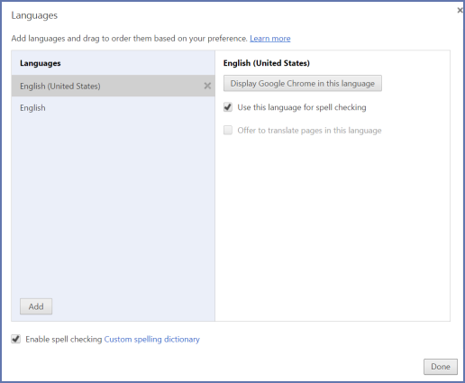
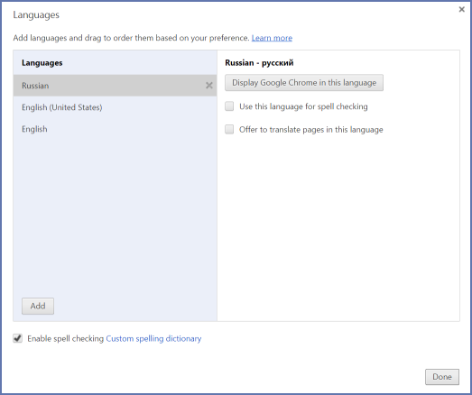
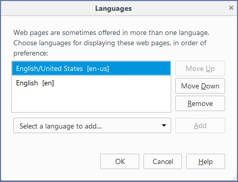
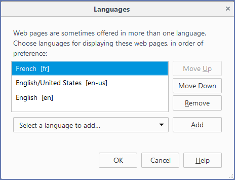
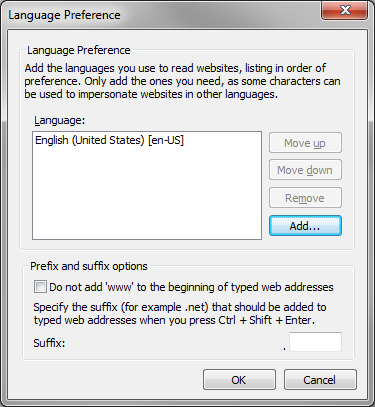
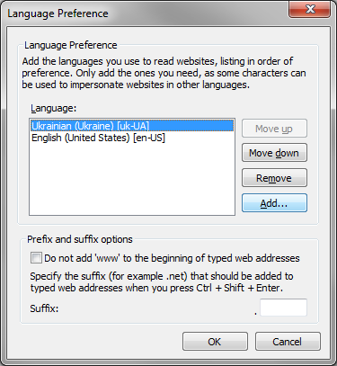

+++
title = "Changing the Interface Language"
keywords = ["language","localization"]
date = 2016-06-16T14:55:37Z
lastmod = 2016-06-16T14:55:37Z
aliases = ["/customer/portal/articles/2466827-changing-the-interface-language"]

+++

Survey Solutions interface for Headquarter and Supervisor users can be
presented in different languages. This article describes how to switch
the interface to be presented in an alternative language.  
  
Recall that both HQ and Supervisor users work via a web browser.
Switching the interface is done by telling the browser to request the
content in a particular language. Note that this affects both Survey
Solutions and other sites that are visited with the same browser.  
  
Step-by-step instructions to switch the language on your browser is
provided for the [Google Chrome](#chrome), [Mozilla Firefox](#firefox),
and [Internet Explorer](#explorer). If you are using a different browser
the steps to take are likely very similar. See also the [W3C
Internationalization
page](http://www.w3.org/International/questions/qa-lang-priorities) for
the additional information.  
  
 

 Google Chrome
---------------------------------------

  
The following instructions are based on Google Chrome version
50.0.2661.102.

1.  Start Google Chrome browser;
2.  Click on the drop down menu  and select
    **Settings** item;
3.  Click the **Show advanced settings...** link at the bottom;
4.  Click **Language and input settings** button;  
      
    
5.  Click the **Add** button in the **Languages** list to add a language
    you need.
6.  Drag and drop that language to the top of the list.  
      
    
7.  Click **Done**.
8.  Close and restart the browser.

  
  
 

 Mozilla Firefox
------------------------------------------

  
The following instructions are based on version 45.0.1 of Mozilla
Firefox.

1.  Start the Mozilla Firefox browser.
2.  Click on the drop down menu  and select
    **Options** item;
3.  Select **Content** tab.
4.  In the **Languages** section, click the **Choose...** button.  
      
    
5.  Select a new language you want to add from the drop-down menu and
    click the **Add** button.
6.  Adjust the order of the languages to have the desired language at
    the top.  
      
    
7.  Click **OK**.
8.  Close and restart the browser.

  
  
 

 Microsoft Internet Explorer
-------------------------------------------------------

  
The following instructions are based on the version 10.0.9200.16750 of
Microsoft Internet Explorer.

1.  Start Internet Explorer.
2.  Click the gear icon  to access the drop-down
    menu.
3.  Select Internet Options.
4.  In the **General** tab click **Languages** button:  
      
    
5.  Click the **Add...** button to add the desired language.
6.  Use the Move up and Move down buttons to change the order of the
    languages to have the desired language at the top of the list.  
      
    
7.  Click **OK**.
8.  Close and restart the browser.
