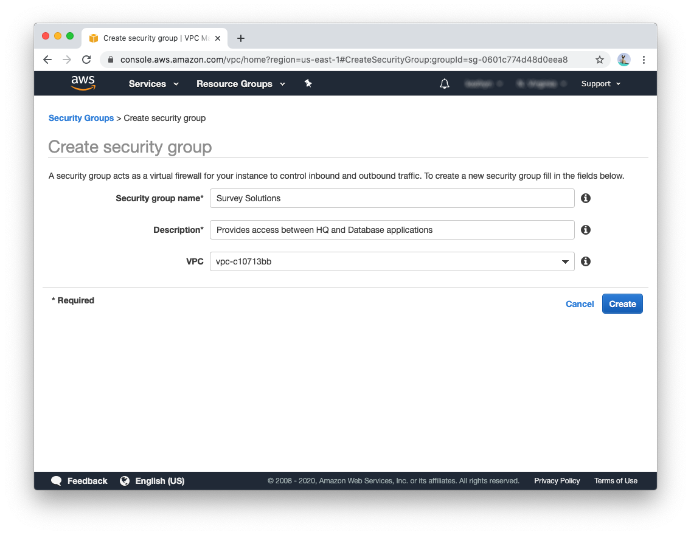
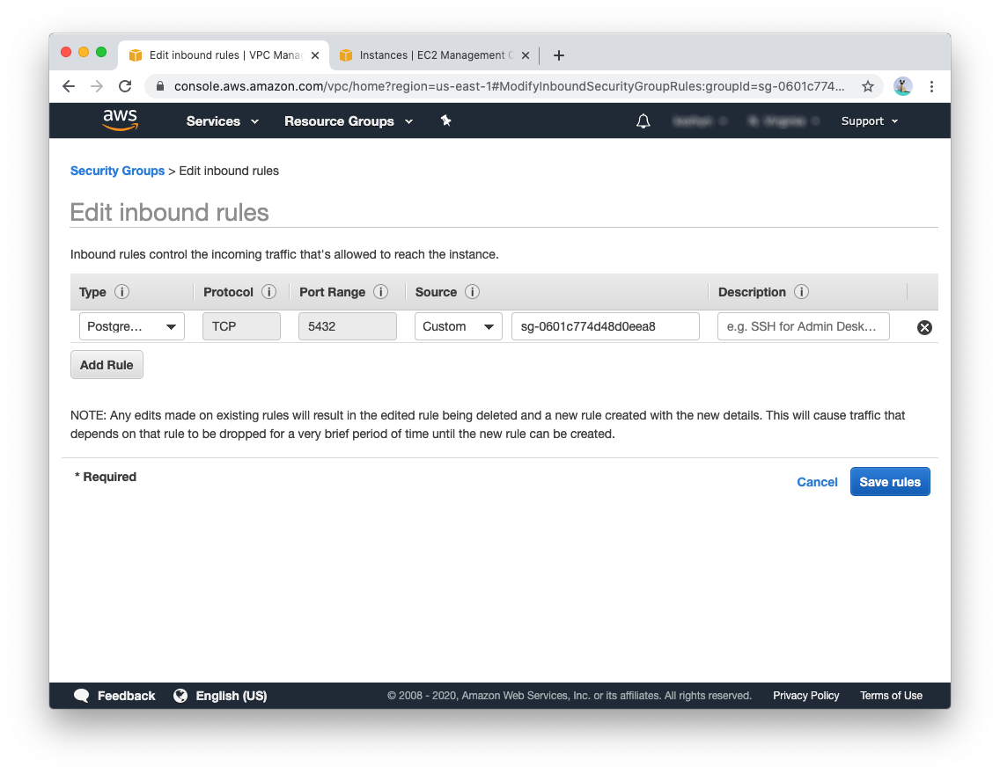
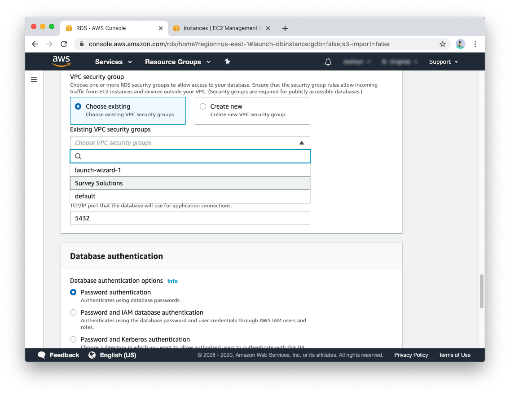
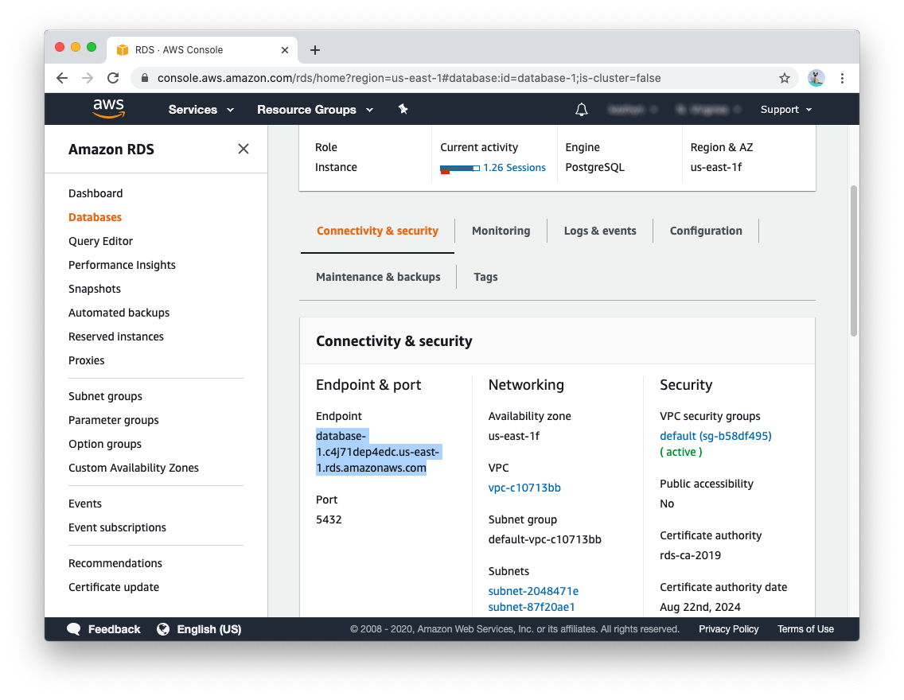
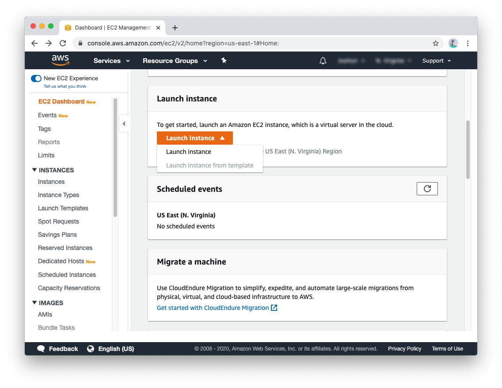
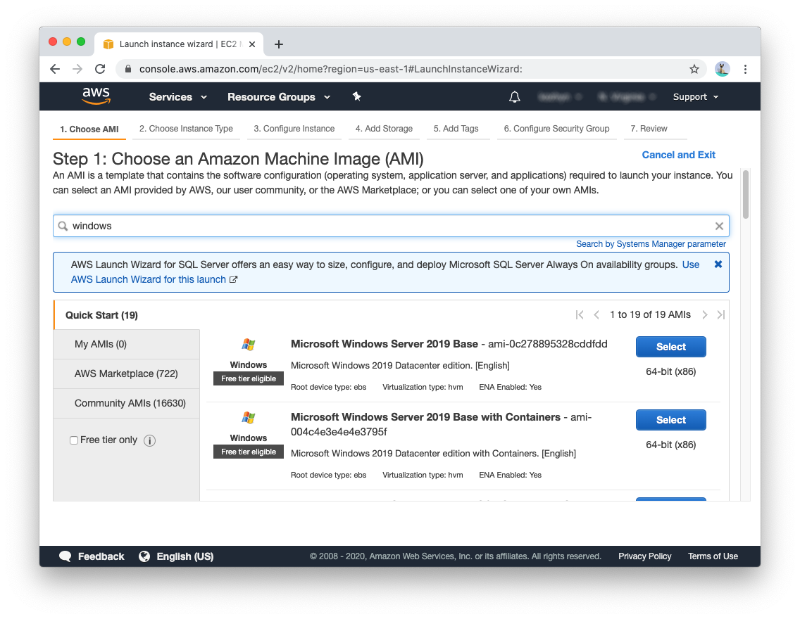
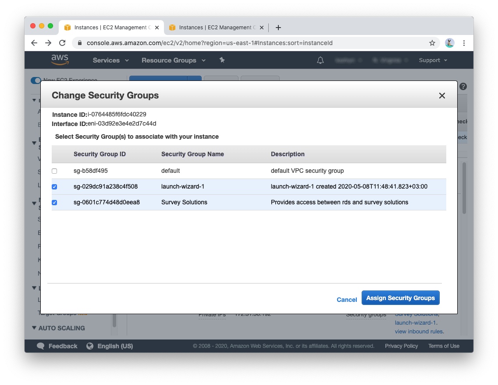
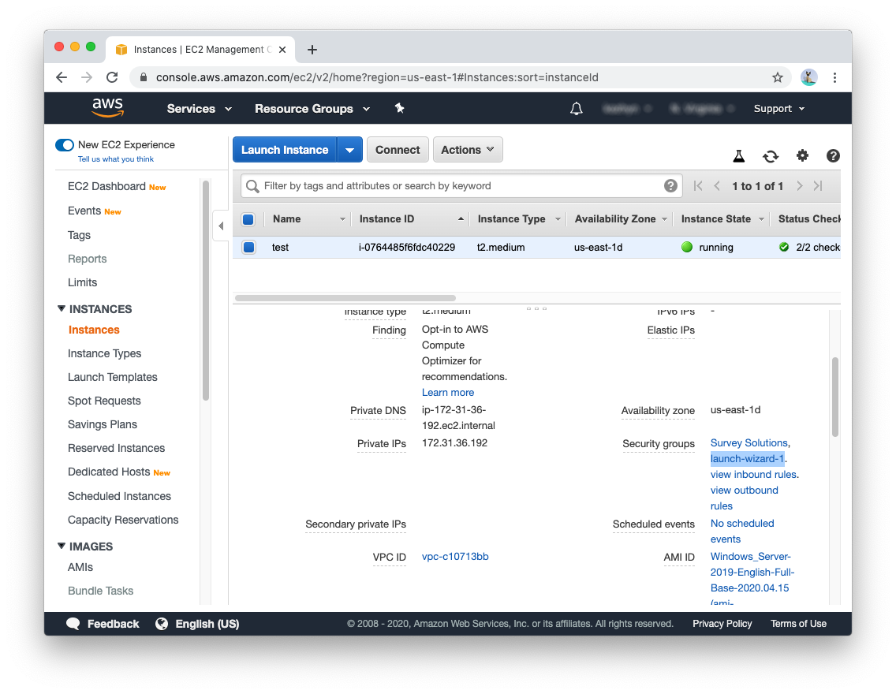
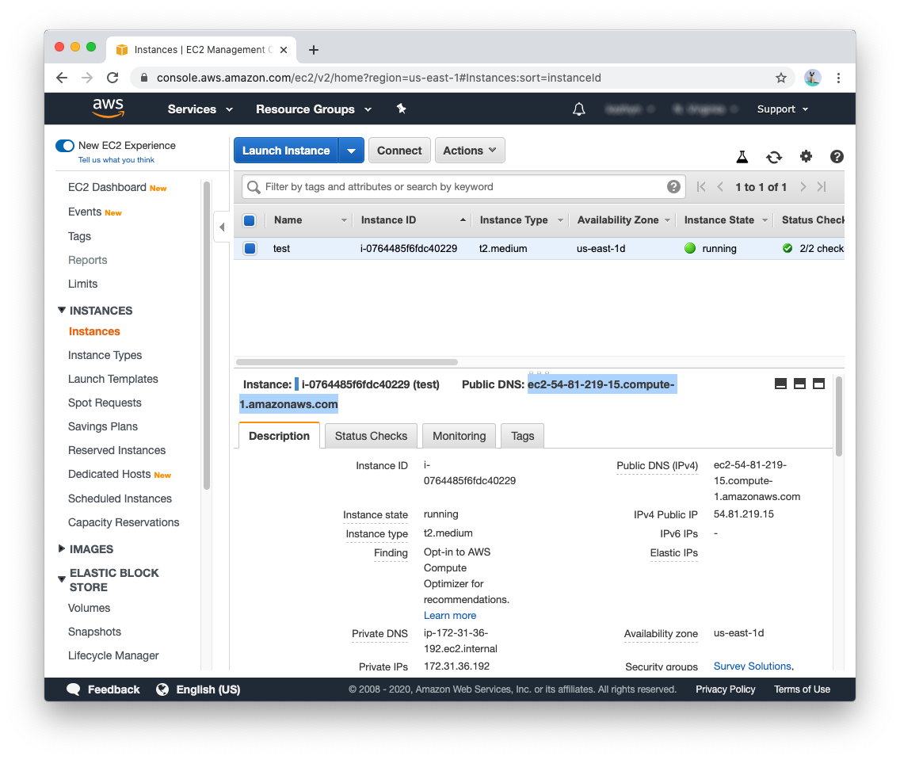
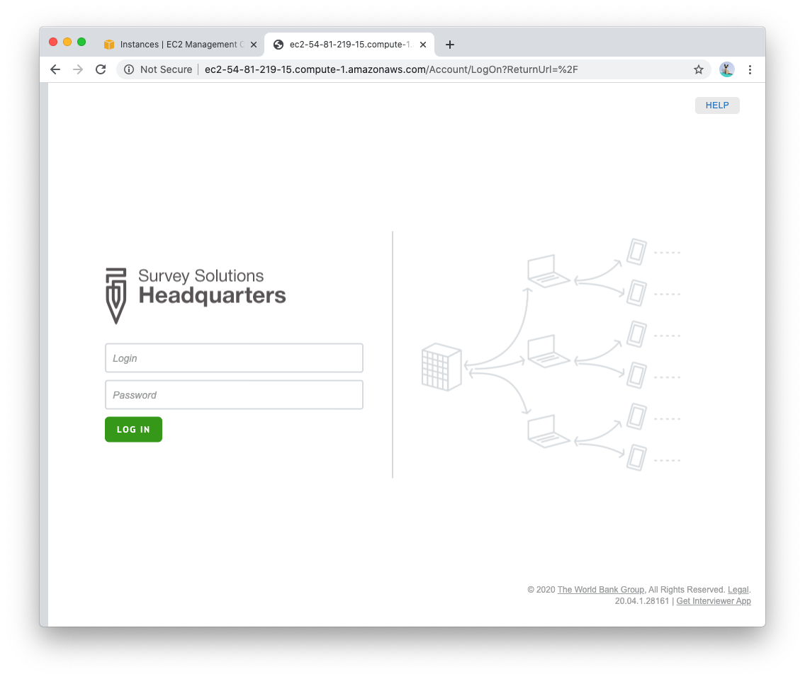

+++
title = "AWS setup"
keywords = ["installation", "configuration", "cloud"]
date = 2020-05-08T12:00:00Z
aliases = []
+++

# Installation of survey solutions on amazon AWS

Installation has following steps:
 1. [Create security group](#create-security-group) for web server and RDS to be able to communicate
 1. [Create PostgreSQL instance](#create-PostgreSQL-RDS-instance)
 1. [Create ec2 instance](#create-ec2-instance) for running Survey Solutions
 1. [Install Survey Solutions](#survey-solutions-installation)

## Create security group 
In order to have connection between Survey Solutions and PostgreSQL you can create new security group as described in [here](https://docs.aws.amazon.com/AmazonRDS/latest/UserGuide/USER_VPC.Scenarios.html). 

In the create security group specify name and description:

In the rules page add single required rule:
* **Type**: PostgreSQL
* **Source**: Start typying "Survey Solutions" and select just created security group

## Create PostgreSQL RDS instance
Create an RDS postgres instance using [this documentation](https://aws.amazon.com/getting-started/tutorials/create-connect-postgresql-db), you dont need to install database client, but it can be used to test databse connection.

During creation process expand *Additional connectivity configuration* section and assign created "Survey Solutions" security group

Keep database port to be default one (5432)

After database is started copy endpoint address 

## Create ec2 instance
* In the services list Compute section select ec2 
* Find "Launch instance menu"
  
* In search bar type "Windows"
* Select Microsoft Windows Server 2019 Base 
  
* In tear selection pick one that suites your needs. You can check for server requirements here
* After instance is created right click on it, select Networking -> Change Security Groups and assign group Survey Solutions
  
* Launch selected instance

## Survey Solutions installation
When your instance is running, connect to it with rdp [using instructions](https://docs.aws.amazon.com/AWSEC2/latest/WindowsGuide/connecting_to_windows_instance.html). Once connected, execute [standalone installation]() steps (skip PostgreSQL part). When asked for database connection, input endpoint from RDS setup and database credentials.

### Change port from 9700 to 80
Delete default web site from IIS web sites list and add :80 port binding to Survey Solutions web site:
  1. Right click on start menu -> run 
  1. Execute `inetmgr` to start IIS manager
  1. On Right click on "Default Web Site" and select delete
  1. Select Survey Solutions site 
  1. In the right panel add :80 port binding 

### Expose 80 port to external users
* In the AWS console ec2 running instances find security group where only web server is included (for me it is "launch-wizard-1"):
  
* Naviate to Network & Security -> Security Groups in the left panel
* Find group of the web server and click on it 
* Click Edit Inbound Rules 
* Add Rule 
  * **Type**: HTTP
* Save rules

When done correctly you should be able to access Survey Solutions application from your browser by using public DNS:

Copy value from your console to browser address bar:

