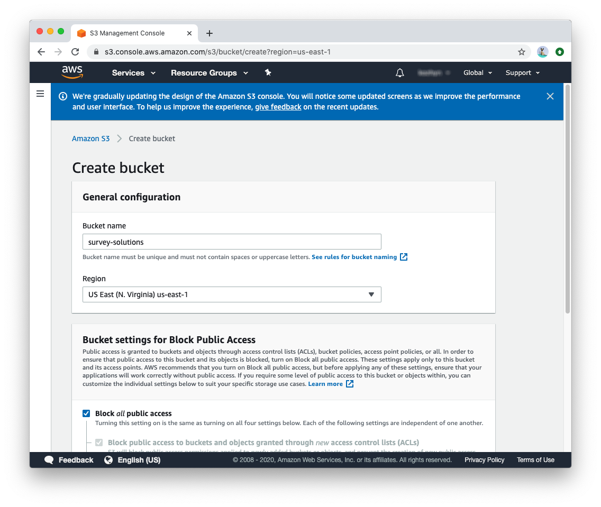
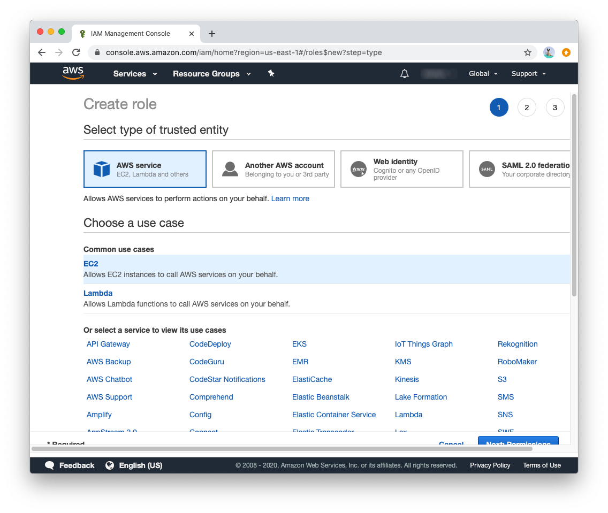
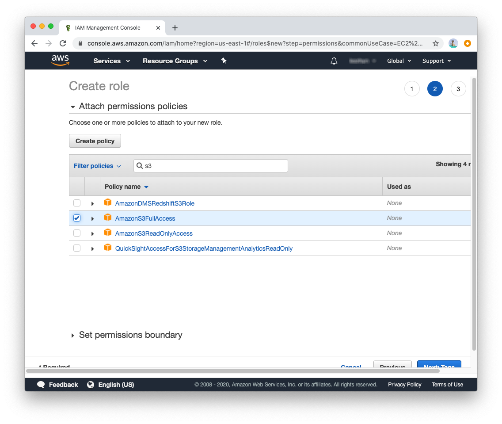
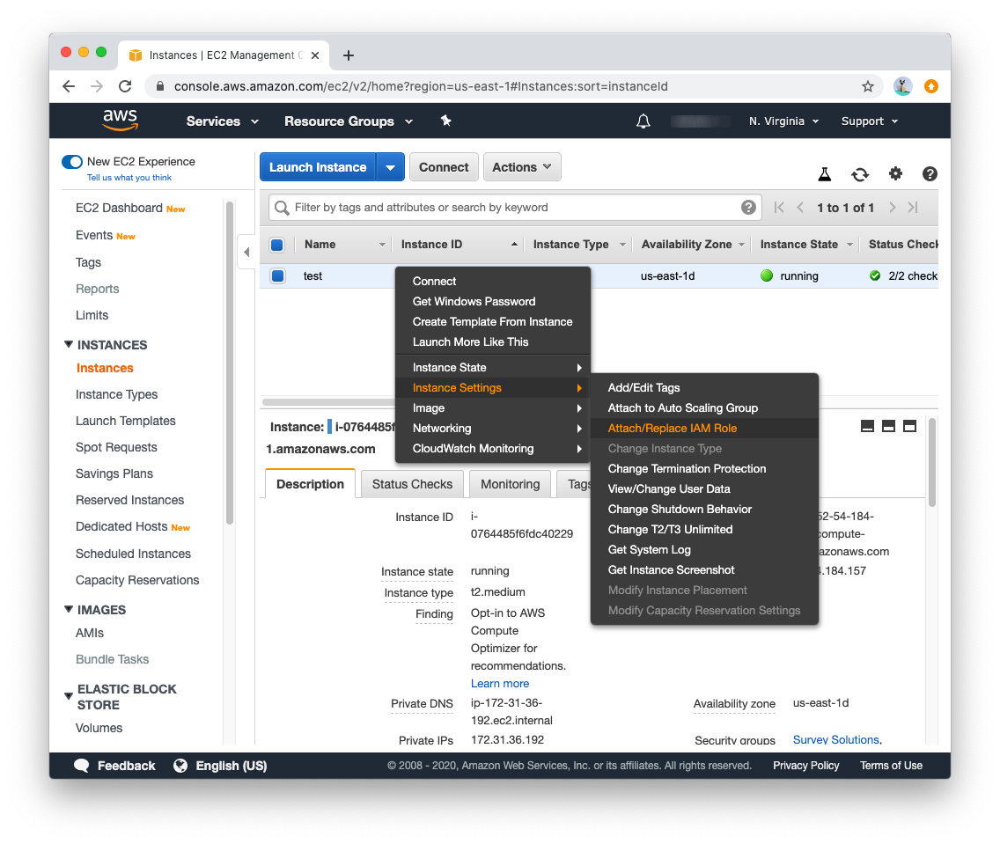

+++
title = "AWS setup"
keywords = ["installation", "configuration", "cloud", "aws"]
date = 2020-05-08T12:00:00Z
aliases = []
+++

# Installation of survey solutions on amazon AWS

Installation has following steps:

 1. [Create security group](#create-security-group) for web server and RDS to be able to communicate
 1. [Create PostgreSQL instance](#create-PostgreSQL-RDS-instance)
 1. [Create ec2 instance](#create-ec2-instance) for running Survey Solutions
 1. [Install Survey Solutions](#survey-solutions-installation)

## Create security group

In order to have connection between Survey Solutions and PostgreSQL you can create new security group as described in [here](https://docs.aws.amazon.com/AmazonRDS/latest/UserGuide/USER_VPC.Scenarios.html).

From the AWS Management Console:

- Click on `EC2` under the `Compute` heading
- Scroll down the left-hand navigation to `Network & Security`
- Click on `Security Groups`
- Click on `Create security group`

In the create security group specify name and description:


In the rules page add single required rule:

* **Type**: PostgreSQL
* **Source**: Start typying "Survey Solutions" and select just created security group


## Create PostgreSQL RDS instance

Create an RDS PostgreSQL instance using [this documentation](https://aws.amazon.com/getting-started/tutorials/create-connect-postgresql-db), you don't need to install database client, but it can be used to test database connection.

During creation process expand *Additional connectivity configuration* section and assign created "Survey Solutions" security group


Keep database port to be default one (5432)

After database is started copy endpoint address


Be sure to retain the following information for accessing the PostgreSQL:

- login
- password
- endpoint

These details will be needed in a later step to connect the RDS with the EC2 instance.

To find the endpoint:

- Navigate to `RDS` from the Amazon Management Console
- Click on `DB Instances` under `Resources` in the main pane
- Click on the RDS instance DB identifier of the desired RDS
- Click on the `Connectivity & security` tab
- Copy the endpoint under `Endpoint & port`

## Create ec2 instance

* In the services list Compute section select ec2
* Find "Launch instance menu"
  
* In search bar type "Windows"
* Select Microsoft Windows Server 2019 Base
  
* In tier selection pick one that suites your needs. You can check for server requirements here
* After instance is created right click on it, select Networking -> Change Security Groups and assign group Survey Solutions
  
* Launch selected instance

## Survey Solutions installation

### Connect to the EC2 instance

When your instance is running, connect to it with RDP [using instructions](https://docs.aws.amazon.com/AWSEC2/latest/WindowsGuide/connecting_to_windows_instance.html). 

### Download Survey Solutions installer

Once connected, download the Survey Solutions installer. Before doing so, you may need to change the security settings of Internet Explorer (IE) on the EC2 instance to make download possible. To do so:

- Open IE
- Navigate to Settings>Internet>Security>Trusted Sites
- Add `https://mysurvey.solutions` as a trusted site
- Reduce the security level for this zone to `Medium-low`
- Click `Apply` and `OK`

To download the Survey Solutions installer:

- Navigate to [installer download page](https://mysurvey.solutions/Download) in a browser outside of the RDP connection
- Right-click on the `DOWNLOAD THE LATEST INSTALLER` button
- Select `Copy link address`
- Paste the link into the address bar of IE in the RDP connection in order to download the installation file on the EC2 instance

### Install Survey Solutions

Once the installer is downlaoded, perform these [installation]() steps (skip PostgreSQL part). When asked for database connection, input endpoint from RDS setup and database credentials. 

### Change port from 9700 to 80

Delete default web site from IIS web sites list and add :80 port binding to Survey Solutions web site:

  1. Right click on start menu -> run
  1. Execute `inetmgr` to start IIS manager
  1. Look in the left-hand `Connections` panel
  1. Expand the entry
  1. Expand `Sites`
  1. On Right click on `Default Web Site` and select remove
  1. Select Survey Solutions site
  1. In the right panel under `Edit Site`, click on `Bindings`
  1. Select the existing site binding
  1. Change `Port` from 9700 to 80
  1. Leave host name empty for now

### Expose 80 port to external users

* In the AWS console ec2 running instances find security group where only web server is included (for me it is "launch-wizard-1"):
  
* Navigate to Network & Security -> Security Groups in the left panel
* Find group of the web server and click on it
* Click Edit Inbound Rules
* Add Rule
  * **Type**: HTTP
  * **Select**: `0.0.0.0/0` as Source
* Save rules

In Survey Solutions installation location `Site` folder find `appsettings.production.ini` file, and remove `:9700` from `BaseUrl`.

When done correctly you should be able to access Survey Solutions application from your browser by using public DNS:


Copy value from your console to browser address bar:


### DNS and SSL

Also we recommend enabling public DNS name for your survey solutions instance. Choose any DNS registrar you like, or maybe you already have domain name. When it is resolved to public IP address of amazon ec2 instance change `BaseURL` setting in `appsettings.production.ini` file. If SSL it used, set `BaseUrl` to `https://%your dns name%`.

### S3 Configuration

Survey solutions can store multimedia data (images, audio audit, etc) on s3 storage to reduce load on database instance.

In order to enable s3 storage open s3 service console and create new bucket (you will need to pick name according to [naming rules](https://docs.aws.amazon.com/AmazonS3/latest/dev/BucketRestrictions.html)):


Now to enable Survey Solutions access to that bucket new IAM role will be required. In order to create it in services list find IAM, then go to Roles->Create new role:


Provide name, and attach appropriate policy:


In order to attach this role to ec2 instance open ec2 console, find appropriate image and select `Attach/Replace IAM role`:

Then select created role:


In Survey Solutions installation location `Site` folder find `appsettings.production.ini` file.

1. Change storage options. In configuration file replace `AppData` key value to `AppData=s3://%Your bucket name%/survey-solutions`
1. Add section with region configuration (use same region as your s3 bucket)

Your configuration file should contain such configuration:

``` ini
[FileStorage]
AppData=s3://%Your bucket name%/survey-solutions
TempData=..\Data_Site
[AWS]
Region=us-east-1 # replace with your region
```

Restart windows image for changes to take effect.

Survey solutions will create folder with configured tenant name where it will store binary data for interviews.
