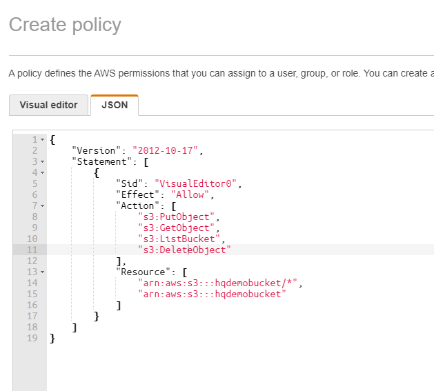
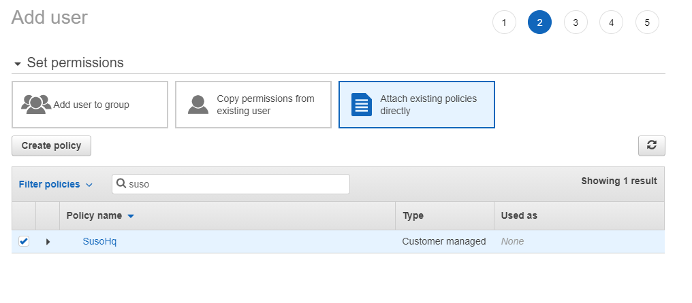
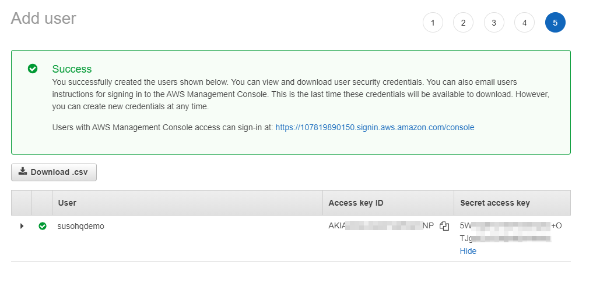

+++
title = "Using AWS S3 to store binary files"
keywords = ["configuration", "aws", "s3", "filestorage", "minio"]
date = 2021-06-01
aliases = []
draft = true
+++

Amazon S3 is a simple web services interface that you can use to store and retrieve any amount of data, at any time, from anywhere on the web. 

This service is usefull for storing any amount of binary data.

Survey Solutions Headquaters can store in AWS S3:
- Binary interview data
  - images
  - audio
- Data Export files

Using AWS S3 storage also make it possible to scale HQ application on multiple servers.

## Prerequisties

1. Installed Survey Solutions HQ application
2. Amazon AWS Account
3. Create a bucket where all binary files will be stored

Please follow official Amazon instruction on how do create AWS account and first bucket: https://docs.aws.amazon.com/AmazonS3/latest/userguide/GetStartedWithS3.html


## Permissions 

Amazon AWS has several layers of permissions.

To work with S3 You need:
1. Create IAM policy
2. Create IAM user
3. Attach policy to user

### Policy

- AWS IAM user should have following permissions on bucket:
    - s3:GetObject
    - s3:ListBucket
    - s3:PutObject
    - s3:DeleteObject

In terms of IAM policy You can use following json to create policy through Amazon AWS console

Here we assume that the bucket name is `hqdemobucket`
```json
{
    "Version": "2012-10-17",
    "Statement": [
        {
            "Sid": "VisualEditor0",
            "Effect": "Allow",
            "Action": [
                "s3:PutObject",
                "s3:GetObject",
                "s3:ListBucket",
                "s3:DeleteObject"
            ],
            "Resource": [
                "arn:aws:s3:::hqdemobucket/*",
                "arn:aws:s3:::hqdemobucket"
            ]
        }
    ]
}
```



This policy should be attached to new or existing user.



To configure HQ to use this user You will need IAM credentials




## Configuring HQ

Headquarters use AWS.SDK .NET library to connect to Amazon S3 services. There is more then one way to pass AWS configuration to application that uses AWS SDK.

Please refer to documentation from Amazon https://docs.aws.amazon.com/sdk-for-net/v3/developer-guide/net-dg-config-creds.html

### Configration example in .ini files

Please find `%USERPROFILE%\.aws\credential` file and add following:

```
[default]
aws_access_key_id = AKIAxxxxxxxxxxxZL3Q
aws_secret_access_key = HwIgxxxxxxxxxxxxxxxxxxxxxxxxxJ5yU
```
This will create default AWS profile

In HQ appsettings in `appsettings.production.ini`:

```ini
[AWS]
Profile = default

[FileStorage]
AppData="s3://hqdemobucket/hq"
```

`/hq` in the configuration above is a prefix for all objects. HQ will never store any data above this prefix.

### Configuration example for docker deployments

Docker-compose.yml
```yml
version: '3'
services:
  hq:
    image: 'surveysolutions/surveysolutions'
    depends_on:
     - "db"
    environment: 
      HQ_ConnectionStrings__DefaultConnection: 'db connection string'
      HQ_Headquarters__BaseUrl: 'http://demo.hq.app'
      AWS_ACCESS_KEY_ID: AKIAxxxxxxxxxxxZL3Q
      AWS_SECRET_ACCESS_KEY: HwIgxxxxxxxxxxxxxxxxxxxxxxxxxJ5yU
      HQ_FileStorage__AppData: s3://hqdemobucket/hq
    restart: always
```

### Configuring for Minio

It also possible to configure HQ to work with MiniO - self hosted object storage service https://min.io/ 
There is a few new settings required to be provided: `ServiceURL` and `ForcePathStyle`. All other settings are the same:

`appsettings.production.ini`
```ini
[AWS]
Profile = default
ServiceURL = https://minio.url
Region = us-east-1
ForcePathStyle = true

[FileStorage]
AppData="s3://hqdemobucket/hq"
```

In Docker

```yml
version: '3'
services:
  hq:
    image: 'surveysolutions/surveysolutions'
    depends_on:
     - "db"
    environment: 
      HQ_ConnectionStrings__DefaultConnection: 'Server=db;Port=5432;User Id=postgres;Password=pg_password;Database=SurveySolutions'
      HQ_Headquarters__BaseUrl: https://hqurl
      HQ_AWS__Region: us-east-1
      HQ_AWS__ServiceURL: http://minio
      HQ_AWS__UseHttp: true  # only required if minio has no https support
      HQ_AWS__ForcePathStyle: true
      AWS_ACCESS_KEY_ID: "minio"
      AWS_SECRET_ACCESS_KEY: "minio123"
      HQ_FileStorage__AppData: s3://miniobucket/hq
    restart: always
  minio:
    image: minio/minio
    volumes:
      - storageVolume:/data
    expose:
      - "9000"
    command: server /data
    environment:
      MINIO_ROOT_USER: minio
      MINIO_ROOT_PASSWORD: minio123
volumes:
    storageVolume:
    
```

