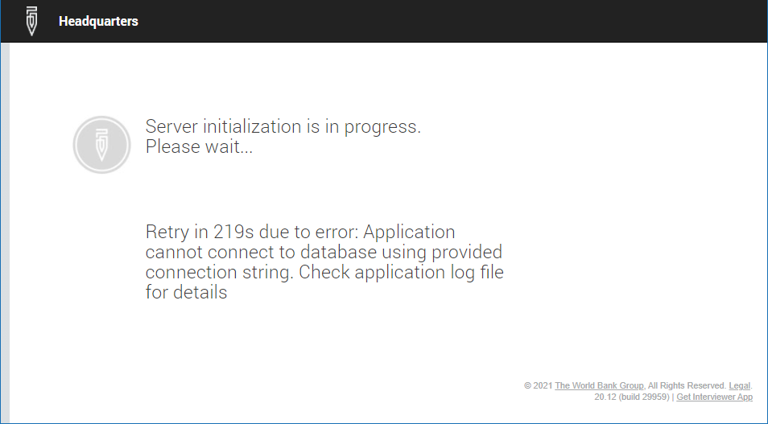
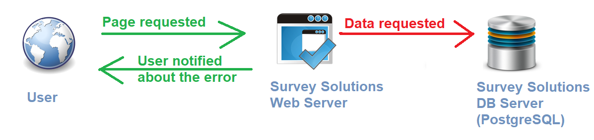

+++
title ="DB connection errors"
keywords = ["local", "standalone", "self-hosted", "error", "troubleshooting"]
date = 2021-06-22T00:00:00Z

+++

The following error may be encountered during the server startup, when it fails
to establish connection to the database server:

  

 

Note, that since the message is displayed on a publicly accessible page, it
does not elaborate the specific reason for the problem.

When the server displays the above message, it is incapacitated and the error
needs to be fixed asap. This is especially critical if the server is being
utilized for CAWI surveys, where the respondents following the link in the
invitation will likely be lost if they encounter this message instead of the
survey form to fill out. Also the interviewers will not be able to synchronize
their tablets, neither to submit collected interviews, nor to receive new
assignments. In fact, because the database is storing the information that is
needed to authenticate the users, no activity can be undertaken on the server
that requires authentication.

Survey Solutions users (interviewers, supervisors, headquarters, etc.) cannot
address this problem, since they don't have direct access to the web server,
nor to the DB server, but only through Survey Solutions program. Note also
that their actions cannot trigger this problem (at least the developers are
not aware of any way of doing this), it must have been caused by something else.
If they encounter this error, they should notify their superiors, elevating
the message to the person who has access to the OS account on the server
(typically the person who has installed the Survey Solutions, who is installing
the updates, or performs other server maintenance).

Hence, fixing this error requires access to the machine where Survey Solutions is
installed, and the database server, which may be located on a different machine.

Conceptually, the problem is in communication between the part that services
the users' queries (the web server) and the part that stores the data
(the DB server):

  

As the message instructs, first inspect the Survey Solutions server logs. They
may point to a specific problem, such as the incorrect password or lack of
connectivity.

Next inspect the settings of the server, locate the DB connection string, and
try to connect manually to the PostgreSQL DB server using the same account. When
checking this connectivity, it is important to connect to the DB server
specifically from the Web server, not from any other machine, as the network
topology may imply different routing of queries from internal and external
nodes.

Most common reasons for this problem are:

* the DB server has been shut down or disconnected from the network, while the
web server is still active;
* a firewall or other security facility is preventing connectivity from the
web server to the DB server;
* if this is the first time the Survey Solutions is starting up, check if the
connection string parameters have been entered correctly during the
installation, as typos may have happened while entering the account name,
password or the server address;
* account changes at the DB server: password has been changed,
permissions/roles changed, account removed or disabled;
* if the DB server is hosted in the cloud, the cloud account may be
suspended/disabled because of billing or other reasons.

Survey Solutions web server component is programmed to retry the call to the DB
server if such a disruption occurs. The message indicates in how many seconds
such a retry attempt will happen next (*219 seconds in the screenshot above*).

If the reason for the problem is temporary in nature, and the DB server starts
responding again, then Survey Solutions will pick up that connection and
continue. Still it is recommended to investigate the reason for the disruption.
