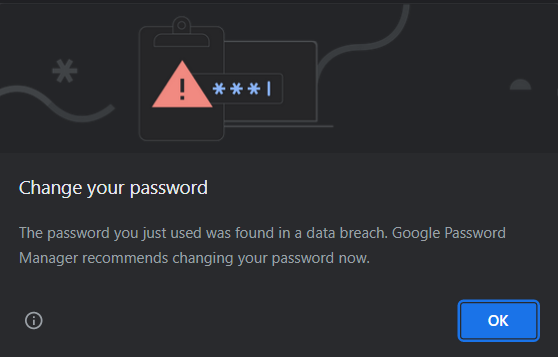

+++
title = "Demo server"
keywords = [""]
date = 2020-06-22T11:11:11Z
lastmod = 2023-04-10T11:11:11Z
+++

Survey Solutions developers team provides a special demo server equipped with the latest version of the Survey Solutions Headquarters for the users that want to:

- explore the interface of the software,
- try different roles,
- test pre-loading data files,
- see the new features added in a [recent release](/release-notes/).

It is important to understand that this server may not be utilized for real survey data collection, because this server is a public server that anyone in the world can access, and also because the demo server is also periodically cleared (erazed), when it accumulates a lot of old surveys or users that are no longer active, usually once a month.

When you are using the demo server, you will start with the headquarters user role, and can create your own supervisors and interviewers, import your own questionnaires, create assignments, conduct and approve interviews, export data.

To access the demo server, in your browser proceed to:
https://demo.mysurvey.solutions
and sign in with the username `DemoHQ` and password `XjQ2gTqFe8`.

***We ask the users never change the password for this headquarters user on the demo server!!***

Please, do <U>not</U> change the password for the above account even if you get a warning from the Chrome browser like the one shown here:

  

(It is correct that the Chrome detects the password for the user is exposed, but this is exactly the intension to let the users log in.)

*We also ask the users not to interfere with each other. If you didn't create a particular interviewer or supervisor account, don't touch it, or the work assigned to it.*

We also provide miniature sandbox-like PDS ([Personal Demo Servers](/headquarters/config/personal-demo-server/)), which can be instantly created from the [self-service portal](https://pds.mysurvey.solutions/PersonalDemoServerRequest) by individual users that prefer no interaction with other users. With PDS you get a control over the administrator account, and can create multiple HQ accounts, observer accounts, or try the Survey Solutions API.

⚠️ Neither the demonstration server above, nor the PDS are intended for real data collection. [Set up your own server for data collection](/headquarters/config/server-setup/).

⚠️ Remember that any data that you upload to the demo server is immediately visible to anyone. Do not upload anything confidential here: no real addresses, phone numbers, credit card numbers, or other sensitive or personally identifying information.
