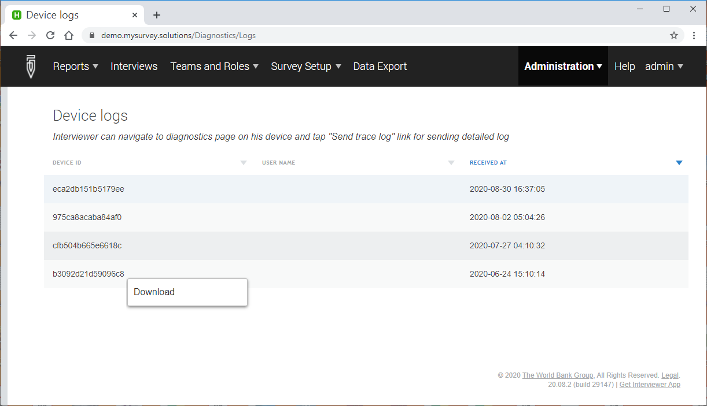
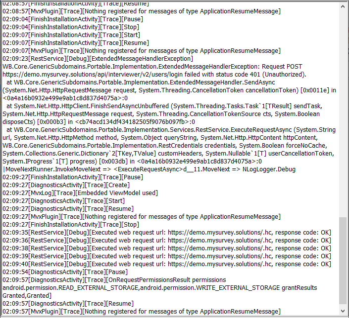

+++
title = "Device Logs"
keywords = ["configuration", "troubleshoot", "logs"]
date = 2020-09-02
aliases = []
+++

Survey Solutions contains a built-in mechanism for logging the problems and transmitting the log data from tablets to the HQ server. This helps to investigate the issues where the interviewers can not supply any detailed problem report and commonly describe the problem with "*it doesn't work*" or "*it crashes*" and it is difficult or not possible to access the device directly.

The information contained in the device logs is rather technical and should be interpreted by IT personnel or software developers. If you are looking for a description of activities undertaken by an interviewer, rather than solving a technical problem, then the [Interviewer Actions Log](/headquarters/reporting/detailed-action-log/) must be used instead.

###### On the tablet

To obtain the device logs the interviewer should proceed to the `Menu` -> `Diagnostics` -> `Send trace logs` (which is option #3 in the article describing the [Diagnostics page](/interviewer/troubleshooting/interviewer-app-diagnostics/)).

Internet connectivity is required to transmit the device logs to the server.

###### On the server

The trace logs sent from other devices are available to the server administrator, who can access them from `Menu` -> `Administration` -> `Device logs`:

The table contains the device identifier (visible on the tablet in the [Settings Dialog](/interviewer/troubleshooting/interviewer-app-settings/)), name (if available) and date/time when the logs package was sent.

Note that the name may be missing, as the logs may be sent even before the user has successfully logged in. 

The table is sortable by any of the columns. Click on the column header to sort.

###### Device log example

Each device log is a zip-archive, which contains one or more files with a description of various actions, error messages, etc which occurred on the tablet (whether or not the interviewer was explicitly notified about them). These are text files and can be opened with a text editor to inspect their contents. You can do so before sending the files if requested so by the development team.

