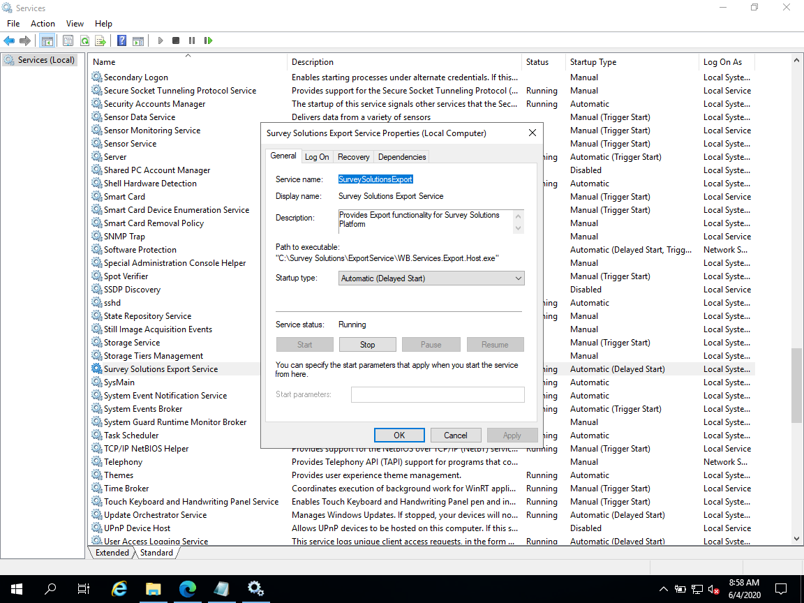

+++
title = "Export Service"
keywords = ["configuration", "troubleshoot"]
date = 2020-06-04
aliases = []
+++

Survey solutions comes in two parts. Headquarters user facing web application (usually executed within IIS web server) and Export background windows service. Web site is communicating with its export service using HTTP protocol and specified in settings port. If you open your `appsettings.Production.ini` file you can find two URLs that are important for export service:

``` INI
[Headquarters]
BaseUrl=http://localhost:9700
[DataExport]
ExportServiceUrl=http://localhost:5000
```

## Export service is working, but fails to export data

When user requests export on [data export page](../../export/data-export-tab) headquarters app sends HTTP request using `DataExport:ExportServiceUrl` configuration option to generate export. Part of this request is a headquarters app URL for export service to use when getting interview data. Back url that is sent to export service is configured in [Headquarters:BaseUrl](../standalone-installation#base-url) configuration option. Check if you can open headquarters application using configured url.

## Export service unavailable

In order to check if export service is currently running you can open specified in configuration URL and append `/.hc` at the end. In default installation you should try opening `http://localhost:5000/.hc` url on machine where survey solutions is installed. If you see a single message saying `Healthy` it means export service is running.

If you don't see a healthy status you should open services list (Press the Win + R keys on your keyboard, to open the Run window. Then, type "services.msc" and hit Enter or press OK) and find Survey Solutions Export Service


It should be in running status.

Reasons why export service cannot be launched can be found in Survey solutions installation / logs folder.

