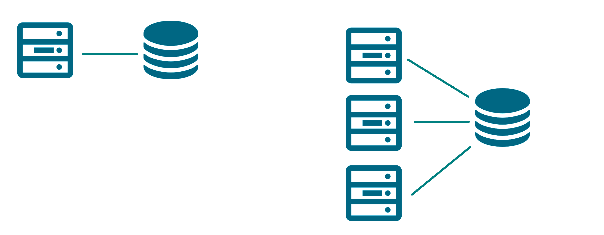
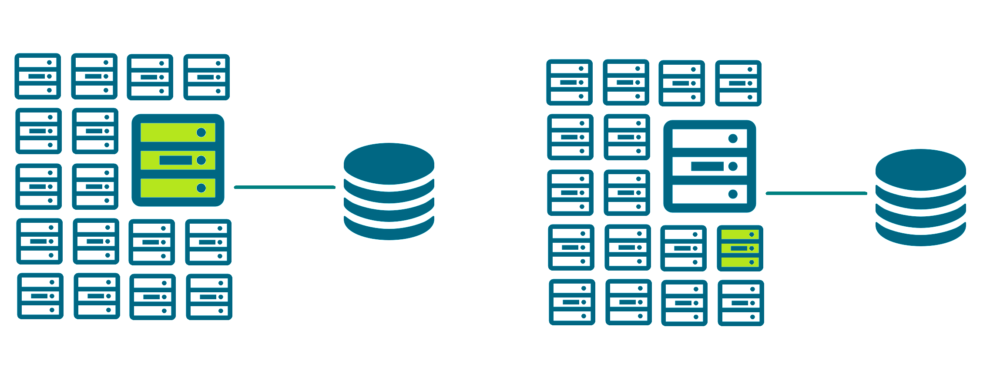
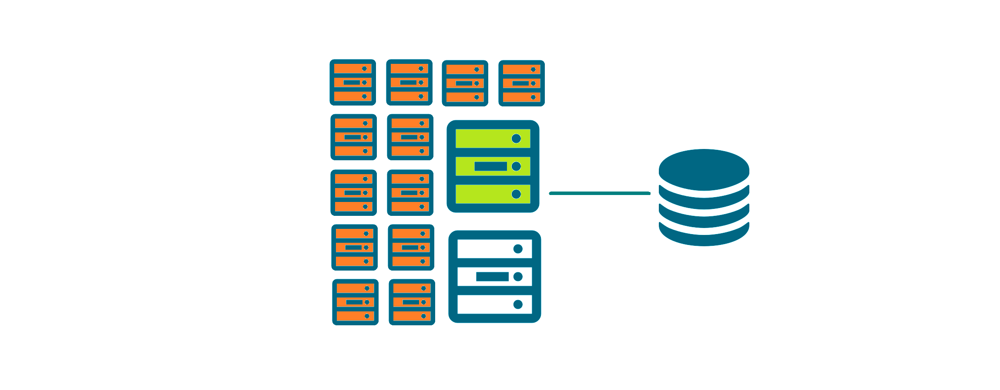

+++
title = "Configuring Export in a Survey Solutions Server Farm"
keywords = ["configuration", "farm"]
date = 2024-03-12
aliases = []
+++

Massive operations involving millions of respondents present considerable load on the infrastructure servicing the requests where Survey Solutions is deployed. This results in server administrators finding themselves in a situation where they need to scale up the infrastructure to ensure the system remains reliable and responsive. Such situations are neither new, nor specific to Survey Solutions software, but merely reflect the peaks in demand for resources that may fluctuate depending on the time of day, impact of ad campaigns, and other factors.

Most users (that start with a typical configuration of one web server and one database server) very quickly realize that [scaling up](/faq/web-farm/) and expanding their web servers capacity eliminates some of the critical bottlenecks.

<CENTER>
  <A href="images/nodes1.png">
    
  </A>
</CENTER>

As the operation continues to grow, or experiences higher shocks, the administrator can introduce more and more of the web server nodes to compensate for higher demand. Notably, some cloud-based systems allow for automatic expansion of the number of the server nodes when certain conditions are met. Yet for larger operations the export operation does not benefit much from the expansion of the number of web server nodes. The performance of the server farm at data export operation will still be limited by the performance of a single node producing the export.

<CENTER>
  <A href="images/nodes2.png">
    
  </A>
</CENTER>

One is tempted to introduce new, larger/higher-performing nodes into the pool of the servers in an attempt to boost the export performance, but this improvement is prone to an issue that any of the nodes may start processing export jobs, and thus the larger node will have roughly ***q/n*** probability to handle export operations (where ***n*** is total number of nodes, and ***q*** is the number of higher performing nodes).

<CENTER>
  <A href="images/nodes3.png">
    
  </A>
</CENTER>

Rather than manipulating the number of nodes, one needs to tell Survey Solutions nodes whether they are responsible for production of the export data or not. This can be done with the help of the `IsReadOnly` flag in the section `[Job]` of the `appsettings.production.ini` configuration file (*requires Survey Solutions version 23.09.4 or newer*).

```

[Job]
IsReadOnly=true

```

The default value of this flag (if not specified) is ***false***, meaning the node is not in the state preventing it from processing export jobs. In other words, at default configuration the node is participating in the pool of the nodes that are eligible for processing data export jobs. But this flag can be raised to ***true***, indicating that even when this node sees an upcoming export job, it will not take action, allowing other nodes to process it. The strategy is to delegate handling the export jobs to the highest performing node(s) only, while designating all other notes to be in the readonly state in the farm (marked orange in the diagram below):

<CENTER>
  <A href="images/nodes4.png">
    
  </A>
</CENTER>

This strategy guarantees that when a new export job is posted it will be handled by a more productive node, while other nodes continue servicing other requests in parallel.

**Note that:**

1. The concept of ***read only*** here is meant with respect to export jobs. Nodes marked as `IsReadOnly=true` can still handle `POST` requests, such as to receive data from interviewers' synchronization streams, or answers submitted by web respondents.

2. Regardless of the typology of nodes involved in the farm, they should share a common storage, which is regulated by the key `AppData` of the `[FileStorage]` section of the `appsettings.production.ini` file and this storage should not be affected by raising and dismantling the dynamic nodes.

```

[FileStorage]
AppData=\\NetStore\AppData

```
