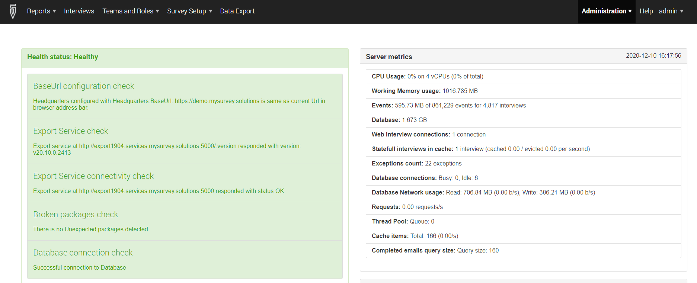
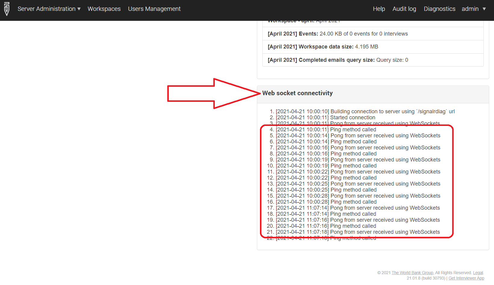

+++
title = "Healthcheck"
keywords = ["healthcheck", "diagnostics", "troubleshooting"]
date = 2020-12-09
aliases = []
+++

Survey Solutions server administrator has access to the special healthcheck
page using the following: `menu` &#x2192; `Administration` &#x2192; `Diagnostics`.

This page may appear like the following:

This page shows two kinds of information:

- left side shows diagnostics related to server configuration, whether the
settings are set up correctly and the different components are able to talk
to each other;

- right side shows various metrics of the server performance, such as the
CPU load, memory usage, number of concurrent queries, or the database footprint.

Server administrators are requested to inspect the indications of this panel for
common problems before bringing them up to the support.

Under proper configuration all components at the left side should be green. The
number of broken packages may become positive due to miscoordination between the
interviewers and supervisors (e.g. the same interview rejected to two different
interviewers) even under normal work.

The following can be the statuses for the healthcheck:

- ***Healthy*** (green) - export service is responding and can access headquarters;
- ***Degraded*** (yellow) - export service is not answering;
- ***Unhealthy*** (red) - export service cannot access headquarters;

The healthcheck status is available for monitoring remotely (without
authorization) at the following URL: https://your.server.name/.hc

For example, for the publicly available demo server the healthcheck status URL is:
https://demo.mysurvey.solutions/.hc

The response contains exactly one word: "*Healthy*", "*Degraded*", or
"*Unhealthy*".

The healthcheck diagnostics tool has been added in version 20.07 of Survey
Solutions.

### Web socket connectivity check

Following the server metrics the healthcheck page shows the process of testing
the web socket connectivity. Under the normal operation the user should observe
a sequence of PING and PONG messages with an interval of about 1-3 seconds. If
only PING messages are observed and no PONG responses are received, then the
server is experiencing a disruption in the web sockets connectivity. This
connectivity is necessary for [SignalR](https://en.wikipedia.org/wiki/SignalR),
which is utilized in Survey Solutions to conduct web interviews and allow the
supervisors/HQ-users to review the interviews on the server.

