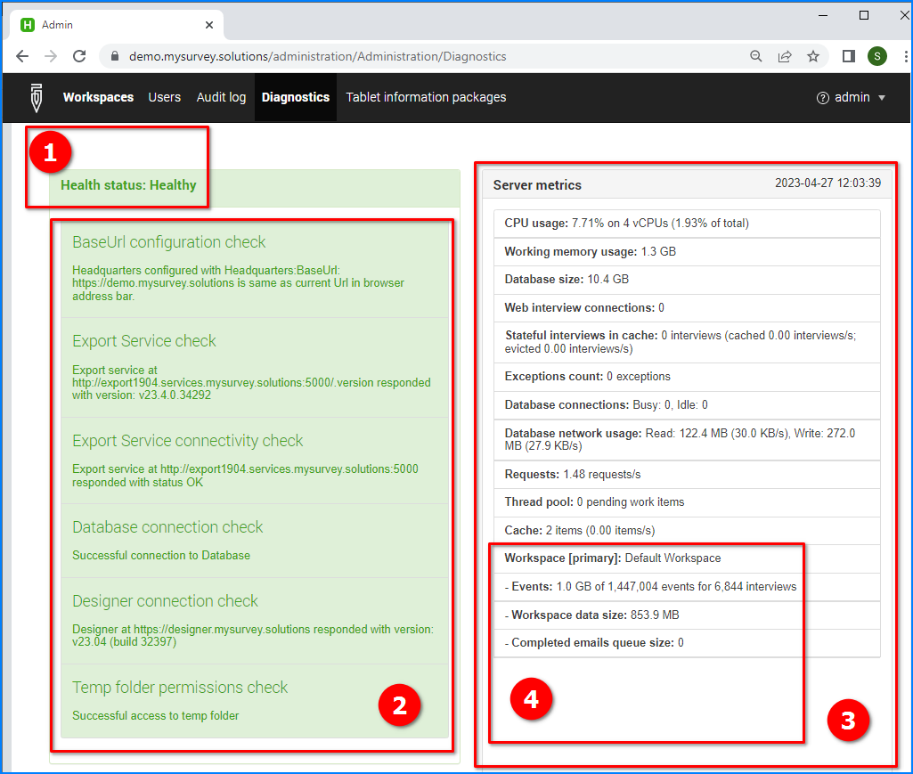
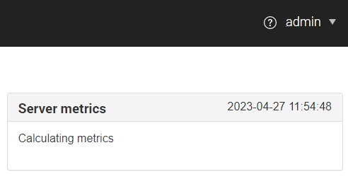

+++
title = "Healthcheck"
keywords = ["healthcheck", "diagnostics", "troubleshooting"]
date = 2020-12-09
aliases = []
+++

Survey Solutions server administrator has access to the special healthcheck
page using the following: `menu` &#x2192; `Administration` &#x2192; `Diagnostics`.

The health check diagnostics page shows:

1. Overall server health status.
2. Results of diagnostic checks.
3. Server metrics.
4. Statistics by workspace of the server.

#### Overall server health check

The following can be the statuses for the healthcheck:

- ***Healthy*** (green) - export service is responding and can access headquarters;
- ***Degraded*** (yellow) - export service is not answering;
- ***Unhealthy*** (red) - export service cannot access headquarters;

#### Results of diagnostic checks.

These are the diagnostic checks related to server configuration: whether the
settings are set up correctly and the different components are able to talk
to each other. Most of these settings are taken from the application
configuration file, which is modified during the server post-installation
configuration.

#### Server metrics.

Server metrics characterize the server performance and workload, such as the
CPU load, memory usage, number of concurrent queries, or the database footprint.

- **CPU usage** the higher the value, the more busy the server is. Values close
to 100% indicate that the server may be inadequate for the survey operation,
which may result in requests not being addressed.

- **Working memory usage** reports the consumption of memory (in GB). If this
value approaches the physical amount of memory expanding the memory may
improve the overall performance of the server.

- **Database size** indicates overall DB footprint (estimation). Watch for the
growth of the DB footprint especially on the systems that impose limits on the
growth of the DB, such as RDS instances in AWS and other cloud-based providers.

- **Web interview connections** reflects the number of concurrent web interview
sessions (includes the review of completed interviews by the supervisors/HQ
users, etc).

- **Stateful interviews in cache** reflects the dynamics of the interviews cache,
which expedites access to the contents of the interviews, such as when the
interview is opened by several users.

- **Exceptions count** reflects the number of exceptions experienced by the
server software. Review the Survey Solutions server logs if this number is
positive.

- **Database connections** shows the number of connections from the Survey
Solutions web server to the DB server (refer to [PostgreSQL documentation
](https://www.postgresql.org/docs/current/runtime-config-connection.html)).

- **Database network usage** reflects the read/write traffic between the web
server and the DB server.

- **Requests** indicates the rate of requests to the server (in requests per
second).

#### Statistics by workspace of the server

For each workspace it reports:
- number of interviews, number of events and the corresponding size of the
events database;
- size of the workspace data;
- number of emails regarding the completion of interviews in the sending
queue currently.

Database-related metrics are as reported by Postgres and are based on estimation.

Please note that calculating server metrics may take some time. During the
calculation the healthcheck page will show:

Server administrators are requested to inspect the indications of this panel for
common problems before bringing them up to the support.

Under proper configuration all the checks in the health check page should
pass in green. The number of broken packages may become positive due to
miscoordination between the interviewers and supervisors (e.g. the same
interview rejected to two different interviewers) even under normal work.

#### Remote monitoring

The overall healthcheck status is available for monitoring remotely (without
authorization) at the following URL: `https://your.server.name/.hc` the response
to which contains exactly one word: "*Healthy*", "*Degraded*", or "*Unhealthy*".

For example, for the publicly available demo server the healthcheck status
URL is: https://demo.mysurvey.solutions/.hc

### WebSocket connectivity check

Following the server metrics the healthcheck page shows the process of testing
the WebSocket connectivity. Under the normal operation the user should observe
a sequence of PING and PONG messages with an interval of about 1-3 seconds. If
only PING messages are observed and no PONG responses are received, then the
server is experiencing a disruption in the WebSocket connectivity. This
connectivity is necessary for [SignalR](https://en.wikipedia.org/wiki/SignalR),
which is utilized in Survey Solutions to conduct web interviews and allow the
supervisors/HQ-users to review the interviews on the server.


 
The WebSockets test is only informative if ran from an external network
(from the internet). When run directly on the server it will indicate
availability of WebSockets, yet the real user experience may be different.
{}


 
Note also that the PING-PONG communication here may indicate that a response
has been received, but not over the <I>WebSockets</I>, but rather using <I>LongPolling</I>.
This is not sufficient for Survey Solutions. Make sure the test succeeds in
communication specifically over <B>WebSockets</B>.
{}
