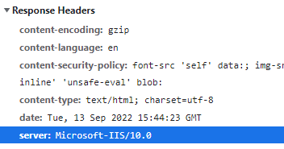
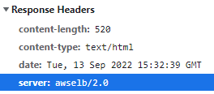
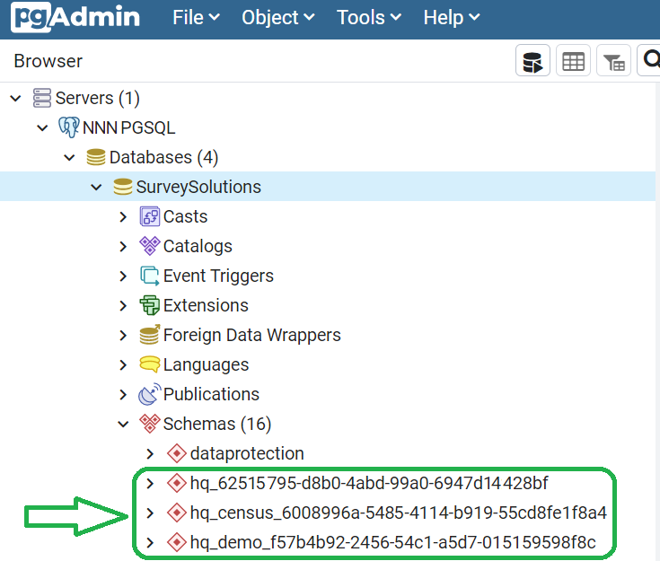

+++
title ="Procedures for maintenance"
keywords = ["support", "service", "maintenance", "testing", "error", "troubleshooting"]
date = 2021-01-06T00:00:00Z

+++

This page contains an outline of procedures that you may need to perform as instructed by developers. Please, pay attention to the steps and record the values and messages as instructed.

PROCEDURE B1
==================================

On the tablet:

1. Make sure you are logged out of the Interviewer application.
2. Reboot the tablet.
3. Start the Interviewer App.
4. Log in as interviewer,
5. Send to the person providing assistance (see bullets 3, 4, and 6 [here](/interviewer/troubleshooting/interviewer-app-diagnostics/)):
- the interviewer trace logs,
- all tablet information, and
- all technical information.

Interviewer trace logs shall be picked by the server administrator by visiting the corresponding server administration page: [device logs](/headquarters/config/device-logs/).

Tablet information packages shall be picked by the server administrator by
visiting the corresponding server administration page:
`Menu` &#x2192; `Administration` &#x2192; `Tablet information packages`
and clicking on the download icon for the corresponding package.

Technical information is sent via any of the means set up on the tablet, which could be an email, messenger, saving as text or otherwise transfer to the station where the output of [Procedure B1](#B1) is being collected for sending to the person providing assistance.

END OF PROCEDURE B1

----

PROCEDURE B2.
===================

[Procedure B2](#B2) shall be performed in English language. Set up your tablet (before step #6) to use English language as the main language of the interface.

1. Login to the Designer.
2. Copy public questionnaire "***[Service-B2](https://designer.mysurvey.solutions/questionnaire/details/4c35966eb9204355be8172df62d7830d)***" to obtain own copy.
Take a note of how you've named this copy: ______________.
3. Login to your data server (as admin) and import that questionnaire copy (made in previous step).
4. Create a new interviewer account with any login name and password, and in any team. You can create a new team if necessary to avoid confusion of an existing supervisor. Take a note:
interviewer account login: _____________ password: ______________.
5. Make one assignment to that interviewer account on the questionnaire imported in #3.  Take a note:
assignment id-number created: _______________.
6. Take a new tablet device. Connect to a WiFi internet connection which is known to be reliable and not manipulated by the ISP.
7. Install the Interviewer App from your data server to the tablet.
8. Login with the interviewer account (created in #4) and synchronize.
9. Make sure the assignment with the id-number recorded in #5 is received on the tablet.
10. a. If the assignment has not been received in #9: Do [Procedure B1](#B1).
STOP

10. b. If the assignment is received in #9: start the interview based on that assignment, take note of the interview key assigned to this interview.
Take a note of the interview key: ___ - ___ - ___ - ___.

11. Fill out the interview in #10b, mark as complete.
12. Synchronize the tablet. Make sure the synchronization was successful.
13. a. If synchronization does not succeed, repeat at least 10 times.

Take a note:
- synchronization timestamp: YEAR____ MONTH_____ DAY_______ HOUR____ MINUTE____ SECONDS___ TIMEZONE_____________________ .

- error messages (in full) during unsuccessful synchronization:

_____________________________________________________________ .
_____________________________________________________________ .
_____________________________________________________________ .
_____________________________________________________________ .
_____________________________________________________________ .
_____________________________________________________________ .
_____________________________________________________________ .
_____________________________________________________________ .
_____________________________________________________________ .
_____________________________________________________________ .

If synchronization has not succeeded after 10 attempts, do Procedure B1.
STOP

13. b. If synchronization does succeed in step #12, continue.
13. Assert that the interview with interview key assigned in #10b has left the dashboard of the tablet. If it has not, do [Procedure B1](#B1), then STOP.

14. Assert that the interview with interview key assigned in #10b has been received at the server. If it has not, do [Procedure B1](#B1), also include server logs [as described in #7 here](/headquarters/config/standalone-server-errors/) then STOP.

15. Open the interview you locate in step #14.
If there is any error message record it below:

________________________________________________________________ .

Regardless at which step you terminated [Procedure B2](#B2) remember to log out of the admin account at the data server afterwards.

The questionnaire that you've imported to the data server at step #3 shall remain until the end of the investigation, and can be subsequently deleted.

The accounts created at step #4 cannot be deleted, but can be locked by the user that created it after completion of [Procedure B2](#B2).

END OF PROCEDURE B2.

----
PROCEDURE B3.
===================

Procedure B3 shall be applied when the tablet can not communicate with the server and thus can't send the logs there.

1. Turn on the tablet.
2. Start the Interviewer App. No need to log in.
3. `Open Menu` &#x2192; `Diagnostics`
4. Click the link `Generate support package`
5. Save the resulting file to the tablet storage. Take a note of the file name: ________________________ .
6. Switch to the tablet's file browser (may be called **Files** or otherwise, depending on the brand of the tablet and OS version).
7. Locate the file saved in step #5.
8. Send this file to the person providing support (by saving to USB flash, SD-Card, emailing, sending over Bluetooth, or any other feasible means of transfer).

END OF PROCEDURE B3

----
PROCEDURE C1
=========================

This procedure is to be performed when the user obtains an unexplained error `403 "Forbidden"` while working with the data server.

1. Open the browser's development console (press `F12`).
2. Switch to the `Network` tab.
3. Refresh the current page (press `F5`) on which `error 403` was obtained.
4. Select the page document in the `Name` tab.
5. Check the `server` parameter in the `Response headers`.

The proper value should mention '*Microsoft-IIS*' for servers hosted in Microsoft IIS on Windows or '*Kestrel*' for servers hosted in Docker.

**Any other `server` value in this response header is indicative of some other device or program responding *instead* of Survey Solutions. Consult your network administrator regarding this issue.**

END OF PROCEDURE C1

----

PROCEDURE M1. Dropping temporary export schemas
=========================

The procedure below may be used in cases when the data export does not succeed, such as when a message appears of "An unexpected error during data export...". Note that this message may be appearing in different situations and the below listed procedure will not be able to resolve all of them.


When performed correctly the procedure is non-destructive, but if performed incorrectly may result in data loss. It is best performed by a qualified person with background in DB-management.
{}

1. Install pgAdmin if it is not already installed:
https://www.pgadmin.org/
2. Stop the SurveySolutions site in IIS.
3. Connect to your database using the same connection string used in installation of Survey Solutions. If you are performing maintenance on somebody else's server you will find the connection string (including the database name, user login and password) in the appsettings.ini file or inquire from the person who has access to these settings.
4. Find schemas that start with <B><TT>hq_</TT></B> followed by a GUID (there may be more than 1 such schema).

5. Drop those schemas. If you are asked if you want cascading deletion, answer affirmatively.  A third party instruction on deleting schemas in PostgreSQL via commands and using a point-and-click interface of pgAdmin is available at <A href="https://www.javatpoint.com/postgresql-drop-schema">this external site</A>.


Do not delete any other schemas, or your data will be lost.

Only delete schemas starting with <B><TT>hq_</TT></B> and ending with a 32-hexdigit GUIDs.
{}

6. Restart the Survey Solutions site in IIS.
7. Retry the export. The first export after performing the above steps may be considerably slower than your previous experience as the program is rebuilding the deleted schemas from raw data. The subsequent exports will be done faster.

END OF PROCEDURE M1
