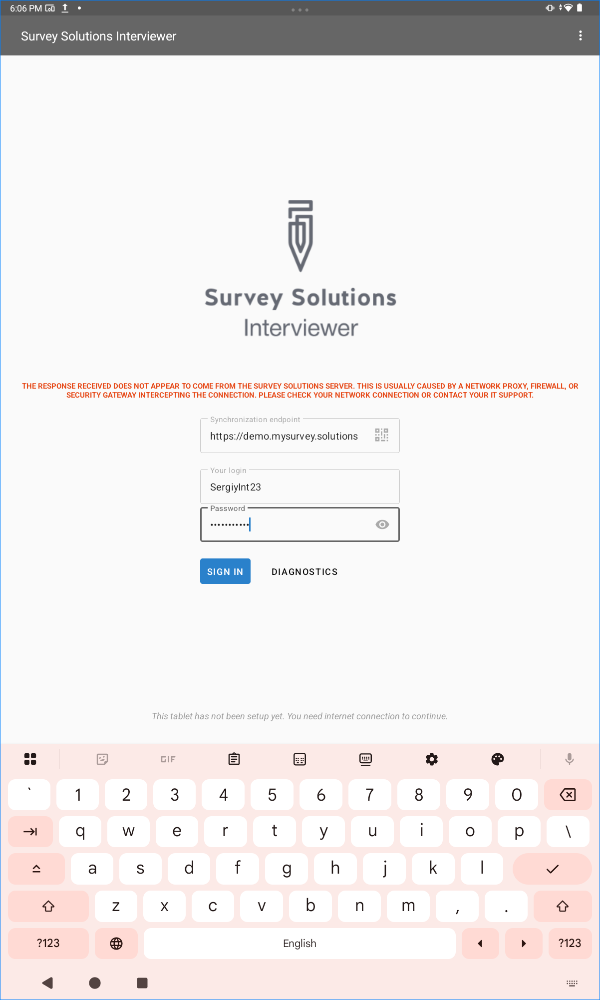

+++
title = "Server response check"
keywords = ["server", "communication", "integrity"]
date = 2026-04-23T00:00:00Z
lastmod = 2026-04-23T00:00:00Z
+++

When Survey Solutions exchanges data with the server this data travels through
the network (typically through the Internet) and through numerous nodes/devices
that handle particular traffic. These may include firewalls, load balancers,
proxy servers, security devices, and other infrastructure nodes that may pass,
filter, or intervene with the normal flow of data.

When (for any reason) these devices decide to block the traffic to the server
(e.g. from the Interviewer application on a mobile device or from a respondent's
web browser in a web survey) some functionality may not be available or worse,
if these devices modify the response from the Survey Solutions server or
respond instead of the Survey Solutions server. In some cases Survey Solutions
application installed on the server may not be even transacted and thus no
evidence remains in the application log, and no possibility for Survey Solutions
software to react. In most cases this is the result of poor configuration and
monitoring of the infrastructure, rather than a real threat or attack.

For that reason the distributed parts of the Survey Solutions software are
expecting a marker in the server response and alert the user of the absence of
such a marker.

For example, here is a screenshot from the Interviewer application whereas the
user is trying to sign in, and yet the authentication response was received not
from a Survey Solutions server.

  

The error message says "*The response received does not appear to come from the Survey Solutions server. This is usually caused by a network proxy, firewall, or security gateway intercepting the connection. Please check your network connection or contact your IT support.*"

It is usually not possible for the application to determine any further details
that would be helpful in troubleshooting and there is no exhaustive list of
reasons or possible problems to enumerate and provide comprehensive advice here.
But the situation where this message is being received points at a communication
intervention that the Survey Solutions is not causing and is not able to react
otherwise except stopping and notifying the user.

Importantly, it is also not possible to determine with certainty whether the
issue is on the server side (in or around the network where the server hosting
Survey Solutions is placed) or on the client side (in or around the network
where the client connecting to the server has joined). Troubleshooting efforts
could concentrate on both. Typically, many clients attempting to synchronize or
communicate with the server from various devices, networks, countries, and
getting this message point heavily towards the issue being on the server side,
while issues reported by only one/handful of users while others doing seemingly
the same tasks without any such disturbance point towards the problems on the
client side.

#### Important notices

- This is <U>not</U> a security feature. It is an instrument to assist in
detecting invalid responses that would otherwise be not be noticeable to
the users.

- The feature is checking whether the response is received from Survey
Solutions vs not Survey Solutions server. It doesn't authenticate the
server in any way (that is the task for the SSL certification).

- If you are seeing the message, this definitely points that there is an issue.
However, absence of such a message can't exclude the possibility of a
networking issue. It may still be present, but be somewhat more complex than a
simple diagnostic like this can detect.
