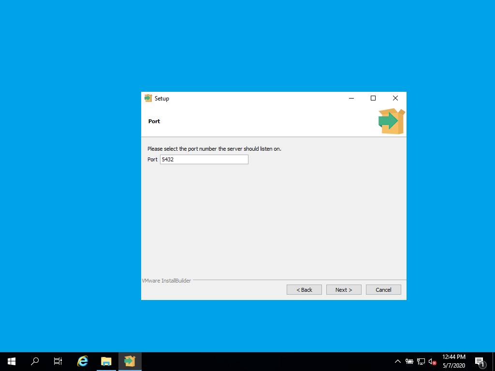
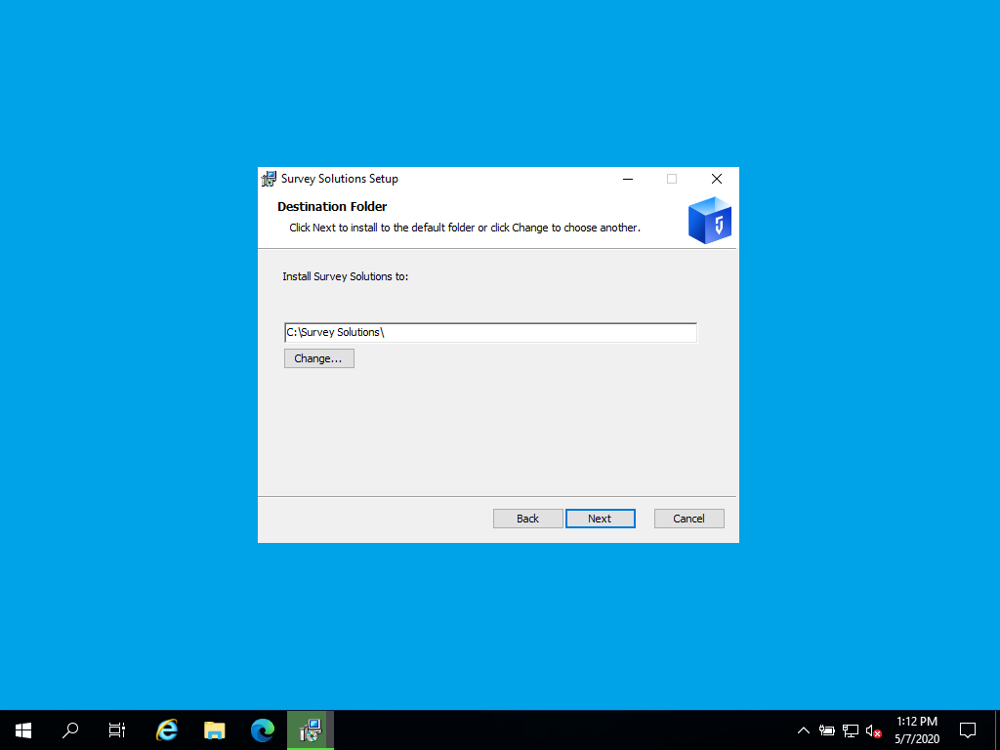
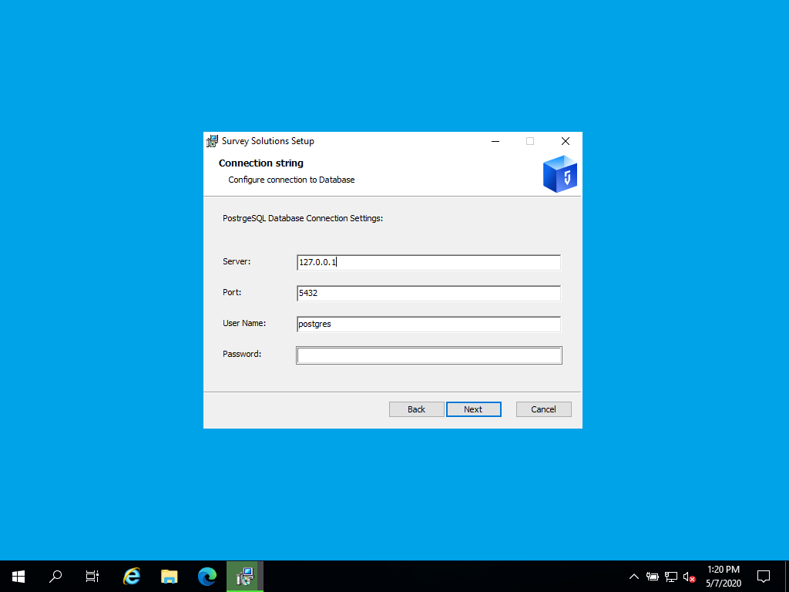
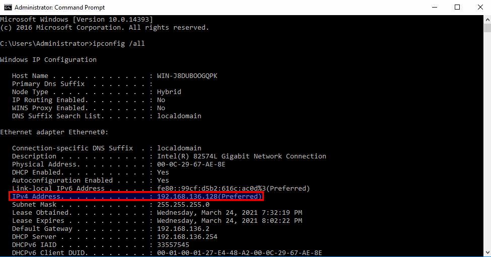
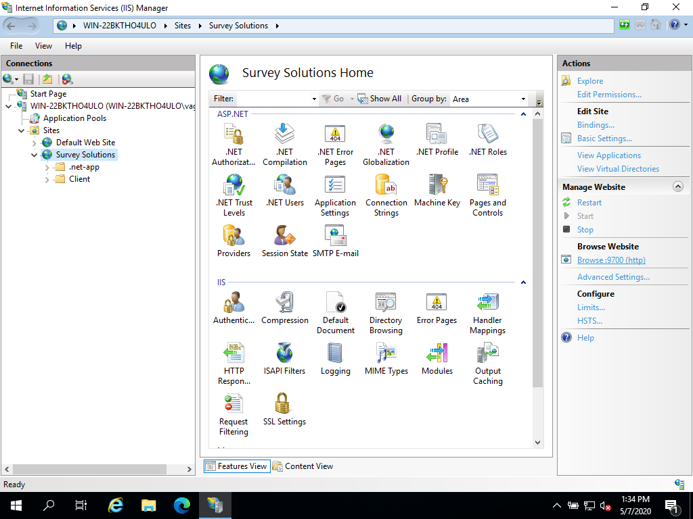
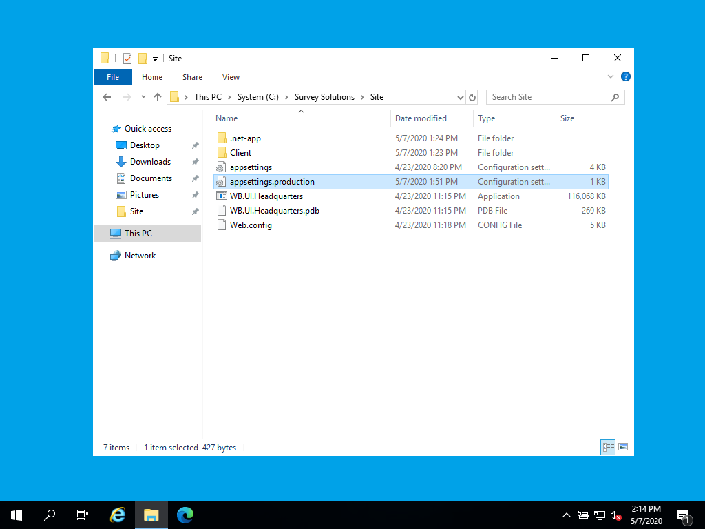
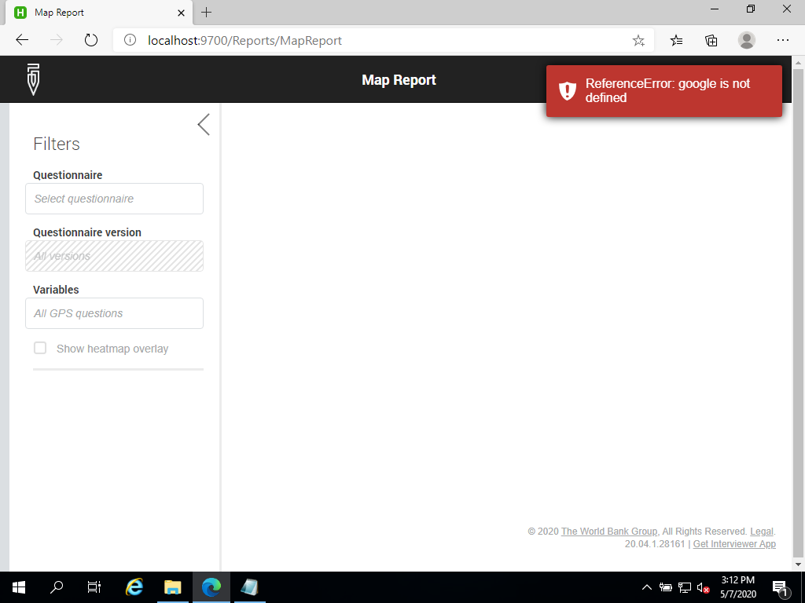

+++
title = "Server Installation"
keywords = ["installation", "configuration"]
date = 2020-05-06T14:14:00Z
aliases = ["/customer/portal/articles/standalone-installation", "/customer/portal/articles/2768436-standalone-installation","/customer/en/portal/articles/2768436-standalone-installation","/customer/portal/articles/2768436","/customer/en/portal/articles/2768436","/headquarters/standalone-installation"]

+++

Installation has following steps:

1. [Installing PostgreSQL](#installing-postgresql)
2. [Installing SurveySolutions](#installing-surveysolutions)
3. [Post installation configuration](#post-installation-configuration)

## Installing PostgreSQL

Make sure that you have an installed and running instance of PostgreSQL
**before running SurveySolutions.exe**

You can download PostgreSQL from
[here](https://www.postgresql.org/download/windows/) and run the setup. Pick
the latest stable version (note: Survey Solutions will not work with PostgreSQL
  prior to version 10.0).

During the process you'll set the password for the database superuser:

{}

{}

and the port, on which the PostgreSQL server will be running:

{}

{}


After the installation is complete, follow the instructions for
[tuning PostgreSQL for production use](https://wiki.postgresql.org/wiki/Tuning_Your_PostgreSQL_Server)

By default, PostgreSQL is set up to allow connections from the same server only. If you are going to install
Survey Solutions on the same server, you don't need to change this default. However if you are splitting the database
and the web application into two separate servers (may be advisable for larger-scale operations when administration and
maintenance of the database is better by its own) you have to explicitly allow connections from external server to reach
your PostgreSQL database. This is done by modifying pg_hba.config file and adding ip address of the webserver, which
will run Survey Solutions. Please take a look at the [documentation](https://www.postgresql.org/docs/13/auth-pg-hba-conf.html)
for further details.

## Installing Survey Solutions

Download the [Survey Solutions installer](https://mysurvey.solutions/Download)

Run SurveySolutions.exe. It will ask you for two parameters: install location
and PostgreSQL connection parameters.

For the install location – choose any or keep the default (`C:\Survey Solutions\`)

{}

{}

For PostgreSQL connection parameters (default values will be already there)
specify the port and password you've chosen when setting up the PostgreSQL
earlier:
{}

{}

That's it. At the end, finish installation page will automatically open
in your browser where you'll be able to create administrator user for
Survey Solutions Headquarters application. The link to the site will be
automatically added to your start menu, but you can always access it by
directly typing the address in the browser's address bar.

In order to check if the application is running correctly you can open
`http://localhost:9700/.hc` URL. It should output `Healthy` message.

## Post installation configuration

The post-installation configuration involves the following:

- [adjusting the site bindings](#bindings);
- [SSL certificate](#ssl);
- [adjusting the firewall rules](#firewall);
- [adjusting the load balancer](#loadbalancer);
- [adjusting the application configuration](#configuration):

  - [BaseURL](#baseurl);
  - [Captcha](#captcha);
  - [Google Maps](#googlemaps);
  - [GeoTIFF](#geotiff).

### Adjusting the site bindings {#bindings}

By default, Survey Solutions is installed as a web application and runs
behind the IIS web server using port 9700. A custom port is used
to avoid potential conflicts with existing web applications you may already be
running on the same server. Also, most firewalls will block custom ports by default
and this will help you in protecting your data by not exposing your application to
external networks/Internet unintentionally.

Accessing your application via `localhost` only works from the same computer, in order
to connect to it from a different machine or an Android tablet, you have to use (and know)
your server's ip address.

One option to find the computer's ip address information is using `ipconfig`. To
access it, right click on start menu, select run option and execute `ipconfig /all` command.

{}

{}

`/all` option is used in case your server has multiple network interfaces.

Once you locate the appropriate address, you can access your server from any other device (connected to the same network)
by typing `http://server_ip_address:9700/` in the browser. For our example, the address would look like
this: `http://192.168.136.128:9700/`

You can now change the port 9700 to 80 in the IIS configuration manager.
To access it right click on start menu, select run option and execute the
`inetmgr` command.

In the IIS Manager you will find the Survey Solutions application:
{}

{}

If you click on the `Bindings...` link in the right panel you will be
able to add or modify ports that application listens to, such as 80 for HTTP, or 443 for HTTPS (see [below](#ssl)).

Now you can ommit the custom port number when accessing the server - `http://192.168.136.128/`.

Remembering and always typing ip address to connect to the server is still not the best and convinient approach. You
could instead attach a domain name to your server, which would simplify work considerably. Moreover, in order to be
able to use [ssl](#ssl) encryption, you must have a domain name attached to the web application.

Obtaining a domain name for the specific purpose of running one application will depend on the way you'd like it to be
accessed by your team and the users. If you would like to get a sub-domain (third-level, forth-level, etc, domain) under
an existing domain name (for example, your organization already operates http://www.coolcompany.com address and you want to add
http://survey.coolcompany.com) it may be as easy as contacting the right person/team who manages the main address and ask them
to issue the sub-domain for you.

But if you instead prefer to have a dedicated, second-level domain name, like http://mycoolsurveys.com address, you will need to
first buy and register the new address. There are many companies who provide global, or country-specific domain registration services,
some of them offering free or discounted options, so finding an appropriate solution for your need would involve little
[searching](https://www.google.com/search?channel=fs&client=ubuntu&q=buying+a+domain+name).

### SSL certificate {#ssl}
If your Survey Solutions instance is exposed to the public in the Internet,
it is highly recommended to setup SSL encryption for web server by applying
an SSL certificate.

The configuration depends on the
[certificate provider](https://en.wikipedia.org/wiki/Certificate_authority#Providers)
that you choose, so refer to their documentation on how to setup IIS.

### Firewall rules {#firewall}

To permit communication of Survey Solutions with the Designer and other utilized
services you may need to enable certain ports or types of communication as
listed below. The instructions vary by type of the security software used.
See #3 in the [FAQ for IT](/getting-started/faq-for-it-personnel/) for common
security software instructions.

- allow incoming connections to the port that you've set up the server binding
of Survey Solutions;
- allow outgoing connections to the Designer site:
`https://designer.mysurvey.solutions`;
- allow outgoing connections to the Survey Solutions site:
`https://mysurvey.solutions`.

In addition expect the client (browser) to

- send queries to the Maps server being used:
typically `https://maps.googleapis.com` and `https://google.com`
(or see [here](/headquarters/config/alternative-maps-for-servers-in-china/) for
alternative settings for China);
- send queries to the CAPTCHA server being used (if it is used):
`https://www.google.com` and `https://www.gstatic.com`

Survey Solutions operates with HTTP/HTTPS requests that may be rather large
(multiple MB). Your server must be configured to receive and process such
queries (rather than block them). This may necessitate additional
[WAF configuration](https://en.wikipedia.org/wiki/Web_application_firewall). If
this is not permitted, the interviewers may not be able to synchronize their
tablets.

### Load balancer {#loadbalancer}

If you are using a load balancer, please make sure that it is configured to use:

- sticky sessions, and
- web sockets.

If this is not satisfied, web interviews will not work resulting in errors for
the respondents (this may not be immediately obvious to the person setting up
the Survey Solutions server).

If the Survey Solutions web server is placed behind a load balancer with
SSL-termination, the following setting must be added to the `Policies` section
of the `appsettings.production.ini` configuration file:

```
[Policies]
CookiesSecurePolicyAlways=true
```

### Survey Solutions application configuration {#configuration}

Open the `/Site` folder where Survey Solutions is installed, and open
`appsettings.production.ini` file. This file will not be replaced during
application upgrades and will retain your local server configuration.

{}

{}

#### Base URL {#baseurl}

If your server has domain name you need to change `BaseUrl` value to the name
you have (without trailing slash at the end of the URL). Make sure that this
URL can be used to open Survey Solutions app from server where application is
installed, otherwise export won't work.

Example of an ini-file with configured base URL:

``` INI
[Headquarters]
BaseUrl=https://demo.mysurvey.solutions
```

#### Captcha {#captcha}

A [captcha](/headquarters/accounts/captcha/) is used to safeguard the
application from brute-force attacks on user accounts and for protection of 
web mode from automatic creation of interviews.

Survey Solutions may utilize a built-in (hosted) implementation of captcha
(default) or an external reCAPTCHA provided by Google (to be configured as
per instructions below).

To take advantage of the more secure reCAPTCHA implementation by Google, you
need to set it up in the Google reCAPTCHA admin and record the 2 issued keys
into your configuration file.

- Navigate to [creation page](https://www.google.com/recaptcha/admin/create)
to register a new captcha. Click on the ℹ️-icons will give you helpful hints
on how to fill out that form.
- Specify your public DNS name that is configured in
Survey Solutions `BaseUrl` property for the site name.
- When selecting the reCAPTCHA type, select version 2 ("*reCAPTCHA v2*").
- You can specify additional emails to receive notifications on problems or
increase in suspicious traffic (alerts are issued by Google).

After you click the `Submit` button you will see a page where you can copy
the necessary *site key* and *secret key*. Then add the following content
into your `appsettings.Production.ini` file:

``` INI
[Captcha]
CaptchaType=Recaptcha
SecretKey=%Your secret key%
SiteKey=%Your site key%
Version=v2
```

#### Google maps {#googlemaps}

If you are using a GPS question you should change
[Google maps API key](https://developers.google.com/maps/documentation/javascript/get-api-key).
After creating it in the console, add it to the `appsettings.Production.ini`
configuration file:

``` INI
[GoogleMap]
ApiKey=%Your API key%
```

when not configured properly you will see error
`ReferenceError: google is not defined` on the map report page:

{}

{}

#### GeoTIFF files support {#geotiff}

If you are using
[GIS](/questionnaire-designer/questions/offline-gis-functionality-expansion/)
functionality and plan using TIFF files as maps, then you need to install the
[GDAL](https://gdal.org/) library. The simplest way to do it (on Windows)
is to use the [OSGeo4W project](https://trac.osgeo.org/osgeo4w/wiki):
download installer from their web site and install only "GDAL".

Survey Solutions will try to locate and make use of the GDAL libraries
at the default installation path: `C:\OSGeo4W64\bin\`. If you've installed
it to another folder then add the following configuration to your
`appsettings.Production.ini` file:

``` INI
[Geospatial]
GdalHome=%Path to bin where GDAL is intalled%
```
If this step is not performed, the users of this Survey Solutions instance
will not be able to upload maps in GeoTIFF format to the HQ. They will still
be able to upload maps in other accepted formats.
