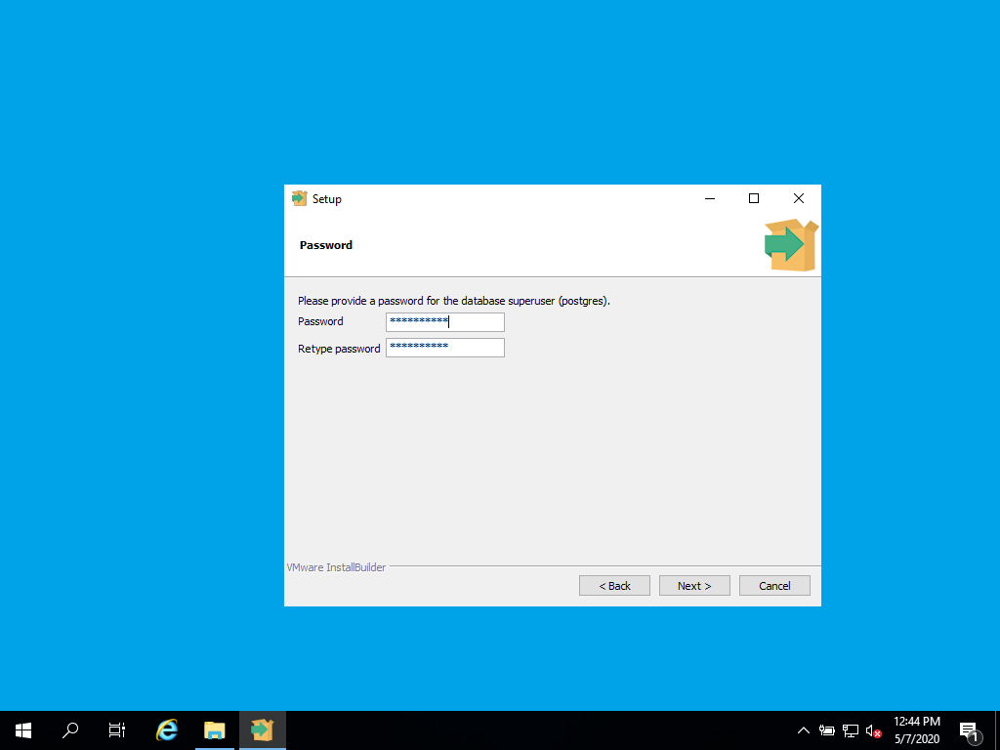
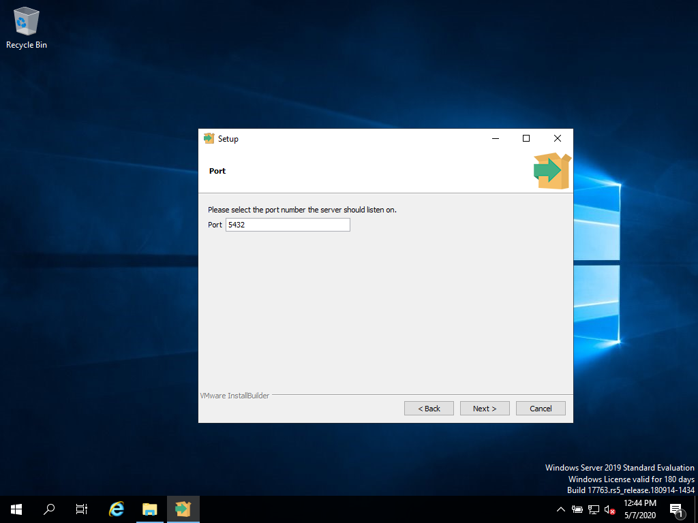
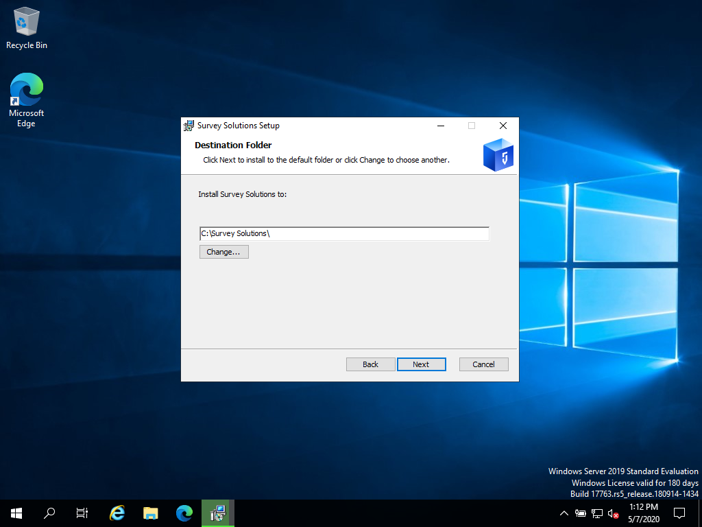
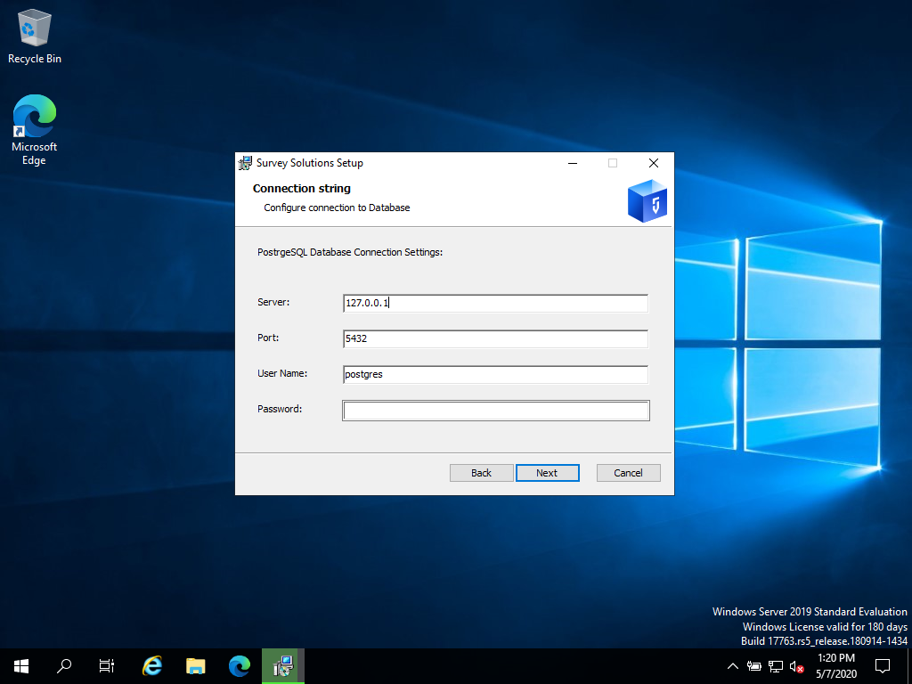
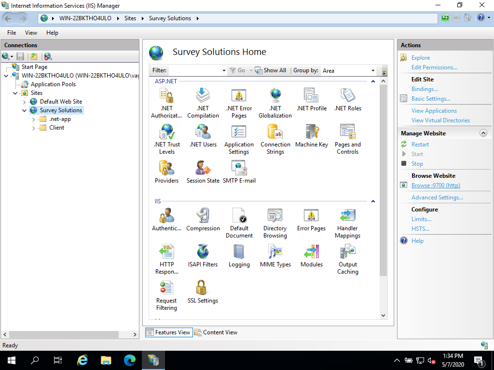
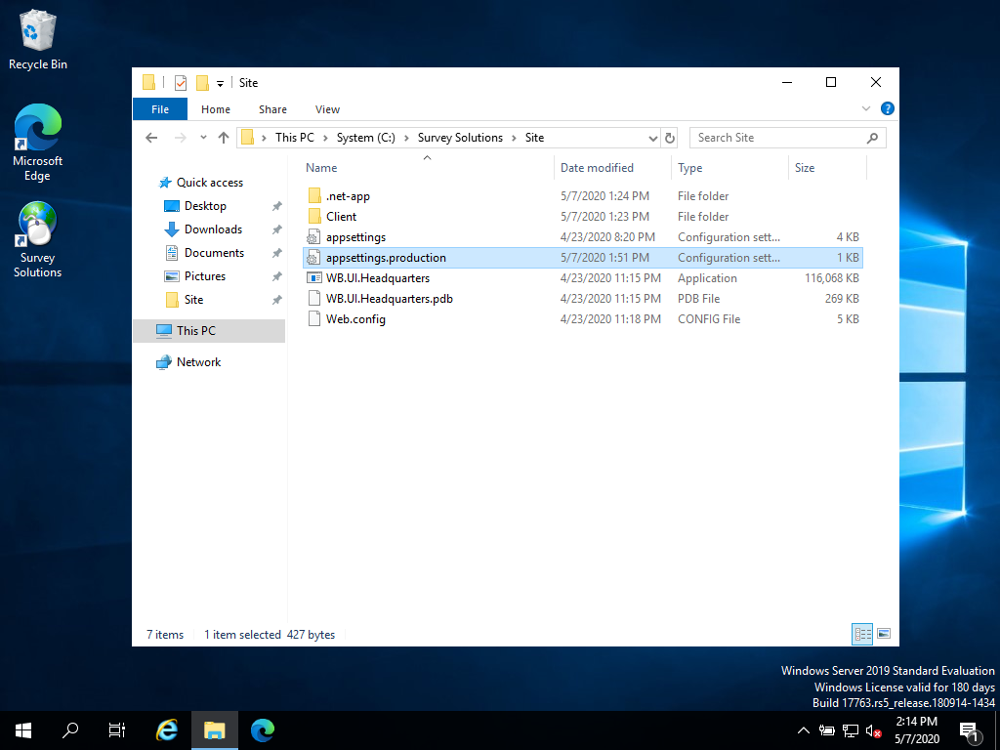

+++
title = "Standalone Installation"
keywords = ["installation", "configuration"]
date = 2020-05-06T14:14:00Z
aliases = ["/customer/portal/articles/2768436-standalone-installation","/customer/en/portal/articles/2768436-standalone-installation","/customer/portal/articles/2768436","/customer/en/portal/articles/2768436","/headquarters/standalone-installation"]

+++

Installation has following steps:

1. [Installing PostgreSQL](#installing-postgresql)
2. [Installing SurveySolutions](#installing-surveysolutions)
3. [Post installation configuration](#post-installation-configuration)

## Installing PostgreSQL

Make sure that you have an installed and running instance of PostgreSQL **before running SurveySolutions.exe**
  
You can download PostgreSQL from [here](https://www.postgresql.org/download/windows/) and run the
setup. Pick latest stable version.

During the process you'll set the password:


Port on which server will be running:
.

After installation is complete, follow the instructions for [tuning PostgreSQL for production use](https://wiki.postgresql.org/wiki/Tuning_Your_PostgreSQL_Server)

## Installing Survey Solutions

Download [survey solutions installer](https://mysurvey.solutions/Download)

Run SurveySolutions.exe. It will ask you for two parameters:  
Install location – choose any or keep the default (C:\Survey Solutions)  


PostgreSQL connection parameters (default values will be already there)
– here specify port and password from step 1:

  
That's it. At the end, finish installation page will automatically open
in your browser where you'll be able to create administrator user for
Survey Solutions Headquarters application. The link to the site will be
automatically added to your start menu, but you can always access it by
directly typing the address in the browser's address bar. 

In order to check if application is running correctly you can open http://localhost:9700/.hc url. It should output `Healthy` message.

## Post installation configuration

By default survey solutions is installed as web application and runs behind IIS web server. It uses 9700 port, it is fine for the default setup, but will require all users when referring to your server to write this :9700 port name at the end of the URL. Also most firewalls will block custom ports by default and it might require additional configuration on client side to access server. If you need to change port you can do it in IIS config. To access it right click on start menu, select run option and execute `inetmgr` command. There you can find Survey Solutions application:


If you click on Bindings... link in the right panel you will be able to add new ports, like 80 for http and 443 for https.

If your survey solutions instance is exposed via public internet access it is highly recommended to setup SSL encryption for web server. Configuration depends on certificate provider that you are going to choose, so refer to their documentation on how to setup IIS.

### Application configuration

Open `/Site` folder where survey solutions is installed, and open `appsettings.Production.ini` file. This file will not be replaced during application upgrades and will retain your local server configuration.


#### Base URL

If your server has domain name you need to change `BaseUrl` value to the name you have (without trailing slash at the end of the URL). Make sure that this URL can be used to open Survey Solutions app from server where application is installed, otherwise export won't work.

Example of ini file with configured base url:

``` INI
[Headquarters]
BaseUrl=https://demo.mysurvey.solutions
```

#### Captcha

Captcha is used to application from brute force attacks on user accounts and for protection of web mode from automatic creation of interviews.
Default version is hosted one, it does not require any configuration but is less secure.
Other option is to use google recapcha. You will need 2 keys from google recaptcha service. Navigate to [creation page](https://www.google.com/recaptcha/admin/create) and create new site. Use your public DNS name that is configured in survey solutions `BaseUrl` property. On creation page select reCAPTCHA v2. After creation you will see a page where you can copy site key and secret key.

To use google catpcha service add following content into your `appsettings.Production.ini` file:

``` INI
[Captcha]
CaptchaType=Recaptcha
SecretKey=%Your secret key%
SiteKey=%Your site key%
Version=v2
```

#### Google maps

If you are using gps question you should change [google maps api key](https://developers.google.com/maps/documentation/javascript/get-api-key). After creating it on console add it to the `appsettings.Production.ini`:

``` INI
[GoogleMap]
ApiKey=%your api key%
```

when not configured properly you will see error `ReferenceError: google is not defined` on maps report page:

