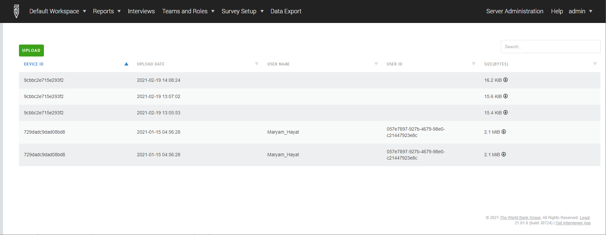

+++
title = "Support packages"
keywords = ["configuration", "troubleshoot", "tablet", "support package", "tablet information package"]
date = 2021-03-17
aliases = []
+++

***Support packages*** are also known as *tablet information packages*. These
terms are used interchangeably in this documentation.

Survey Solutions contains a built-in mechanism for collecting the data from
tablets and transmitting it to the HQ server. This helps to investigate the
issues where the interviewers can not supply any detailed problem report and
commonly describe the problem with "*it doesn't work*" or "*it crashes*" and
it is difficult or not possible to access the device directly.

The information contained in the tablet information packages (support packages)
is rather technical and should be interpreted by IT personnel or software
developers. If you are looking for a description of activities undertaken by
an interviewer, rather than solving a technical problem, then the
[Interviewer Actions Log](/headquarters/reporting/detailed-action-log/) must
be used instead.

Tablet information packages do contain confidential information of the kind
processed by the Interviewer App. For transit, they are encrypted on the
tablet before sending and decrypted on the server upon receiving.

###### On the tablet

To obtain the device logs the interviewer should proceed to the `Menu` ->
`Diagnostics` -> `Generate support package` (which is option #5 in the article
describing the [Diagnostics page](/interviewer/troubleshooting/interviewer-app-diagnostics/)).

Internet connectivity is required to transmit the tablet information packages
to the server.

###### On the server

The support packages sent from tablets are available to the server
administrator, who can access them from `Menu` &#x2192; `Server Administration`
&#x2192; click particular workspace name &#x2192; `Tablet information packages`:

The table contains the device identifier (visible on the tablet in the
[Settings Dialog](/interviewer/troubleshooting/interviewer-app-settings/)),
date/time when the logs package was sent, name (if available), user-id (if
available), and size of the support package.

Note that the user name and id may be missing, as the packages may be sent
even before the user has successfully logged in.

The table is sortable by any of the columns. Click on the column header to sort.

To download the support package, click on the download-icon located next to
the package size.

###### Support packages

Each support package is a zip-archive, which contains a wealth of information
on the tablet, including:

- one or more log files with a description of various actions, error messages,
etc which occurred on the tablet (as text files);
- database snapshots (as binary data);
- interviews data (as binary data);
- audio recordings (if any);
- questionnaire assemblies (compiled code);
- device description file (text file);
- other relevant information.

The support packages are not intended for end-user manipulation or processing.
They are intended for the developers during debugging and troubleshooting
sessions. Do not build any business logic around this functionality.
Specifically, this is not a backup/restore functionality.


  Device logs contained in support packages may be obtained separately, see the
article on [Device logs](/headquarters/config/device-logs/) for details.

