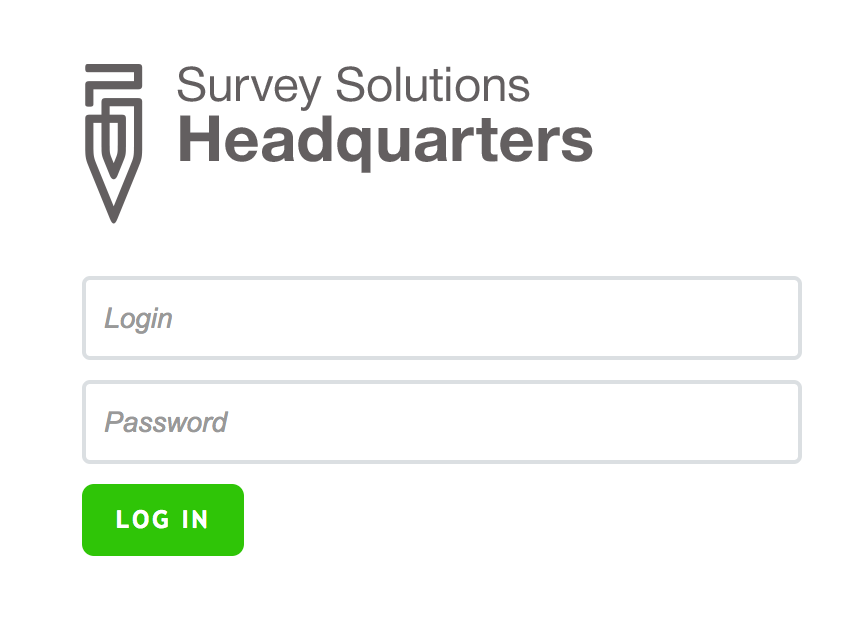
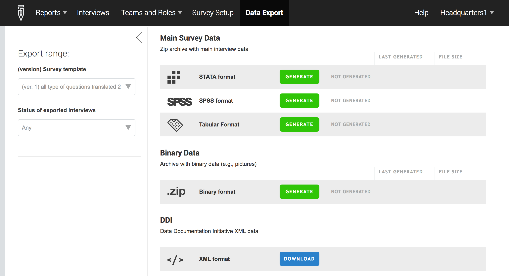

+++
title = "Data Export Tab"
keywords = ["export","headquarters"]
date = 2016-07-11T19:45:00Z
lastmod = 2016-07-11T19:45:00Z
aliases = ["/customer/portal/articles/2494108-data-export-tab"]

+++

Overview
--------

  
The Data Export tab enables headquarters to export:

-   Data for all survey cases or by survey case status (interviewer
    assigned, completed, approved by supervisor, or approved by
    headquarters
-   Binary data
-   Metadata
-   Paradata

 

How to export data
------------------

 

### Step 1

  
Log in to the server as the headquarters user. If you are testing Survey
Solutions, log in at
[https://demo.mysurvey.solutions](http://demo.mysurvey.solutions).  
  
  
**Note that each institution using
Survey Solutions will utilize their own server. Consequently, the server
address above may not be applicable. **  
  
 

### Step 2

  
Click on the *Data Export* tab  
  
  
 

### Step 3

  
Select the questionnaire template whose data you would like to export.
In the Status menu, you can choose among exporting all the data
(independently of the interview status) or only the interviews that were
already approved by headquarters.  
  
Scroll down the page to see all the data types available for export.   
  
  
 

### Step 4

  
Click on the generate button for the type of data file that you would
like to download. For DDI, skip to step 5.   
  
  
 

### Step 5

  
Click on the download button after the update is completed.  
  
  
  
  
 

 
-
