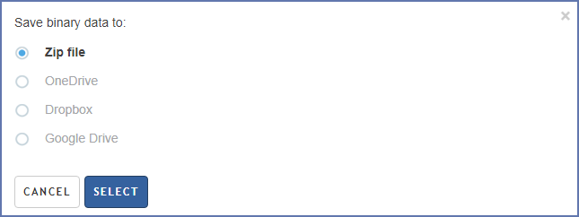

+++
title = "Export to cloud storage"
keywords = [""]
date = 2018-04-02T22:20:01Z
lastmod = 2018-04-02T22:20:01Z
aliases = ["/customer/portal/articles/2932041-export-to-cloud-storage"]

+++

Binary data files, such as pictures and audio recordings are often large
and can be time-consuming to download. One can now opt for pushing the
data to own cloud storage, rather than downloading directly. The
following cloud storage repositories are supported:

-   DropBox;
-   Google Drive;
-   OneDrive.

The direct download of binary data in the form of a single large
zip-archive remains available. To push the data to the cloud storage,
select the corresponding option in the download dialog, then
authenticate yourself with the corresponding cloud storage provider:  
  
Note that despite the cloud-to-cloud data
transfer is usually faster than direct download, it may still take
significant time to complete, especially for large surveys.
