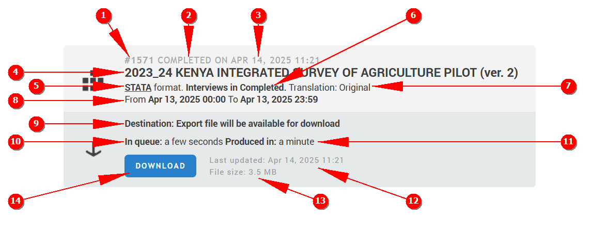

+++
title = "Data Export"
keywords = ["export","headquarters"]
date = 2016-07-11T19:45:00Z
lastmod = 2024-05-06T11:11:11Z
aliases = [
  "/customer/portal/articles/2494108-data-export-tab",
  "/customer/en/portal/articles/2494108-data-export-tab",
  "/customer/portal/articles/2494108",
  "/customer/en/portal/articles/2494108",
  "/headquarters/data-export-tab",
  "/customer/portal/articles/2932041-export-to-cloud-storage",
  "/customer/en/portal/articles/2932041-export-to-cloud-storage",
  "/customer/portal/articles/2932041",
  "/customer/en/portal/articles/2932041",
  "/headquarters/export-to-cloud-storage"
]

+++

Export of data may be requested at any time when the Survey Solutions server is
running (during or after the survey) and it doesn't cause any interruption of
the synchronization (of mobile devices) or online work (CAWI surveys). In case
the server is busy processing other export requests, the new export jobs are
put into a queue and processed sequentially. This article describes how to
request a data export from Survey Solutions.

  

<aside class="warning admonition-content">

🛈 Data export functionality is available to users in the following roles:

 - Headquarters,
 - Administrator.

</aside>

1. In the main menu select `Data Export`.
2. Select the questionnaire corresponding to the survey that needs to be exported.
3. Select the questionnaire version (from available at the server).
4. Select the status of interviews that need to be exported or leave blank for
 export of all interviews (in any status).
5. Select data type, *main survey data*, *binary data*, or *paradata*.
6. Select whether to include metadata (does not apply to paradata export).
7. Select the format of the data file (does not apply to paradata export):
    * **Tab-separated data (*.tab)** - unicode text format with tab-character
    used as a delimiter.
    * **Stata format (*.dta)** - Stata statistical package format, Stata version 14 or newer can open these files.
    * **SPSS format (*.sav)** - SPSS statistical package format.

8. Select the export file destination (Binary data files, such as pictures and audio recordings are often large and can be time-consuming to download. One can opt for pushing the data to own cloud storage, rather than downloading directly):
    * **Download** - exported data will be prepared for downloading to the user's machine.
    * **Upload to OneDrive** - when the data is ready it will be pushed to OneDrive cloud storage.
    * **Upload to DropBox** - when the data is ready it will be pushed to DropBox cloud storage.
    * **Upload to Google Drive** - when the data is ready it will be pushed to Google Drive cloud storage.
9. Press the `Add to Queue` button to create a new export job and add it to the queue of export jobs.

If the queue is empty, a new job is immediately picked for processing.
Once an export job is processed, the result is either uploaded to the cloud
destination, or a `Download` button is presented to the user in a card
corresponding to the export job.

The cards are placed in the queue regardless whether the export was requested
directly from the web interface, or by submitting the corresponding request via
the [Survey Solutions' API](/headquarters/api/survey-solutions-api/).

If you've chosen export to the cloud storage, authenticate yourself with the
corresponding cloud storage provider. Note that despite the cloud-to-cloud data
transfer is usually faster than direct download, it may still take significant
time to complete, especially for large surveys.

#### Statuses of interviews
In step 4 the user may select all interviews by not specifying any particular
status, or rather select one of the following:

- `interviewer assigned`
- `completed`
- `approved by supervisor`
- `approved by headquarters`

Note that selection is based on the _current_ status of interview when the export
of data is requested, and not on any of the past statuses that the interview
had. For example, if the interview is currently in the status
`Approved by Headquarters` it will not get exported when the status `Completed`
is specified, despite having one or more `Completed` events in the past.

#### Metadata

If metadata is requested to be included with main survey data, it includes:

- a DDI description file (in XML format);
- PDF documents containing textual representation of the questionnaire
(1 document per each translation of the questionnaire);
- a questionnaire document (in JSON format);
- questionnaire attachments (images, and other files that may be embedded into
the questionnaire).

See more on this in [Organization of meta-data storage in the exported
data](/headquarters/export/metadata-organization/).

<aside class="warning admonition-content">

🛈 Regardless of the choices you make for type of data to export and
        selection of the interviews, the export is compressed into a zip-archive
        and needs to be unpacked before use.

The zip-archive can be protected with password set by the server
        administrator for a particular workspace, see
        [admin settings](/headquarters/config/admin-settings/).

</aside>

#### Export card

Export cards corresponding to past export jobs can also be seen here.

  

Each such card compactly displays a great amount of information about the export
job:

<TABLE class="table table-striped table-hover">
<TR>
<TH>#</TH>
<TH>Explanation</TH>
<TH>In this example</TH>
</TR>

<TR>
<TD>1.</TD>
<TD>Export job number</TD>
<TD><TT>21131</TT></TD>
</TR>

<TR>
<TD>2.</TD>
<TD>Job status</TD>
<TD><TT>COMPLETED</TT></TD>
</TR>

<TR>
<TD>3.</TD>
<TD>Timestamp when the export job was created</TD>
<TD><TT>May 01, 2024 22:08</TT></TD>
</TR>

<TR>
<TD>4.</TD>
<TD>Card menu button.</TD>
<TD></TD>
</TR>

<TR>
<TD>5.</TD>
<TD>Title of the questionnaire and version</TD>
<TD><I>"2023_24 Kenya Integrated Survey of Agriculture Pilot"</I> version <TT>2</TT></TD>
</TR>

<TR>
<TD>6.</TD>
<TD>Format of export data</TD>
<TD><TT>paradata</TT></TD>
</TR>

<TR>
<TD>7.</TD>
<TD>Selection of interviews for export</TD>
<TD>interviews in all statuses</TD>
</TR>

<TR>
<TD>8.</TD>
<TD>Selection of language/translation</TD>
<TD>original language</TD>
</TR>

<TR>
<TD>9.</TD>
<TD>Destination</TD>
<TD>the job prepared a file for downloading by the user</TD>
</TR>

<TR>
<TD>10.</TD>
<TD>Time spent in queue</TD>
<TD>about a minute</TD>
</TR>

<TR>
<TD>11.</TD>
<TD>Time spent on production of the export data</TD>
<TD>a few seconds</TD>
</TR>

<TR>
<TD>12.</TD>
<TD>Timestamp when this job's output was last updated (output can be regenerated, see below)</TD>
<TD><TT>May 01, 2024 22:08</TT></TD>
</TR>

<TR>
<TD>13.</TD>
<TD>Approximate size of the file for download</TD>
<TD>about 0.5 MB</TD>
</TR>

<TR>
<TD>14.</TD>
<TD><TT>DOWNLOAD</TT> button (during production of the export data, while the <TT>DOWNLOAD</TT> button is not available, this space is utilized to display the current export step, such as <TT>RUNNING</TT> or <TT>COMPRESSING</TT>).</TD>
<TD>
</TR>

</TABLE>

#### Export card menu
Export card menu (4) provides only one item, which allows to **regenerate** the
export of data with the same parameters, as for the current card.

When regeneration is started, a new export job is created and placed into the
queue (and a new card appears in the export queue with a new job number).
However, when the job completes, its result overrides all other jobs' export
data matching the same parameters. Hence there are two timestamps on each card,
reflecting the point of processing of the job (3) and update of the data file
(12).

#### See also

* Description of the [paradata file format](/headquarters/export/paradata_file_format/);
* Description of the [system-generated data files](/headquarters/export/system-generated---export-file-anatomy/).
