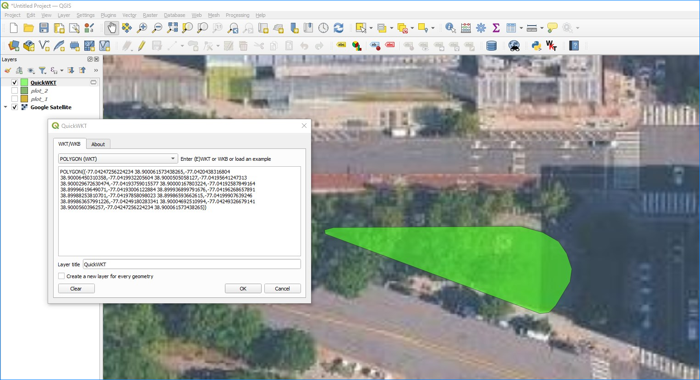

+++
title = "Geography Export Format"
keywords = ["export","headquarters","Geography"]
date = 2026-04-23T00:00:00Z
lastmod = 2026-05-17T00:00:00Z

+++

Survey Solutions records answers to geography-type questions as series of
coordinates of points. During export the user can select the desired format
for writing these coordinates to files in the
[workspace settings](/headquarters/config/admin-settings/).


#### Survey Solutions Geometry String

In the early versions the coordinates were exported as arrays following this
pattern:

```
longitude1,lattitude1;longitude2,lattitude2;...longitudeN,lattitudeN
```

This format (*Survey Solutions Geometry String*) contains all the collected
data in a compact form, but lacks some of the information needed for properly
visualizing the data, such as whether the sequence describes a polyline or a
polygon. This information is contained in the metainformation contained in the
questionnaire, which is exported with the data files, but requires additional
processing steps.

Here is an example of a plot boundary described in this format:

```
-77.04247256224234,38.900061573438265;
-77.0420438316804,38.90006450310358;
-77.0419932205604,38.9000505058127;
-77.04195641247313,38.900029672630474;
-77.04193759015577,38.90000167803224;
-77.04192587849164,38.89996619649071;
-77.04193006122884,38.899936899791676;
-77.04196268657891,38.89988253810701;
-77.04197858098023,38.89986593662615;
-77.04199907639246,38.899863657991226;
-77.04249180283341,38.90004692510994;
-77.04249326679141,38.9000560396257
```
In this illustration the line breaks were added for readability. Survey
Solutions doesn't include line breaks in this string. See the
[raw file](images/SurveySolutions/plots.tab) exactly as exported.

#### Well-Known Text

Recently added alternative formats include this information into the data
content making it more suitable for immediate processing.

The new default is the WKT format, aka *Well-Known Text* originally developed
by the Open Geospatial Consortium (OGC). Here is a quick reference to the
Wikipedia [article](https://en.wikipedia.org/wiki/Well-known_text_representation_of_geometry)
describing the format. The strict definition of the format is contained in [OpenGIS®
 Implementation Standard for Geographic information - Simple feature access - Part 1: Common
architecture](https://docs.ogc.org/is/06-103r4/06-103r4.pdf)

The same plot boundary will export like the following when WKT is selected:

```
POLYGON((
  -77.04247256224234 38.900061573438265,
  -77.0420438316804 38.90006450310358,
  -77.0419932205604 38.9000505058127,
  -77.04195641247313 38.900029672630474,
  -77.04193759015577 38.90000167803224,
  -77.04192587849164 38.89996619649071,
  -77.04193006122884 38.899936899791676,
  -77.04196268657891 38.89988253810701,
  -77.04197858098023 38.89986593662615,
  -77.04199907639246 38.899863657991226,
  -77.04249180283341 38.90004692510994,
  -77.04249326679141 38.9000560396257,
  -77.04247256224234 38.900061573438265
))
```
In this illustration the line breaks were added for readability. Survey
Solutions doesn't include line breaks in this string. See the
[raw file](images/WKT/plots.tab) exactly as exported.

Note that in exporting area features Survey Solutions will always write the
feature type as `POLYGON`, not utilizing e.g. `TRIANGLE` even if the original
contained exactly 3 vertices.

Visualization of WKT formatted features is readily available online and offline.
For example, in QGIS one can utilize the QuickWKT plugin by *Alessandro Pasotti*
(ItOpen):

<CENTER>
  <A href="images/QuickWKT_plot.png">
    
  </A>
</CENTER>


#### GeoJSON

Survey Solutions can also export the same data formatted in GeoJSON - an open
standard format designed for representing simple geographical features. GeoJSON
file format can be understood from the following Wikipedia article:
[GeoJSON](https://en.wikipedia.org/wiki/GeoJSON). The standard itself is
described rigorously in the following publication:
[RFC7946](https://datatracker.ietf.org/doc/html/rfc7946).

```
"{""type"":""Polygon"",""coordinates"":[[[-77.04247256224234,38.900061573438265],[-77.0420438316804,38.90006450310358],[-77.0419932205604,38.9000505058127],[-77.04195641247313,38.900029672630474],[-77.04193759015577,38.90000167803224],[-77.04192587849164,38.89996619649071],[-77.04193006122884,38.899936899791676],[-77.04196268657891,38.89988253810701],[-77.04197858098023,38.89986593662615],[-77.04199907639246,38.899863657991226],[-77.04249180283341,38.90004692510994],[-77.04249326679141,38.9000560396257],[-77.04247256224234,38.900061573438265]]]}"
```
See the [raw file](images/GeoJSON/plots.tab) exactly as exported.

Note that the content as saved in the exported data has enveloping double quotes
around the content and the inner double quotes are duplicated. The software
reading these files must support this content formatting. This recorded
structure is equivalent to this formatted JSON:

```
{
  "type": "Polygon",
  "coordinates": [
    [
      [
        -77.04247256224234,
        38.900061573438265
      ],
      [
        -77.0420438316804,
        38.90006450310358
      ],
      [
        -77.0419932205604,
        38.9000505058127
      ],
      [
        -77.04195641247313,
        38.900029672630474
      ],
      [
        -77.04193759015577,
        38.90000167803224
      ],
      [
        -77.04192587849164,
        38.89996619649071
      ],
      [
        -77.04193006122884,
        38.899936899791676
      ],
      [
        -77.04196268657891,
        38.89988253810701
      ],
      [
        -77.04197858098023,
        38.89986593662615
      ],
      [
        -77.04199907639246,
        38.899863657991226
      ],
      [
        -77.04249180283341,
        38.90004692510994
      ],
      [
        -77.04249326679141,
        38.9000560396257
      ],
      [
        -77.04247256224234,
        38.900061573438265
      ]
    ]
  ]
}
```


#### Accompanying variables

For any question `Q` of
[geography type](/questionnaire-designer/questions/geography-question/), the
export from Survey Solutions will contain the string variable `Q` with
coordinates data (in one of the formats described above) accompanied with the
following additional variables:

`Q__area` - calculated area (in square meters) of the selected polygon or a
0 (zero value) if the geometry type is anything different from *polygon*;

`Q__len` - length (in meters) of the selected polygon or polyline, or a 0
(zero value) if the geometry type is anything different from *polygon* or *polyline*;

`Q__num` - number of recorded points. Note that the first point is always added
as the last point when exporting polygons to WKT or GeoJSON formats to guarantee
that the polygon is closed. (This means that the number of actual points in such
features will be 1 more than is recorded in this variable.)

`Q__racc` - requested accuracy (in meters) effective at the time when the
question was answered if the input method for Q was *automatic* or *semi-automatic*,
otherwise a system missing value;

`Q__rfrq` - requested frequency (in seconds) effective at the time when the
question was answered or a system missing if the input method is not *automatic*.


Please note that if the question was not answered, then
**all of the above fields** will take values mentioned as
*'reserved values'* in the [Missing values](/headquarters/export/missing-values/)
article.

#### Notice for API users

The format of export of the geography questions is not selectable via the
export API because it is set in the workspace settings and regulates all
exports from that workspace, whether requested interactively from the user
interface or from an API query.

If an export in a specific format is needed for applications acquiring data
from Survey Solutions, that format needs to be set in the workspace settings
by the administrator user. For applications requiring the data to be exported
in the old format that setting must be set to: *Survey Solutions Geometry String*.

#### See also

* [Data Export](/headquarters/export/data-export-tab/)
* [Geography Type Question](/questionnaire-designer/questions/geography-question/);
* [Workspace Settings](/headquarters/config/admin-settings/).
