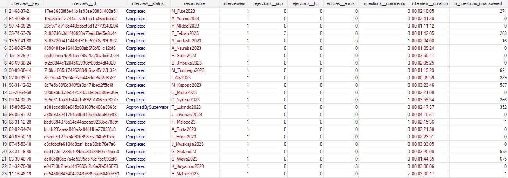

+++
title = "Interview diagnostics file"
keywords = ["export", "interview", "diagnostics"]
date = 2018-09-28
lastmod = 2023-12-05T00:00:00Z
aliases = ["/headquarters/interview_diagnostics_file"]
+++

**interview__diagnostics** file is a special service file, automatically produced 
with every data export, that contains useful information for assessing the quality 
of interviews:

*   number of invalid entities (invalid answers and errors in static texts),
*   number of questions with comments,
*   duration of the interview etc.

For a description of available fields and their types, refer to [this article](/headquarters/export/system-generated---export-file-anatomy/#interview__diagnostics).

This is especially useful for user-written monitoring systems that work alongside 
Survey Solutions and continually monitor the quality of incoming data by 
periodically exporting the data and building customized reports. Supervisors already 
had access to all the same information interactively through interview details and 
interview history pages. The interview statistics API endpoint has been updated to 
obtain the same information for API consumers. 

_This feature was proposed by Andreas Kutka and other users._

  

