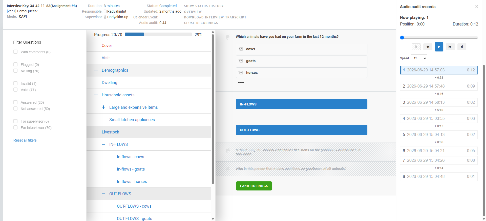
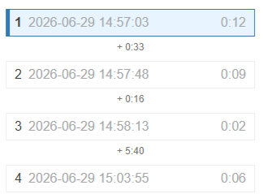
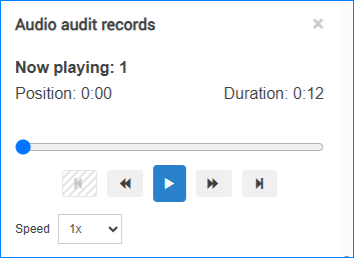

+++
title = "Audio audit playback"
keywords = ["audio audit", "audit", "recording", "play", "playback", "listen", "quality"]
lastmod = 2026-08-27T00:00:00Z
draft = false
+++

Survey Solutions includes a built-in audio player that allows authorized users
to listen to audio audit recordings directly while reviewing an interview. The
player is integrated into the interview view and enables reviewers to examine
questionnaire answers and audio audit recordings side by side without
downloading files.

  

##### Overview

When audio audit is enabled for a questionnaire and recordings have been
collected during an interview, authorized users can open an audio audit panel
and play the recordings directly in the browser.

The integrated player is intended for quality control, supervision, and data
verification activities. It allows reviewers to navigate through individual
audio audit recordings, control playback speed, and continue working with the
interview while recordings are playing.

Playback is read-only; recordings cannot be modified or edited from the player.

Access to audio audit recordings should always comply with applicable privacy,
consent, and data protection requirements.

##### Who Can Access Audio Audit Recordings?

Audio audit recordings can be reviewed by users in the following roles:

- `Administrator` - can access all audio audit data at any time;
- `Headquarters` - can access all audio audit data in a permitted workspace;
- `Supervisor` - can access audio audit data for interviews under their review
and only if permitted by administrators.

Access to audio audit recordings by supervisors is controlled at the workspace
level. Users in the role administrator can enable or disable audio audit
playback for all supervisors in a workspace through the
[workspace settings](/headquarters/config/admin-settings/).

Even when supervisor playback is enabled, supervisors can access audio audit
recordings only while they have access to the corresponding interview. For
example, once an interview is approved and is no longer available to the
supervisor, the supervisor can no longer review its audio audit recordings.

##### Opening and Closing the Audio Player

If an interview contains audio audit recordings, a `VIEW RECORDINGS` link
appears in the interview header.

The `VIEW RECORDINGS` link is shown only when audio audit recordings are
actually available for the interview.

To open the player:

- Open an interview.
- Click `VIEW RECORDINGS`.

The audio audit panel opens on the right side of the screen.

To close the panel, either:

- Click the `X` button in the upper-right corner of the panel, or
- Click `CLOSE RECORDINGS` in the interview header.

##### Audio Player Interface

The audio audit panel displays all recordings collected for the interview along
with playback controls.

###### Recording List

Each recording entry includes:

- Recording sequence number
- Recording timestamp
- Recording duration

The currently selected recording is highlighted in the list.

Between recordings, the player shows time gaps indicating how much time elapsed
between one recording and the next. This can help reviewers understand the
timing of events during the interview.

For example:

  

Here 33 seconds elapsed between the end of the first recording and the start of
the second recording, and 5 minutes and 40 seconds between the third and the
fourth ones.

###### Playback Controls

  

The player provides controls for:

- Play and pause
- Move to the previous recording
- Move to the next recording
- Fast-forward and rewind within a recording
- Seek to a specific position using the progress bar
- Playback Speed

Playback speed can be adjusted using the `Speed` selector. It may help reviewers
process long interviews more efficiently.

##### Playing Recordings

To start playback, double-click any recording.

The player automatically advances to the next recording when the current
recording finishes. This allows reviewers to listen through all available
recordings without manually selecting each one. Playback continues until the
final recording has been played. After the last recording finishes, playback
stops automatically.

To jump directly to any recording in the list, double-click the desired
recording.

##### Reviewing an Interview During Playback

The audio player remains available while the interview is being reviewed.

During playback, users can continue to:

- Navigate between interview sections
- Expand and collapse groups
- Scroll through questionnaire content
- Review answers and comments
- Examine validation messages and flags
- Answer supervisor questions, etc.

Playback continues while the reviewer interacts with the interview, allowing
audio audit recordings and questionnaire data to be reviewed simultaneously.
Playback stops if the player panel is closed.

##### Typical Use Cases

- **Quality Control**: Review interview techniques and verify that interview
procedures were followed correctly.

- **Data Verification**: Compare recorded conversations with questionnaire
responses to investigate unusual, inconsistent, or suspicious data.

- **Supervisor Support**: Listen to interview excerpts when providing guidance
and feedback to interviewers.

- **Interview Review**: Examine audio audit recordings alongside comments, flags,
and validation messages without leaving the interview review screen.

##### More information

- To learn how to activate audio audit for CAPI interviews see
[audio audit](/headquarters/svymanage/audio-audit/).

- For details on the quality settings for audio files see
[format of audio files](/headquarters/config/audio-files-format/).
