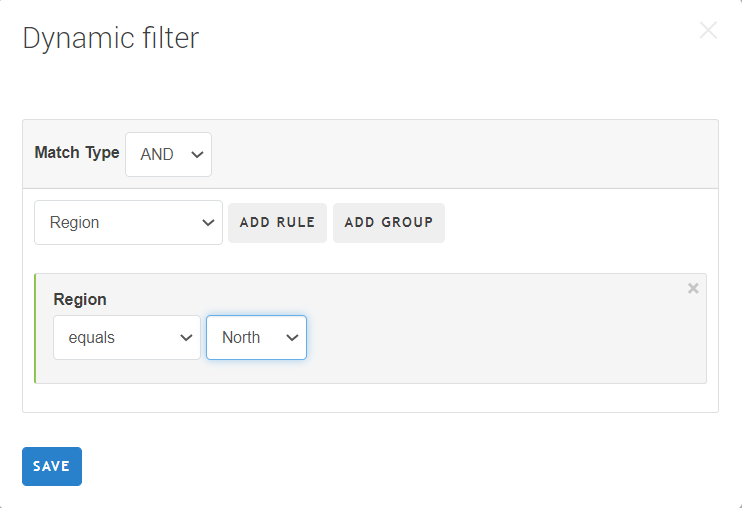
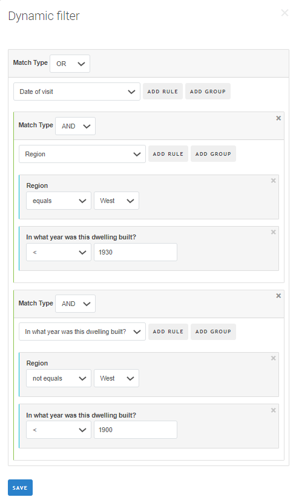

+++
title = "Dynamic filters for interviews"
date = 2021-05-11T00:00:00Z
lastmod = 2021-05-11T00:00:00Z

+++

Dynamic filters are used to filter responses in the interviews list and in the map report. The filters can be formulated based on the variables belonging to the cover page and/or [exposed variables](/headquarters/svymanage/exposed-variables).

#### Rules
Rules utilize comparative operators, that are logical operators for comparing the value to a constant. Which operators are available depends on the type of the question/variable:

<CENTER>
  <A href="images/filter_simple_categorical.png">
    
  </A>
</CENTER>

* For categorical single-select: **equals**, **not equals**.
* For numeric: **=**, **<>**, **<**, **<=**, **>**, **>=**.
* For text: **equals**, **not equals**, **contains**, **not contains**, **starts with**, **not starts with**.
* For date:
  * **on** - event occurred specifically on that date;
  * **not on** - event didn't occur on the specified date;
  * **before** - event occurred before the specified date;
  * **not later than** - event occurred before or on the specified date;
  * **after** - event occurred after the specified date;
  * **on or after** - event occurred on or after the specified date.

For all types of questions one can apply unary logical operators **answered** and **not answered**.

#### Examples:

<TABLE class="table table-striped table-hover">

<TR>
  <TH bgcolor="Orange">Condition</TH>
  <TH bgcolor="Orange">Matches</TH>
  <TH bgcolor="Orange">Does not match</TH>
</TR>

<TR>
  <TD>Address contains Washington DC</TD>
  <TD>123 Main St, Washington DC, USA<BR>
  4567 Washington St, Washington DC, USA</TD>
  <TD>175 Washington Rd, Seattle WA, USA<BR>
1212 5th Ave, New York NY, USA</TD></TR>

<TR>
  <TD>EmployeesCount>=100</TD>
  <TD>100</TD>
  <TD>99, Null</TD>
</TR>

<TR>
  <TD>RegistrationDate on or after 2001-01-01</TD>
  <TD>2001-01-01<BR>2001-02-02</TD>
  <TD>2000-12-31<BR>1980-07-03</TD>
</TR>

<TR>
  <TD>Region equals North</TD>
  <TD>North</TD>
  <TD>South<BR>East<BR>West<BR>Null</TD>
</TR>

<TR>
  <TD>EmployeesCount Answered</TD>
  <TD>....-1, 0, 1, 2, 3, ….100...1000...</TD>
  <TD>Null</TD>
</TR>

</TABLE>


#### Match types
Multiple rules or several groups, or a rule and a group may be combined (within a higher level group) with one of the logical operators:

{}

{}

{}

{}

Any expression is contained within at least one group.

#### Use of match types

We are using `OR` to identify observations from one of several groups:  This is commonly utilizing a single variable and equality, with different constants. For example, we might want to highlight observations from e.g. districts 1, 2, 3, 4, 5 or 6 (of 1..10). Conceptually it is `district.InList(1,2,3,4,5,6)`, which is same as:
```
district==1 || district==2 || district==3 || district==4 || district ==5 || district==6
```
which we can construct as a single `OR` group with 6 rules, each singling out a particular district from 1 to 6.

Different variables may still be used in a group of `OR`. For example, to identify skilled employees we may come up with a criterion:
```
educYears>=12 OR tenure>=8
```

We use `AND` to identify observations that satisfy several conditions simultaneously. For example, in an enterprise survey, we might be interested in finding all companies that are from the private sector, have more than 1 owner, more than 100 employees, located in the South. We describe such criteria as individual rules united in a group with an `AND` operator:
```
sector=Private AND NumOwners>1 AND NumEmployees>100 AND region==South.
```

A single variable may also be used within the `AND` group. This is commonly used for range checks:
```
age>=18 AND age<=65
```

#### Writing complex expressions

Suppose we are interested in finding interviews obtained from "*old dwellings*". And our definition of "*old dwellings*" varies by region. Specifically, in the *West* it is all buildings built before 1930, while in all other regions before 1900.

We construct the following dynamic filter. First we realize that our observations come from two principally different locations, they can be from West or from Not-West. So we will have a top level group with an `OR` operator. We will then describe what we want to be true about the first location: *West*. We want that observations carry the region specifically *West*: ```Region equals West```, and at the same time the year must be earlier than 1930: ```yearbuilt < 1930```. We reflect the simultaneity of these conditions by selecting the `AND` operator to unite them in a group.

Similarly we construct the conditions for selection from the Non-West: ```Region not equals West AND yearbuilt < 1900```.

<CENTER>
  <A href="images/filter_complex_and_or.png">
    
  </A>
</CENTER>

As we formulate more and more complex expressions involving more operators, their level of nesting goes deeper. We can see the nesting by different indentation of the cards corresponding to individual rules in the dynamic filter, and the different colors of their tabs. Tabs at the same level of nesting are getting the same color of the tab.

Different users may construct different dynamic filters. They are not affecting each other and are not saved. Yet changing the set of the exposed variables does affect all the users utilizing dynamic filters.

#### Use with filter by questions

The dynamic filter may be utilized simultaneously with the filter by questions. In this case the observations shown are only those that satisfy both the filter by questions and the dynamic filter.

Note that this may result in incompatible choices, e.g. if the user selects ```REGION=5``` in the filter by questions and ```REGION=7``` in the dynamic filter. A single variable may not be equal 5 and 7 at the same time, so the resulting set of interviews will be empty.
