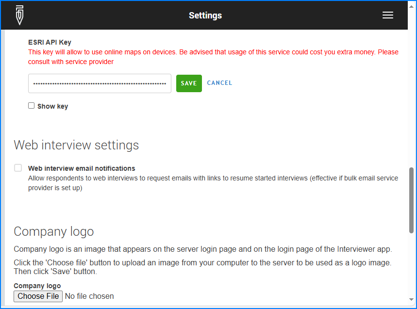

+++
title = "Online maps key"
keywords = ["maps", "online", "key", "API", "ESRI", "Esri"]
date = 2024-06-05T11:11:11Z
lastmod = 2024-06-05T11:11:11Z
+++

Usage of online maps is possible in Survey Solutions by consuming data
sources of [Esri](https://www.esri.com/en-us/about/).

By default the API key is blank (not specified) and the online maps are not
selectable on mobile devices. Specifying a valid key facilitates using Esri's
services supplying tiles for base map layer when:

- using the map dashboard, and/or
- answering geography type questions

in Interviewer and Supervisor apps.

Usage of the `ESRI API key` may (and likely will) cost you
money.  It is important to familiarize yourself with the pricing, plans, charges
and limits as applicable. These conditions may be changed, possibly even without
prior notice. Pricing and billing conditions may depend on whether the user is a
private user or an organization. All of the billing for this service occurs
between you and the corresponding provider, the Survey Solutions developers are
not charging you for this service.

The same key is shared across all surveys in the Survey Solutions workspace. If
there is a need to utilize more than one key, then more than one workspace must
be created on the server.

The `ESRI API key` is an alphanumeric key that the user needs to [obtain from
Esri directly](https://developers.arcgis.com/documentation/mapping-apis-and-services/security/tutorials/create-and-manage-an-api-key/), and
subsequently monitor and be responsible for its use (it is recommended that the
user of the key checks regularly the usage of the service and compliance with
any applicable terms, conditions and limits). Survey Solutions software is not
tracking usage of the tiles or the costs associated with such use.

It is necessary that this key has the "*Basemaps*" scope enabled for the online
maps to work in Survey Solutions Android apps (Interviewer and Supervisor).

  

Once the key is received, it is entered by the administrator in the
[workspace settings](/headquarters/config/admin-settings/). Users of the
Android apps (interviewer, supervisor) will receive this key as part of the
next synchronization. Specifically, this key is transferred during the regular
synchronization (of questionnaires, assignments, interviews, etc), not the maps
synchronization.

Interviewers/Supervisors do not see the value of the key in their interface,
but when the key is received, the selection of online maps is activated
(otherwise only offline maps are available for selection).

To regulate the costs the person controlling the key may disable it during the
periods when the field operation is not in the active phase by deactivating the
key in Esri's [developer dashboard](https://developers.arcgis.com/documentation/mapping-apis-and-services/security/tutorials/create-and-manage-an-api-key/). To temporarily deactivate the key one can edit the key settings
to remove the "*Basemaps*" scope. This allows to re-activate online maps
functionality at a later point without re-issuing a new key and having all the
tablets to synchronize.

Any changes to key configuration are not instanteneous. It may take time for
the new key to become active, or scope of the key to change. Consult the details
at the service provider's site.

Users relying on online maps should understand that it may be affected by
Internet connectivity of the mobile device and other factors beyond the control
of Survey Solutions' developers or the users of the mobile devices.

**One doesn't need to specify this key if:**
- the questionnaire uses neither GPS nor geography type questions, or
- insterviewers/supervisors are assigned and using offline maps only, or
- only web surveys are collected, without the use of mobile applications.

The introduction of the online maps key [was announced in the Survey Solutions
users' forum](https://forum.mysurvey.solutions/t/use-of-online-maps-in-survey-solutions/6415)
on May 22, 2024.
